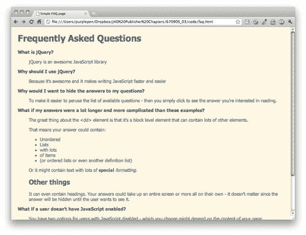
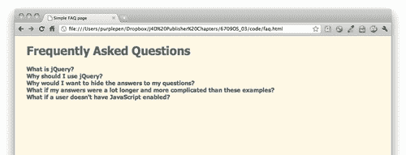
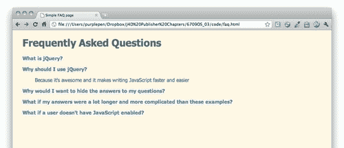
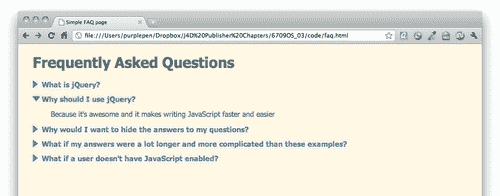

# 第三章。打造更好的常见问题解答页面

> 自互联网诞生以来，常见问题解答页面一直是各种类型的网站的主要页面。它被用作营销页面，试图减少对客户服务部门的电话或电子邮件数量，并且作为站点访问者了解与之交易的公司或组织，或者他们感兴趣购买的产品或服务的有用工具。
> 
> 虽然我们将为此示例构建一个常见问题解答页面，但此展开和折叠技术在许多不同情况下都很有用 — 事件列表与事件详情、员工或成员列表与简介、产品列表与详情 — 任何情况下都应该使站点访问者能够快速浏览项目列表，但在他们找到所需内容时应该能够立即轻松地根据需求获取更多信息。

在本章中，我们将学习：

+   如何使用 jQuery 遍历 HTML 文档

+   如何显示和隐藏元素

+   如何使用简单的 jQuery 动画

+   如何轻松切换元素的类名

# 常见问题解答页面标记

我们将从特别关注我们如何标记常见问题解答列表开始。与大多数涉及 Web 开发的事情一样，没有一种正确的方法，所以不要将这种方法视为唯一正确的方法。任何语义上合理且便于使用 CSS 和 JavaScript 增强列表的标记都是完全可以接受的。

# 行动时间 — 设置 HTML

1.  我们将从我们的示例 HTML 文件和关联的文件和文件夹开始，就像我们在第一章中设置的那样，*设计师，遇见 jQuery*。在这种情况下，我们的 HTML 将是一个包含在`<dt>`标签中的问题的定义列表，而答案则包含在`<dd>`标签中。默认情况下，大多数浏览器会缩进`<dd>`标签，这意味着问题会悬挂在左边距中，使其易于浏览。在 HTML 文档的`<body>`内，按如下方式添加标题和定义列表：

    ```js
    <h1>Frequently Asked Questions</h1>
    <dl>
    <dt>What is jQuery?</dt>
    <dd>
    <p>jQuery is an awesome JavaScript library</p>
    </dd>
    <dt>Why should I use jQuery?</dt> <dd>
    <p>Because it's awesome and it makes writing JavaScript faster and easier</p>
    </dd>
    <dt>Why would I want to hide the answers to my questions? </dt>
    <dd>
    <p>To make it easier to peruse the list of available questions - then you simply click to see the answer you're interested in reading.</p>
    </dd>
    <dt>What if my answers were a lot longer and more complicated than these examples?</dt>
    <dd>
    <p>The great thing about the &lt;dd&gt; element is that it's a block level element that can contain lots of other elements.</p>
    <p>That means your answer could contain:</p>
    <ul>
    <li>Unordered</li>
    <li>Lists</li>
    <li>with lots</li>
    <li>of items</li>
    <li>(or ordered lists or even another definition list)</li>
    </ul>
    <p>Or it might contain text with lots of <strong>special</strong> <em>formatting</em>.</p>
    <h2>Other things</h2>
    <p>It can even contain headings. Your answers could take up an entire screen or more all on their own - it doesn't matter since the answer will be hidden until the user wants to see it.</p>
    </dd>
    <dt>What if a user doesn't have JavaScript enabled?</dt>
    <dd>
    <p>You have two options for users with JavaScript disabled - which you choose might depend on the content of your page.</p>
    <p>You might just leave the page as it is - and make sure the &lt;dt&gt; tags are styled in a way that makes them stand out and easy to pick up when you're scanning down through the page. This would be a great solution if your answers are relatively short.</p>
    <p>If your FAQ page has long answers, it might be helpful to put a table of contents list of links to individual questions at the top of the page so users can click it to jump directly to the question and answer they're interested in. This is similar to what we did in the tabbed example, but in this case, we would use jQuery to hide the table of contents when the page loaded since users with JavaScript wouldn't need to see the table of contents.</p>
    </dd>
    </dl>

    ```

1.  你可以通过添加一些 CSS 来调整页面的样式。以下是我的样式设置方式：

对于禁用 JavaScript 的用户，该页面可以正常工作。问题会悬挂在左边距中，比页面上的其他文本更加粗体和深色，使其易于浏览。

## 刚刚发生了什么？

我们设置了一个基本的定义列表来保存我们的问题和答案。默认样式的定义列表很好地使得问题列表对于没有 JavaScript 的站点访问者易于浏览。我们可以进一步通过自定义 CSS 来增强我们的样式以使列表的风格与我们的站点匹配。

# 行动时间 — 在 HTML 文档中移动

1.  我们将继续使用前一节设置的文件进行工作。打开位于您的`scripts`文件夹内的`scripts.js`文件。在文档就绪语句之后，编写一个名为`dynamicFaq`的新空函数：

    ```js
    function dynamicFaq() {
    //our FAQ code will go here
    }

    ```

1.  让我们思考一下我们希望此页面的行为。我们希望在页面加载时将所有问题的答案隐藏，然后当用户找到他们正在寻找的问题时，当他们点击问题时，我们希望显示相关答案。

    这意味着当页面加载时，我们首先需要隐藏所有答案。这只是简单地选择所有我们的`<dd>`元素并隐藏它们。在您的`dynamicFaq`函数内，添加一行代码以隐藏`<dd>`元素：

    ```js
    function dynamicFaq() {
    $('dd').hide();
    }

    ```

    

    ### 注意

    您可能想知道为什么我们没有使用 CSS 将`<dd>`标签的显示设置为`none`。那样会隐藏我们的答案，但会使所有人都无法访问我们的答案 - 没有启用 JavaScript 的网站访问者将无法访问页面的最重要部分 - 答案！

    这也会阻止大多数搜索引擎索引我们答案内的内容，这对于试图在搜索引擎中找到答案的人可能是有帮助的。通过使用 JavaScript 隐藏答案，我们可以确保答案将可用，除非用户启用了 JavaScript 并且能够再次显示它们。

1.  现在，当网站访问者点击问题时，我们需要显示答案。为此，我们需要告诉 jQuery 在有人点击其中一个问题或`<dt>`标签时做些什么。在`dynamicFaq`函数内，添加一行代码以将点击函数绑定到`<dt>`标签：

    ```js
    function dynamicFaq() {
    $('dd').hide();
    $('dt').bind('click', function(){
    //Show function will go here
    });
    }

    ```

1.  当网站访问者点击问题时，我们希望获取该问题的答案并显示出来，因为我们的常见问题列表设置与以下代码类似：

    ```js
    <dl>
    <dt>Question 1</dt>
    <dd>Answer to Question 1</dd>
    <dt>Question 2</dt>
    <dd>Answer to Question 2</dd>
    ...
    </dl>

    ```

    …我们知道答案是我们问题后的 DOM 中的下一个节点或元素。我们将从问题开始。当网站访问者点击问题时，我们可以使用 jQuery 的`$(this)`选择器获取当前问题。用户刚刚点击了一个问题，我们使用`$(this)`来表示他们刚刚点击的问题。在该新的`click`函数中，添加`$(this)`以便我们可以引用点击的问题：

    ```js
    $('dt').bind('click', function(){
    $(this);
    });

    ```

1.  现在我们已经有了刚刚点击的问题，我们需要获取下一个内容或该问题的答案，以便我们可以显示它。这在 JavaScript 中称为**DOM 遍历**。这只是意味着我们正在移动到文档的另一部分。

    jQuery 为我们提供了`next()`方法来移动到 DOM 中的下一个节点。我们将通过以下方式选择我们的答案：

    ```js
    $('dt').bind('click', function(){
    $(this).next();
    });

    ```

1.  现在我们已经从问题移动到答案。现在剩下的就是显示答案：

    ```js
    $('dt').bind('click', function(){
    $(this).next().show();
    });

    ```

1.  别忘了，我们的`dynamicFaq`函数在我们调用它之前什么都不会做。在您的文档就绪语句中调用`dynamicFaq`函数：

    ```js
    $(document).ready(function(){
    dynamicFaq();
    });

    ```

1.  现在，如果我们在浏览器中加载页面，您会发现在单击问题之前，我们所有的答案都是隐藏的。这很好也很有用，但是如果网站访问者完成阅读后可以再次隐藏答案以摆脱它，那将更好。幸运的是，这是一个常见任务，jQuery 为我们提供了很大的帮助。我们所要做的就是将我们的 `.show()` 方法替换为 `.toggle()` 方法，如下所示：

    ```js
    $('dt').bind('click', function(){
    $(this).next().toggle();
    });

    ```

现在，当您在浏览器中刷新页面时，您会发现单击问题会显示答案，再次单击问题会再次隐藏答案。

## 刚刚发生了什么？

在页面上切换元素的显示是一个常见的 JavaScript 任务，所以 jQuery 已经内置了处理它的方法，并且使得在我们的页面上实现这个功能变得简单明了。这相当容易；只需几行代码。

# 点缀我们的常见问题解答页面

实际上，这么简单，我们还有大量时间来增强我们的常见问题解答页面，使其变得更好。这就是 jQuery 的威力所在 — 您不仅可以创建一个显示/隐藏的常见问题解答页面，而且还可以使其变得花哨，并且仍然能够按时完成任务。这对于给客户或老板留下深刻印象来说如何？

# 行动时间 — 让它变得花哨

1.  让我们从一点 CSS 开始，将鼠标光标更改为指针，并向我们的问题添加一点悬停效果，以便向网站访问者明确表明问题是可点击的。打开位于样式文件夹中的 `styles.css` 文件，并添加以下 CSS 代码：

    ```js
    dt {
    color: #268bd2;
    font-weight: bold;
    cursor: pointer;
    margin: 0 0 1em 0;
    }
    dt:hover {
    color: #2aa198;
    }

    ```

    这绝对有助于向网站访问者传达问题是可点击的信息。

    

1.  当我们单击问题查看答案时，页面上的变化没有很好地传达给网站访问者 — 页面上的跳转有点让人不安，需要一会儿才能意识到刚刚发生了什么。如果问题能够平滑地显示出来，那将更加舒适和易于理解；网站访问者可以看到问题的出现，立即理解屏幕上刚刚发生的变化。

    jQuery 为我们提供了便利。我们只需将我们的 `.toggle()` 方法替换为 `.slideToggle()` 方法。

    ```js
    $('dt').bind('click', function(){
    $(this).next().slideToggle();
    });

    ```

现在，如果您在浏览器中查看页面，您会发现点击问题时，问题会平滑地显示和隐藏。当页面发生变化时，很容易理解发生了什么，并且动画效果很不错。

## 刚刚发生了什么？

我们用 `slideToggle()` 方法替换了我们的 `toggle()` 方法来动画显示和隐藏答案。这使得网站访问者更容易理解页面上发生的变化。我们还添加了一些 CSS，使问题看起来像是可点击的，以向我们的网站访问者传达我们页面的能力。

# 我们快要完成了！

jQuery 使得动画的显示和隐藏变得如此容易，以至于我们仍然有时间进一步增强我们的 FAQ 页面。添加一些指示器来显示我们的问题已经折叠并且可以展开，以及一旦它们被打开就添加一些特殊的样式以显示它们可以再次折叠，这将是很好的。

# 行动时间——添加一些最后的修饰

1.  让我们从一些简单的 CSS 开始，向我们的问题的左侧添加一个小箭头图标。返回`style.css`并稍微修改样式以添加一个箭头图标或您选择的图标。您可以将所选图标放在`images`文件夹中：

    ```js
    dt {
    color: #268bd2;
    font-weight: bold;
    cursor: pointer;
    margin: 0 0 1em 0;
    padding: 0 0 0 20px;
    background: url(../images/arrow.png) 0 0 no-repeat;
    line-height: 16px;
    }
    dt:hover {
    color: #2aa198;
    background-position: 0 -32px;
    }

    ```

    我正在使用图像精灵来显示箭头。当鼠标悬停在问题上时，我将我的问题从蓝色更改为绿色，因此我在精灵中包含了蓝色和绿色的箭头，并且在文本变为绿色时使用了一些 CSS 来显示绿色箭头。这意味着只需下载一个图像，无需在鼠标悬停在我的问题上时下载新图像来显示。如果您对 CSS 图像精灵技术不熟悉，我建议您查看*Chris Coyier*在[`css-tricks.com/css-sprites/.`](http://css-tricks.com/css-sprites/. )上解释它的文章。

1.  现在，当问题打开时，我们想要将箭头改为不同的方向。我们所要做的就是为我们的问题的打开状态使用一个新的 CSS 类，并编写关闭和打开状态的代码，以便新的箭头形状也会改变颜色。同样，我已经将这些箭头图像包含在同一个精灵中，所以我唯一需要改变的就是背景位置：

    ```js
    dt.open {
    background-position: 0 -64px;
    }
    dt.open:hover {
    background-position: 0 -96px;
    }

    ```

    ### 注意

    请确保在我们用来为`<dt>`标签添加样式的其他 CSS 之后添加这些新类。这样可以确保 CSS 按照我们的意图级联。

1.  所以我们有了 CSS 来显示我们的问题是打开的，但是我们如何实际使用它呢？我们将使用 jQuery 在问题打开时向我们的问题添加类，并在关闭时删除类。

    jQuery 提供了一些很好的方法来处理 CSS 类。`addClass()`会将一个类添加到 jQuery 对象中，而`removeClass()`会删除一个类。但是，我们想要像切换问题的显示和隐藏一样切换我们的类。jQuery 也为此提供了支持。当我们点击问题时，我们希望类发生变化，因此我们将在我们每次点击`<dt>`时调用的`dynamicFaq`函数中添加一行代码：

    ```js
    $('dt').bind('click', function(){
    $(this).toggleClass('open');
    $(this).next().slideToggle();
    });

    ```

    现在当您查看页面时，您将看到在`<dt>`标签打开时应用的打开样式，并在关闭时再次删除。但我们实际上可以将我们的代码压缩得更小一些。

1.  jQuery 最强大的功能之一被称为链式调用。当我们在一行中向`next()`方法添加了`slideToggle()`时，我们已经使用了链式调用。

    ```js
    $(this).next().slideToggle();

    ```

    jQuery 中的方法可以链接在一起。您可以继续添加新的方法来进一步转换、修改或动画化一个元素。这行代码获取问题，遍历 DOM 到下一个节点，我们知道这是我们的 `<dd>`，然后切换那个 `<dd>` 的滑动动画。

    我们可以再次利用链接。我们的代码中存在一些冗余，因为我们在两行不同的代码中都以 `$(this)` 开头。我们可以删除额外的 `$(this)`，并将我们的 `toggleClass()` 方法添加到我们已经开始的链中，如下所示：

    ```js
    $(this).toggleClass('open').next().slideToggle();

    ```

    

## 刚刚发生了什么？

我们创建了 CSS 样式来为我们的问题的打开和关闭状态添加样式，然后我们在我们的 JavaScript 中添加了一点代码来更改问题的 CSS 类以使用我们的新样式。jQuery 提供了几种不同的方法来更新 CSS 类，这通常是对来自站点访问者的输入做出响应时更新文档显示的一种快速简便的方法。在这种情况下，由于我们想要添加和移除一个类，所以我们使用了 `toggleClass()` 方法。这使我们免于自己去弄清楚是否需要添加或移除打开类。

我们还利用链接来简单地将这个新功能添加到我们现有的代码行中，使得答案的动画显示和隐藏以及我们问题的 CSS 类的更改都只需一行代码即可完成。这对于在短时间内用少量代码实现令人印象深刻的功能来说，算怎么样？

# 总结

在本章中，我们学习了如何设置一个基本的常见问题解答页面，该页面在站点访问者需要查看答案之前隐藏问题。由于 jQuery 让这个过程变得如此简单，我们有足够的时间来进一步增强我们的常见问题解答页面，为我们的问题的显示和隐藏添加动画效果，并利用 CSS 来为我们的问题添加特殊的打开和关闭类，以向我们的站点访问者传达我们页面的工作方式。而我们只用了几行代码就完成了所有这些工作。

接下来，我们将学习如何在我们的页面上使用自定义滚动条。
