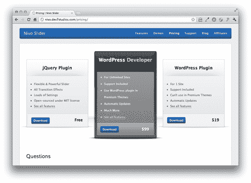
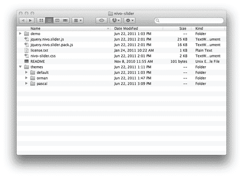
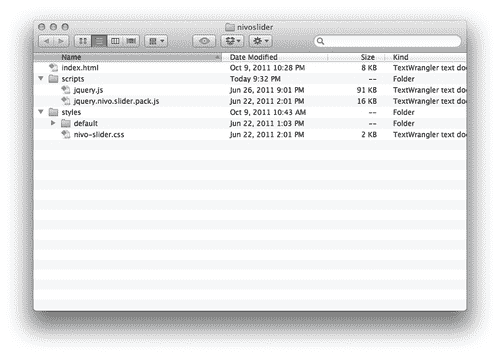
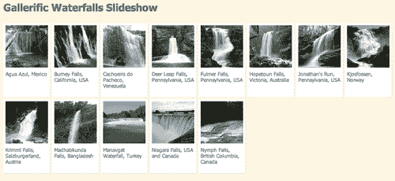
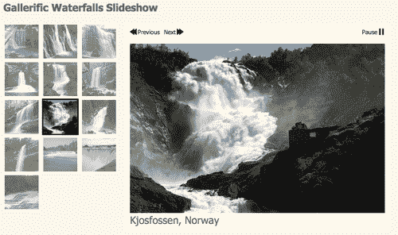
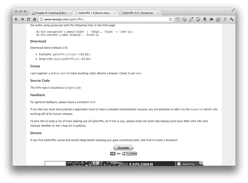
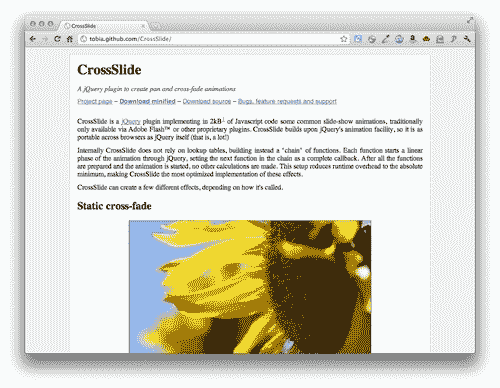

# 第九章。创建幻灯片

> 幻灯片通常是在 Flash 中创建的，是展示照片、产品、插图、作品集等的绝佳方式。创建幻灯片是 jQuery 开发人员最常见的任务之一。在本章中，我们将看看如何从头开始创建一个简单的幻灯片，然后探讨三个创建华丽、动态且功能齐全的幻灯片的强大插件。

在本章中，我们将涵盖以下内容：

+   如何规划幻灯片

+   如何从头开始编写一个简单的淡入淡出幻灯片

+   如何使用 CrossSlide 插件创建平移和缩放幻灯片

+   如何使用 Nivo Slider 插件创建具有有趣过渡效果的幻灯片

+   如何使用 Galleriffic 插件创建缩略图幻灯片

# 规划幻灯片

在准备构建 jQuery 幻灯片时，有几个要考虑的事项。它们如下：

+   首先，您必须决定对于禁用 JavaScript 的用户来说，体验会是什么样的。幻灯片中各个内容片段的优先级应该成为您的指南。如果幻灯片只是展示网站其他地方可用的内容片段，那么只需展示一张照片或幻灯片就足够了。如果幻灯片是访问内容的唯一方式，那么您必须确保将内容提供给未启用 JavaScript 的用户。在本章的各个示例中，我们将看看这两种策略。

+   其次，您必须确定幻灯片中的所有项目是否大小相同还是大小不同。出于显而易见的原因，处理所有大小和宽高比相同的项目是最容易的，但有时对所有项目设置相同大小是不切实际或不可能的。随着我们的讨论，我将介绍哪些幻灯片适合相同大小的内容，哪些适合不同大小的内容。

+   接下来，您需要考虑您的网站访问者是否需要对幻灯片有任何控制。有时，只需让您的图像自动轮换很方便。其他时候，允许网站访问者暂停幻灯片，或手动向前和向后移动幻灯片会很有帮助。我会告诉您每种幻灯片方法为您的网站访问者提供了多少控制。

# 简单淡入淡出幻灯片

在本节中，您将学习如何构建一个简单的淡入淡出幻灯片。这种类型的幻灯片非常适合相同大小的图像，并且在禁用 JavaScript 时可以显示为单个图像。最后，这种类型的幻灯片不向您的网站访问者提供任何对幻灯片的控制。他们无法暂停幻灯片或手动浏览幻灯片。

# 行动时间 —— 创建一个简单的淡入淡出幻灯片

按照以下步骤创建一个简单的淡入淡出幻灯片：

1.  我们将开始创建一个基本的 HTML 文档以及与之关联的文件和文件夹，就像我们在第一章*设计师，见 jQuery*中所做的那样。在 HTML 文档的正文中，包括一系列图片。每个列表项将包含一张图片，可选择包装在链接中。以下是我的图片列表的示例：

    ```js
    <ul id="crossfade">
    <li>
    <a href="http://en.wikipedia.org/wiki/Agua_Azul"></a>
    </li>
    <li>
    <a href="http://en.wikipedia.org/wiki/Burney_Falls"></a>
    </li>
    <li>
    <a href="http://en.wikipedia.org/wiki/Venezuala"></a>
    </li>
    </ul>

    ```

1.  接下来，我们将编写几行 CSS 来为幻灯片添加样式。幻灯片一次只显示一张图片，显示一张图片的最简单方法是将图片堆叠在一起。如果网站访问者禁用了 JavaScript，他们将只看到列表中的最后一张幻灯片：

    ```js
    #crossfade { position:relative;margin:0;padding:0;list-style-type:none;width:600px;height:400px;overflow:hidden; }
    #crossfade li { position:absolute;width:600px;height:400px; }

    ```

    如果您在浏览器中查看页面，您将看到幻灯片中的最后一项可见，但其他项都不可见—它们都叠放在最后一项下面。这就是禁用 JavaScript 的网站访问者的体验。

1.  接下来，打开 `scripts.js`，我们将开始编写我们的 JavaScript 代码。这个脚本将与我们以前设置的脚本有些不同。我们不再是在文档加载或网站访问者点击链接时发生一次性事件，而是实际上要设置一个在定时间隔上发生的函数。例如，如果我们希望幻灯片的每一张幻灯片可见三秒钟，我们将必须设置一个每三秒钟调用一次的切换幻灯片的函数。

    我们已经在页面上将幻灯片叠放在一起，并且最后一项在顶部。想想你如何处理一叠照片。您查看顶部的照片，然后将其移至堆栈底部以查看第二张照片。然后，您将第二张照片移至底部以查看第三张照片，依此类推。我们将同样的原理应用于我们的幻灯片。

    在 `scripts.js` 中，创建一个名为 `slideshow` 的函数。这是我们在想要切换照片时每三秒调用的函数。

    ```js
    function slideshow() {
    }

    ```

1.  在我们的函数内部，我们需要做的第一件事是选择堆栈中的第一张照片。

    ```js
    function slideshow() {
    $('#crossfade li:first')
    }

    ```

1.  现在我们已经有了堆叠中的第一张照片，我们只需要将它移到堆栈底部以使下一张照片可见。我们可以使用 jQuery 的 `appendTo()` 方法来实现。这将从列表开头删除第一张照片，并将其追加到列表末尾。

    ```js
    function slideshow() {
    $('#crossfade li:first').appendTo('#crossfade');
    }

    ```

1.  我们的翻转照片的函数已经准备好了。现在我们只需要在页面加载时进行一些初始设置。然后，我们将每三秒设置一次调用我们的翻转照片的函数。我们将在文档上调用 `ready()` 方法。

    ```js
    $(document).ready(function(){
    // Document setup code will go here
    });
    function slideshow() {
    $('#crossfade li:first').appendTo('#crossfade');
    }

    ```

1.  一旦我们的文档准备就绪，我们就要准备我们的幻灯片。我们将从选择幻灯片中的所有照片开始。

    ```js
    $(document).ready(function(){
    $('#crossfade li')
    });

    ```

1.  接下来，我们要隐藏幻灯片中的所有照片。

    ```js
    $(document).ready(function(){
    $('#crossfade li').hide();
    });

    ```

1.  然后，我们将过滤照片列表，只获取第一张。

    ```js
    $(document).ready(function(){
    $('#crossfade li').hide().filter(':first');
    });

    ```

1.  最后，我们将使第一张照片可见。所有其他照片将保持隐藏。

    ```js
    $(document).ready(function(){
    $('#crossfade li').hide().filter(':first').show();
    });

    ```

1.  刷新浏览器页面后，你会发现，如果没有启用 JavaScript，最后一个可见的幻灯片现在被隐藏了，而列表中的第一个幻灯片现在可见了。现在，剩下的事情就是每三秒调用我们的翻页函数。为此，我们将使用一个名为`setInterval()`的 JavaScript 方法。这允许我们以固定的时间间隔调用一个函数。我们向`setInterval`传递两个值：要调用的函数的名称以及应该在函数调用之间经过的毫秒数。例如，要每三秒（或 3000 毫秒）调用我的幻灯片函数，我会这样写：

    ```js
    $(document).ready(function(){
    $('#crossfade li').hide().filter(':first').show();
    setInterval(slideshow, 3000);
    });

    ```

1.  现在，我们每隔三秒调用一次我们的翻页函数，所以你期望如果你在浏览器中刷新页面，你会看到照片每三秒变化一次，但事实并非如此。回顾代码，很容易看出出了什么问题——尽管照片堆栈的实际顺序每三秒都在改变，但除了第一张照片之外，所有的照片都是不可见的。无论第一张照片是否在顶部，它都是唯一可见的照片，因此我们的幻灯片似乎没有变化。我们将不得不回到我们的`slideshow`函数，并修改它使当前照片不可见，并使堆栈中的下一张照片可见。由于我们希望照片以一个漂亮、缓慢的交叉淡入淡出效果切换，我们将调用`fadeOut()`方法将第一张照片淡出为透明，并且我们将向该方法传递`slow`以确保它花费足够的时间：

    ```js
    function slideshow() {
    $('#crossfade li:first').fadeOut('slow').appendTo('#crossfade');
    }

    ```

1.  现在，我们需要移动到列表中当前不可见的下一张照片，并使其不透明。我们将使用`next()`方法获取列表中的下一项，然后调用`fadeIn()`方法使其出现。再次，由于我们想要一个缓慢的效果，我们将`slow`传递给`fadeIn()`方法：

    ```js
    function slideshow() {
    $('#crossfade li:first').fadeOut('slow').next().fadeIn('slow').appendTo('#crossfade');
    }

    ```

1.  最后，我们的 jQuery 方法链有点麻烦。我们从堆栈中的第一张照片开始，淡出它，然后移到堆栈中的第二张照片，并淡入。然而，当我们调用`appendTo()`方法时，我们将第二张照片添加到末尾——我们将第二张照片移动到底部而不是第一张照片。幸运的是，jQuery 为我们提供了一个方法来返回到我们的原始选择——`end()`方法。我们可以在淡入第二张照片后调用`end()`方法，以确保将第一张照片附加到照片堆栈的底部：

    ```js
    function slideshow() {
    $('#crossfade li:first').fadeOut('slow').next().fadeIn('slow').end().appendTo('#crossfade');
    }

    ```

## 刚才发生了什么？

如果你在浏览器中刷新页面，你会看到一个漂亮的交叉淡入淡出的幻灯片。当一张照片淡出时，下一张照片就会淡入，平滑地在每张照片之间过渡。由于我们不断地将堆栈中的顶部照片移到底部，我们永远不会到达幻灯片的结尾，就像你可以不断地翻阅一叠照片一样。

我们设置了一个幻灯片功能，选择了堆栈中的第一张照片，淡出它，并将它移动到堆栈的底部。同时，我们正在找到堆栈中的第二张照片并将其淡入。我们使用了 jQuery 链接的强大功能，只需一行代码就可以完成所有操作。

我们设置了三秒的间隔，并在每个三秒的间隔结束时调用我们的照片翻转函数。

最后，我们在文档加载后做了一些设置工作 —— 隐藏所有照片，然后使第一张照片可见。这将确保照片始终按顺序显示在我们的幻灯片中。

接下来，让我们看看另一个具有一些花哨过渡效果的插件。

# Nivo Slider

在本节中，我们将看看如何充分利用来自 Dev 7 Studios 的 Nivo Slider 插件。Nivo Slider 提供了一些引人注目的照片之间的过渡效果，并提供了许多配置选项。Nivo Slider 非常适合尺寸完全相同的照片，并且很容易在 JavaScript 禁用的情况下显示单张照片以代替幻灯片。站点访问者可以手动向前和向后浏览幻灯片，并且当鼠标移动到幻灯片上时，幻灯片会暂停。

Nivo Slider 与本书中大多数我们将介绍的插件有些不同。该插件本身是根据 MIT 许可证开源的（[`nivo.dev7studios.com/license/`](http://nivo.dev7studios.com/license/)），可以免费下载和使用。此外，还有付费版本的插件供 WordPress 用户使用，包括支持、自动更新和在高级 WordPress 主题中包含插件的权限。我们在本节中创建的幻灯片使用的是该插件的免费开源版本。

# 采取行动的时间 —— 创建 Nivo Slider 幻灯片

按照以下步骤创建具有花哨过渡效果的图像幻灯片：

1.  我们将通过设置一个基本的 HTML 文件和相关文件和文件夹来开始，就像我们在第一章 *设计师，遇见 jQuery* 中所做的那样。在 HTML 文档的正文中，Nivo Slider 只需要一个容器`<div>`内的一组图像。

    如果我们希望幻灯片的每个幻灯片链接到另一个页面或网络位置，我们可以选择将每个图像包装在链接中，但这并不是必需的。Nivo 也可以正常使用未链接的图像。`` 标签的 `title` 属性用于显示幻灯片的标题。

    ```js
    <div id="slideshow">
    <a href="http://en.wikipedia.org/wiki/Agua_Azul"></a>
    <a href="http://en.wikipedia.org/wiki/Burney_Falls"></a>
    <a href="http://en.wikipedia.org/wiki/Venezuala"></a>
    <a href="http://en.wikipedia.org/wiki/Deer_Leap_Falls"></a>
    <a href="http://en.wikipedia.org/wiki/Fulmer_Falls"></a>
    <a href="http://en.wikipedia.org/wiki/Hopetoun_Falls"></a>
    <a href="http://en.wikipedia.org/wiki/Ohiopyle_State_Park"></a>
    <a href="http://en.wikipedia.org/wiki/Kjosfossen"></a>
    <a href="http://en.wikipedia.org/wiki/Krimml_Waterfalls"></a>
    <a href="http://en.wikipedia.org/wiki/Madhabkunda"></a>
    <a href="http://en.wikipedia.org/wiki/Manavgat_Waterfall"></a>
    <a href="http://en.wikipedia.org/wiki/Niagra_Falls"></a>
    <a href="http://en.wikipedia.org/wiki/British_Columbia"></a>
    </div>

    ```

1.  接下来，我们将添加一些 CSS，将图像堆叠在一起，并为我们的幻灯片设置固定的宽度和高度：

    ```js
    #slideshow { position:relative;width:600px;height:400px; }
    #slideshow img { position:absolute;top:0;left:0; }

    ```

1.  现在，前往[`nivo.dev7studios.com/pricing/`](http://nivo.dev7studios.com/pricing/)下载 Nivo Slider 插件。在标记为**jQuery plugin**的左框中，你会找到**Download**链接。

    点击**Download**链接，将 zip 文件保存到您的计算机上。

1.  解压文件夹并查看其内容。

    有一个包含示例 HTML 文件以及图像、脚本和样式的**演示**文件夹。插件有两个版本 —— 源版本和打包压缩版本。还有一个许可证的副本，比你期望的要短和简单，所以请随意查看。有一个 CSS 文件，然后有一个包含三个其他文件夹的**主题**文件夹：**default, orman** 和 **pascal**。这是插件附带的三个示例主题。你可以选择其中一个示例主题，创建你自己的主题，或者修改其中一个示例主题以适应你的口味。

1.  让我们将必要的文件复制并准备好使用。首先，将`nivo-slider.css`复制到你自己的`styles`文件夹中。选择一个主题并将整个文件夹复制到你自己的`styles`文件夹中。然后将`jquery.nivo.slider.pack.js`复制到你自己的`scripts`文件夹中，与 jQuery 放在一起。你的设置应该像下面的图片一样：

1.  接下来，我们将设置我们的 HTML 文件以使用 Nivo Slider。在文档的`<head>`部分，包含选定主题的`nivo-slider.css`文件以及你的`styles.css`文件之前：

    ```js
    <head>
    <title>Chapter 9: Creating Slideshows</title>
    <link rel="stylesheet" href="styles/nivo-slider.css"/>
    <link rel="stylesheet" href="styles/default/default.css"/>
    <link rel="stylehseet" href="styles/styles.css"/>
    </head>

    ```

1.  在 HTML 文档底部，紧挨着闭合的`</body>`标签下方，插入`<script>`标签以引入 Nivo Slider 插件，位置在 jQuery 和你的`scripts.js`文件之间：

    ```js
    <script src="img/jquery.js"></script>
    <script src="img/jquery.nivo.slider.pack.js"></script>
    <script src="img/scripts.js"></script>
    </body>

    ```

1.  打开`scripts.js`并在文档上调用`ready()`方法，这样我们的幻灯片将在页面在浏览器窗口加载时立即开始：

    ```js
    $(document).ready(function(){
    //Nivo Slider code will go here
    });

    ```

1.  接下来，我们将选择幻灯片放置的容器元素：

    ```js
    $(document).ready(function(){
    $('#slideshow');
    });

    ```

1.  最后，我们将调用`nivoSlider()`方法：

    ```js
    $(document).ready(function(){
    $('#slideshow').nivoSlider();
    });

    ```

    现在，如果你在浏览器中查看页面，你会看到我们的幻灯片已经创建了。过渡效果的默认设置是对每个过渡使用不同的随机效果，所以如果你观看一段时间，你会对 Nivo Slider 包含的不同类型的过渡效果有一个很好的了解。

    你还会注意到我们作为每个图像的`title`属性包含的值被显示为每个图像的标题。

1.  现在让我们利用 Nivo Slider 插件提供的一些自定义选项。我们选项的文档可以在[`nivo.dev7studios.com/support/jquery-plugin-usage/`](http://nivo.dev7studios.com/support/jquery-plugin-usage/)找到。

    在文档页面底部，你会找到可用过渡效果的列表。我个人最喜欢的过渡效果叫做 boxRain。让我们设置它成为唯一使用的过渡效果。我们将通过在一对花括号内传递一组键/值对给`nivoSlider()`方法来自定义 Nivo Slider 插件：

    ```js
    $(document).ready(function(){
    $('#slideshow').nivoSlider({
    effect: 'boxRain'
    });
    });

    ```

1.  我们可以指定盒子动画应包含的行数和列数。 默认情况下，有八列和四行，但让我们增加一下，以便 `boxRain` 过渡使用更多（更小的）盒子：

    ```js
    $(document).ready(function(){
    $('#slideshow').nivoSlider({
    effect: 'boxRain',
    boxCols: 10,
    boxRows: 5
    });
    });

    ```

1.  我们还可以自定义动画速度和每张幻灯片显示的时间：

    ```js
    $(document).ready(function(){
    $('#slideshow').nivoSlider({
    effect: 'boxRain',
    boxCols: 10,
    boxRows: 5,
    animSpeed: 800,
    pauseTime: 4000
    });
    });

    ```

    我将 `animSpeed` 设置为 800 毫秒，以便 `boxRain` 过渡效果需要 800 毫秒才能完成。 我还将 `pauseTime` 设置为 4000，因此幻灯片中的每个图像都可见 4000 毫秒或四秒。

## 刚才发生了什么事？

我们设置了 Nivo Slider 插件，展示了具有令人印象深刻的过渡效果的幻灯片。 我们学会了如何适当设置 HTML 文档，如何调用 `nivoSlider()` 方法以及如何自定义一些幻灯片设置。

## 尝试一下吧——自定义幻灯片

除了我们使用的自定义选项之外，幻灯片还提供了几种其他配置选项，包括显示或隐藏上/下一页按钮的能力，设置分页显示或是否显示以及用于编写幻灯片的自定义功能的大量回调函数。 除此之外，您还可以完全自定义用于创建幻灯片的 CSS 和图像，使其看起来任何你想要的样子。

尝试着自定义一个幻灯片，以匹配任何你想要的设计，并尝试使用 Nivo Slider 提供的其他自定义选项。 创建自己设计的自定义幻灯片。

接下来，我们将看看如何创建缩略图照片画廊。

# Galleriffic 幻灯片

Trent Foley 的 Galleriffic 幻灯片允许您将完整尺寸照片的链接列表转换为照片幻灯片。 这种方法与我们迄今为止看到的其他画廊有些不同，那里的重点是将完整尺寸的照片插入文档，然后将它们动画成幻灯片。 相反，Galleriffic 将一个完整尺寸照片的链接列表转换为幻灯片。 这些链接作为浏览幻灯片的一种方式保留在页面上。

Galleriffic 幻灯片可以与大小和纵横比略有不同的照片集合一起使用，但如果不同照片之间的差异太大，那么设置 CSS 来优雅地处理幻灯片将是一个挑战。 Galleriffic 幻灯片使您的站点访问者可以手动导航到幻灯片中的任何照片，并为幻灯片提供了下一张、上一张和播放/暂停按钮。 对于禁用 JavaScript 的站点访问者，将提供一系列链接，这些链接将链接到照片的全尺寸版本。

我们还将探讨一种简单的技术，您可以根据 JavaScript 是否启用来应用不同的 CSS 到页面上。当访问者在没有启用 JavaScript 的情况下访问您的网站时，这种技术可以应用在各种情况下，为您提供对内容呈现方式的更多控制。

# 行动时间——创建一个 Galleriffic 幻灯片秀

按照以下步骤使用 Galleriffic 插件创建幻灯片秀：

1.  首先，我们将额外努力规划幻灯片秀将如何在启用和未启用 JavaScript 的网站访问者中出现。如果网站访问者没有 JavaScript，我们将向他们展示一个缩略图网格，并在下方显示标题。单击缩略图将向他们显示照片的全尺寸版本。

    页面将看起来像以下屏幕截图：

    

    对于使用 JavaScript 的用户，我想在主幻灯片区域旁边显示一个较小的缩略图网格，如下面的屏幕截图所示：

    

    缩略图的情况下，标题不重要，因为它们将显示在幻灯片秀下方，而不是图片下方。

1.  在考虑我们希望页面的外观时，我们将开始设置一个 HTML 文件和相关文件和文件夹，就像我们在第一章中所做的那样，*设计师，遇见 jQuery*。为每张照片创建一个 100x100 的缩略图，并将它们存储在您的`images`文件夹内的一个`thumbs`文件夹中。我们将使用这些缩略图在 HTML 文档的正文中创建一个到全尺寸照片的链接列表。

    ```js
    <ul class="thumbs">
    <li>
    <a class="thumb" title="Agua Azul, Mexico" href="images/600/AguaAzul.jpg"></a>
    <div class="caption">Agua Azul, Mexico</div>
    </li>
    <li>
    <a class="thumb" title="Burney Falls, California, USA" href="images/600/BurneyFalls.jpg"></a>
    <div class="caption">Burney Falls, California, USA</div>
    </li>
    <li>
    <a class="thumb" title="Cachoeira do Pacheco, Venezuela" href="images/600/Cachoeira_do_Pacheco.jpg"></a>
    <div class="caption">Cachoeira do Pacheco, Venezuela</div>
    </li>
    <li>
    <a class="thumb" title="Deer Leap Falls, Pennsylvania, USA" href="images/600/Deer_Leap_Falls.jpg"></a>
    <div class="caption">Deer Leap Falls, Pennsylvania, USA</div>
    </li>
    </ul>

    ```

    ### 注意

    我们在每个链接上都包含了一个`title`属性，以确保当鼠标悬停在每个缩略图上时会显示一个工具提示，其中包含此照片的简短描述。我还在每个图像标签上包含了一个`alt`属性，以便无法看到图像的任何原因的网站访问者仍然可以访问该图像的描述。

    在每个`<li>`内部，我还包括了一个`<div>`，带有类名为`caption`，其中包含将显示在缩略图下方或幻灯片秀中图片下方的标题。

    这是足够为非 JavaScript 版本的幻灯片秀设置 HTML 的，但是 Galleriffic 插件需要页面上更多的元素。

1.  我们需要像以下这样，用一个带有`id`为`thumbs`的`<div>`来包裹我们的图片列表：

    ```js
    <div id="thumbs">
    <ul class="thumbs">
    <li>
    ...
    </li>
    </ul>
    </div>

    ```

1.  我们还需要在页面中添加一些空元素，用来容纳我们的幻灯片秀、幻灯片说明和幻灯片控件。

    ```js
    <div id="thumbs">...</div>
    <div id="gallery">
    <div id="controls"></div>
    <div id="slideshow-container">
    <div id="loading"></div>
    <div id="slideshow"></div>
    </div>
    <div id="caption"></div>
    </div>

    ```

    这些元素在页面上的确切位置由您决定——您可以创建任何您喜欢的布局，并将幻灯片秀的各个部分放在您喜欢的页面上的任何位置。出于可用性考虑，当然，这些元素应该相对靠近一起。

    请注意，除了包含缩略图列表的 thumbs `div`外，我们添加到页面的其他元素都是空的。这些元素只会在访问者启用 JavaScript 时使用，并且它们内部的所有内容都将由 Galleriffic 插件自动生成。这将使它们在不使用时保持不可见。

1.  现在，打开你的 HTML 文件，找到开头的`<body>`标签，添加一个`class`为`jsOff`。

    ```js
    <body class="jsOff">

    ```

1.  接下来，我们将为缩略图设置 CSS 样式。打开你的`styles.css`文件并添加这些样式：

    ```js
    .thumbs { margin:0;padding:0;line-height:normal; }
    .thumbs li { display:inline-block;vertical-align:top; padding:0;list-style-type:none;margin:0; }
    .jsOff .thumbs li { width:100px;margin-bottom:5px;background:#fff; border:5px solid #fff;box-shadow:1px 1px 2px rgba(0,0,0,0.1) }
    .jsOff .caption { min-height:52px;font-size:12px; line-height:14px; }
    .jsOff #gallery { display:none; }

    ```

    CSS 在这里有两个部分。以`.thumbs`开头的选择器将应用于缩略图，无论访问者是否启用 JavaScript。以`.jsOff`开头的选择器将仅应用于没有启用 JavaScript 的访问者。这段 CSS 会创建带有标题的缩略图网格。

    我们还选择了幻灯片放映的父容器，并设置为对于没有 JavaScript 的访问者根本不显示。由于这是一组空的`<div>`，它们不应该占用页面上的任何空间，但这是为了确保这些额外的元素不会对没有 JavaScript 的访问者造成任何问题的额外保证。

    该页面的非 JavaScript 版本已经完成。

1.  接下来，我们将为启用 JavaScript 的用户设置页面。我们将开始打开`scripts.js`文件并插入我们的文档就续语句：

    ```js
    $(document).ready(function(){
    // This code will run as soon as the page loads
    });

    ```

1.  接下来，我们将编写一些代码，将`jsOff`类从`body`中删除并替换为`jsOn`类。

    ```js
    $(document).ready(function(){
    $('body').removeClass('jsOff').addClass('jsOn');
    });

    ```

    如果站点访问者启用了 JavaScript，`jsOff`类将从`body`中移除，替换为`jsOn`类。

1.  现在，我们可以编写一些 CSS，应用于对于已启用 JavaScript 的站点访问者的缩略图列表。打开你的`styles.css`文件并添加这些样式：

    ```js
    .jsOn .thumbs { width:288px; }
    .jsOn .thumbs li { width:86px; }
    .jsOn .thumbs img { border:3px solid #fff;max-width:80px;opacity:0.6; }
    .jsOn #thumbs { float:left; }

    ```

    这个 CSS 只会应用于启用 JavaScript 的访问者，因为只有在 JavaScript 可用来工作时，`jsOn`类才能应用于`<body>`。

1.  现在，我们将编写一些样式来控制幻灯片的各个部分，包括控件、标题和幻灯片区域本身：

    ```js
    #gallery { float:left;width:600px;position:relative;background:#fff;padding:10px;margin-bottom:20px;line-height:18px; }
    .ss-controls { text-align:right;float:right;width:40%; }
    .nav-controls { float:left:width:40%; }
    #controls a { font-size:14px;color:#002B36;background:100% 0px no-repeat url(images/controls/sprite.png);padding-right:18px; }
    #controls a.pause { background-position: 100% -18px; }
    #controls a.prev { background-position: 0 -36px;padding-right:0;padding-left:18px;margin-right:10px; }
    #controls a.next { background-position: 100% -54px; }
    .caption { font-size:24px;padding:5px 0; }
    .thumbs li.selected img { border-color:#000;opacity:1; }

    ```

    我已经创建了一个小精灵，其中包含**播放、暂停、上一个**和**下一个**的图像，我将应用到这些控件上。

1.  现在，既然我们已经准备好创建一个令人惊叹的幻灯片放映，我们只需要我们的插件代码。前往 [`www.twospy.com/galleriffic/`](http://www.twospy.com/galleriffic/)，在那里你会找到 Galleriffic 插件的文档和下载。你需要向下滚动页面几乎到底部才能找到**下载**部分。

    您会注意到下载有两个选项——您可以获取包含一些示例的 ZIP 文件，也可以仅获取插件代码本身。由于我们已经知道我们想要的幻灯片样式，我们将仅获取插件代码。单击链接将在浏览器窗口中打开代码本身。右键单击或从浏览器菜单中选择 **文件 | 另存为** 将文件保存到您自己的 `scripts` 文件夹中。

1.  现在我们已经获得了插件，我们想将它包含在我们的 HTML 页面中。转到您 HTML 页面的底部，并将 Galleriffic 插件插入在 jQuery 和您的 `scripts.js` 文件之间：

    ```js
    <script src="img/jquery.js"></script>
    <script src="img/jquery.galleriffic.js"></script>
    <script src="img/scripts.js">
    </script>

    ```

1.  接下来，我们将打开 `scripts.js` 并选择包装我们的缩略图列表的容器，并在我们改变 body 类的代码行后调用 `galleriffic()` 方法：

    ```js
    $('body').removeClass('jsOff').addClass('jsOn');
    $('#thumbs').galleriffic();

    ```

1.  但是，如果您在浏览器中查看页面，您会发现幻灯片不起作用。这是因为 Galleriffic 插件需要一些配置才能运行。我们将在花括号内传递一组键/值对给 `galleriffic()` 方法，以便我们的幻灯片运行。我们基本上必须告诉插件在哪里显示我们的幻灯片、控件和标题。

    ```js
    $('#thumbs').galleriffic({
    imageContainerSel: '#slideshow',
    controlsContainerSel: '#controls',
    captionContainerSel: '#caption',
    loadingContainerSel: '#loading',
    autoStart: true
    });

    ```

    具有 `id` 为 `slideshow` 的 `<div>` 是我们将显示全尺寸图像的位置。控件将显示在具有 `id` 为 controls 的 `div` 中。 `<div id="caption">` 将显示标题，而我们创建的具有 `id` 为 `loading` 的 `div` 将在幻灯片初始化时显示加载动画。我还将 `autoStart` 设置为 `true`，这样幻灯片就会自动播放。

    现在，如果您在浏览器中刷新页面，您将看到幻灯片正在运行。**下一页** 和 **上一页** 按钮允许您翻转，并且 **播放/暂停** 按钮使您可以控制幻灯片。

## 发生了什么？

我们设置了我们的页面以显示为禁用 JavaScript 的站点访客优化的图像缩略图。然后，我们使用了一行 JavaScript 代码来更改 body 类，以便我们可以为启用 JavaScript 的站点访客应用不同的样式。我们设置了 CSS 来显示我们的幻灯片，并调用了 `galleriffic()` 方法来动画显示幻灯片。站点访客可以手动在照片之间前后移动，可以单击缩略图将相应的全尺寸照片加载到幻灯片区域，并可以在任何时候暂停幻灯片。

# CrossSlide 插件

CrossSlide 插件，由 Tobia Conforto 制作，使得不仅可以淡入淡出图像，还可以动画平移和缩放图像成为可能。如果您有各种不同尺寸的图像，则此插件非常理想。为了获得最佳效果，唯一的要求是所有图像至少与幻灯片查看区域一样大。大于幻灯片查看区域的图像将被裁剪。例如，如果幻灯片宽度为 600 像素，高度为 400 像素，那么幻灯片中使用的所有图像的宽度和高度都应至少为 600 像素和 400 像素。

当 JavaScript 被禁用时，CrossSlide 插件将显示你放入幻灯片的任何内容作为占位符。这可以是一个单独的图像，或者是一个图像加上文本，或者任何你想要的其他类型的 HTML 内容。页面加载时，插件将删除此占位符内容，并用幻灯片替换它。

可以提供按钮，让网站访问者停止和重新启动幻灯片播放。但是，访问者不能手动切换到各个幻灯片。

在我们深入了解之前，我想提醒一下，与我们之前见过的一些插件相比，你会发现 CrossSlide 插件的设计不太友好。一个平移和缩放幻灯片是一个复杂的任务，而该插件只能做到让这种复杂性减轻一些。话虽如此，我相信如果你花点时间并稍微耐心一些，你就能搞清楚。

# 行动时间 —— 构建 CrossSlide 幻灯片

按照以下步骤设置 CrossSlide 幻灯片：

1.  要开始，我们将设置一个简单的 HTML 文档和关联的文件和文件夹，就像我们在第一章中所做的那样，*设计师，见 jQuery*。HTML 文档的主体将包含幻灯片的容器。在容器内，放置任何您希望为禁用 JavaScript 的用户显示的内容。

    ```js
    <div id="slideshow">
    
    </div>

    ```

    我将简单地为禁用 JavaScript 的用户显示幻灯片中的第一张照片。我给我的容器 `<div>` 加上了 `id` 为 `slideshow`。

1.  打开 `styles.css` 并添加一些 CSS 来定义幻灯片的宽度和高度：

    ```js
    #slideshow { width:600px;height:400px; }

    ```

1.  接下来，前往 [`tobia.github.com/CrossSlide/`](http://tobia.github.com/CrossSlide/) 获取 CrossSlide 插件的下载和文档。

    你会在页面顶部附近找到**下载缩小版**链接。页面的其余部分展示了 CrossSlide 插件在几个示例中的应用。浏览一下这些示例。你会发现它可以做从与本章第一节中构建的简单交叉淡入淡出幻灯片类似的事情，到完全动态的平移和缩放幻灯片的所有事情。

    现在你已经看了一些你可以使用 CrossSlide 插件创建的幻灯片类型，接下来有几件事情需要记住：

    +   首先，由于某些浏览器（即，Internet Explorer）的渲染限制，对照片进行缩放可能会影响照片显示的质量。插件的作者建议将缩放因子保持在 1 或以下，以最小化此效果。

    +   第二，因为浏览器限制为呈现完整像素，所以平移和缩放动画效果可能不太流畅，特别是对于对角线动画。您可以通过减少或避免对角线动画或选择相对较高的动画速度来减少 1 像素跳跃效果，从而使它们看起来更流畅。

    +   最后，动画可能会占用一些 CPU 资源，特别是当同时使用了平移、缩放和交叉淡化动画，就像我们在这个例子中所做的那样。这并不会使大多数新电脑遇到问题，但是根据你的网站受众，你可能希望避免同时使用所有可能的动画效果。在本教程的结尾，我将向你展示如何避免幻灯片最消耗 CPU 资源的部分，如果它在你自己或你的网站访问者的电脑上造成了问题的话。

1.  当你点击**下载压缩版**链接时，插件脚本本身将在浏览器窗口中打开，就像 jQuery 本身一样。只需右键单击页面或从浏览器的菜单栏选择**文件 | 另存为**，将文件保存到你自己的计算机上。保留文件名`jquery.cross-slide.min.js`，并将文件保存在你的`scripts`文件夹中。

1.  接下来，我们只需要在我们的 HTML 页面底部包含 CrossSlide 插件文件，放在 jQuery 和`scripts.js`之间：

    ```js
    <script src="img/jquery.js"></script>
    <script src="img/jquery.cross-slide.min.js"></script>
    <script src="img/scripts.js"></script>
    </body>
    </html>

    ```

1.  接下来，打开你的`scripts.js`文件，我们将通过选择我们的幻灯片容器并调用`crossSlide()`方法来开始使用 CrossSlide 插件：

    ```js
    var slideshow = $('#slideshow');
    slideshow.crossSlide();

    ```

    请记住，变量只是某物的容器。在这种情况下，我们选择了幻灯片容器并将其放在一个名为`slideshow`的变量中。我们这样做是因为我们将在脚本中多次引用这个容器。通过将幻灯片容器保存在一个变量中，我们可以防止 jQuery 每次想要引用它时都需要查询 DOM，使我们的代码更加高效。

1.  此时，如果在浏览器中加载页面，你会发现调用`crossSlide()`方法似乎对我们的页面没有产生任何效果。你仍然会在我们的幻灯片容器内看到占位内容，而且没有幻灯片播放。这是因为我们不仅需要向`crossSlide()`方法传递设置，还需要传递我们想在幻灯片中显示的照片列表。在`crossSlide()`方法的括号内，插入一对花括号，我们将传递一个键值对来配置图片之间淡入淡出的时间长度，单位为秒：

    ```js
    var slideshow = $('#slideshow');
    slideshow.crossSlide({
    fade: 1
    });

    ```

    ### 注意

    请注意，我们使用的时间长度单位是秒，而不是毫秒。CrossSlide 插件设置为期望秒作为时间单位，而不是我们通常在 JavaScript 中找到的毫秒。

1.  接下来，在我们的配置设置之后，我们想要将一组照片传递给`crossSlide()`方法。一个数组被放在方括号中：

    ```js
    slideshow.crossSlide({
    fade: 1
    }, [
    //Our list of photos will go here.
    ]
    );

    ```

1.  每张照片都将有自己的一组描述图片 URL、标题等的键值对。每张照片都将包含在自己的一组花括号中。我们将从图片的 URL 开始，该 URL 由`src`键描述：

    ```js
    slideshow.crossSlide({
    fade: 1
    }, [
    {
    src: 'images/1000/AguaAzul.jpg'
    }
    ]
    );

    ```

1.  接下来，我们将另一个键值对作为照片的标题：

    ```js
    slideshow.crossSlide({
    fade: 1
    }, [
    {
    src: 'images/1000/AguaAzul.jpg',
    alt: 'Agua Azul, Mexico'
    }
    ]
    );

    ```

1.  现在，我们需要添加两个键/值对来描述平移和缩放动画的起点和终点。假设我们要从左上角平移到右下角，同时放大这张照片。这里是我们将传递给 `from` 和 `to` 键的值：

    ```js
    slideshow.crossSlide({
    fade: 1
    }, [
    {
    src: 'images/1000/AguaAzul.jpg',
    alt: 'Agua Azul, Mexico',
    from: 'top left 1x',
    to: 'bottom right .8x'
    }
    ]
    );

    ```

1.  最后，我们要指定动画持续的时间，以秒为单位。我将展示这张照片动画四秒钟：

    ```js
    slideshow.crossSlide({
    fade: 1
    }, [
    {
    src: 'images/1000/AguaAzul.jpg',
    alt: 'Agua Azul, Mexico',
    from: 'top left 1x',
    to: 'bottom right .8x',
    time: 4
    }
    ]
    );

    ```

1.  这是我们幻灯片的一张照片。要添加更多照片，只需在花括号内添加另一组键/值对。不要忘记用逗号将每张照片与前一张照片分隔开。请记住不要在列表中的最后一张照片后面放逗号。这是我添加了另外三张照片的示例：

    ```js
    slideshow.crossSlide({
    fade: 1
    }, [
    {
    src: 'images/1000/AguaAzul.jpg',
    alt: 'Agua Azul, Mexico',
    from: 'top left 1x',
    to: 'bottom right .8x',
    time: 4
    },
    {
    src: 'images/1000/BurneyFalls.jpg',
    alt: 'Burney Falls, California, USA',
    from: 'top left 1.2x',
    to: 'bottom right .8x',
    time: 5
    },
    {
    src: 'images/1000/Cachoeira_do_Pacheco.jpg',
    alt: 'Cachoeira do Pacheco, Venezuela',
    from: '50% 0% 1.2x',
    to: '50% 60% .6x',
    time: 4
    },
    {
    src: 'images/1000/Deer_Leap_Falls.jpg',
    alt: 'Deer Leep Falls, Pennsylvania, USA',
    from: '50% 50% 1.2x',
    to: '50% 100% .8x',
    time: 3
    }
    ]
    );

    ```

    ### 注意

    请注意，我可以选择每张照片显示的时间长度——如果我愿意，可以让一张特别惊艳的照片在页面上停留更长时间，或者更快地将较小或不太有趣的照片移出页面。

    现在，如果您在浏览器中刷新页面，您将看到您的照片的平移和缩放幻灯片放映。我们离成功越来越近了！

1.  接下来，我们将使用我们传递给 `crossSlide()` 方法的标题值为每张照片创建标题。首先，我要回到我的 HTML 标记并添加一个容器用于标题。您可以使用 CSS 自定义此容器的样式：

    ```js
    <div id="slideshow">
    
    </div>
    <div class="caption"></div>

    ```

    请记住，您的标题容器必须出现在幻灯片放映容器的外部。如果您将其放在内部，当 CrossSlide 插件用幻灯片放映替换幻灯片放映容器的内容时，它将被移除。

    现在，我们有了一个显示标题的地方，所以我们只需要一种方法将我们的标题放入该容器中。`crossSlide()` 方法将接受一个回调方法以及我们的设置和图像数组。每次图像开始淡出到下一张图像时，都会调用此回调函数，并在淡出完成后再次调用。

    ```js

    slideshow.crossSlide({
    fade: 1
    }, [
    {
    src: 'images/1000/AguaAzul.jpg',
    alt: 'Agua Azul, Mexico',
    from: 'top left 1x',
    to: 'bottom right .8x',
    time: 4
    },
    {
    src: 'images/1000/BurneyFalls.jpg',
    alt: 'Burney Falls, California, USA',
    from: 'top left 1.2x',
    to: 'bottom right .8x',
    time: 4
    },
    {
    src: 'images/1000/Cachoeira_do_Pacheco.jpg',
    alt: 'Cachoeira do Pacheco, Venezuela',
    from: '50% 0% 1.2x',
    to: '50% 60% .6x',
    time: 4
    },
    {
    src: 'images/1000/Deer_Leap_Falls.jpg',
    alt: 'Deer Leep Falls, Pennsylvania, USA',
    from: '50% 50% 1.2x',
    to: '50% 100% .8x',
    time: 3
    }
    ], function(index, img, indexOut, imgOut) {
    //our callback function goes here
    }
    );

    ```

    我们的回调函数传递了四个可能的值：当前图像的索引，当前图像本身，前一图像的索引和前一图像本身。图像的索引只是它在幻灯片中按编号的位置。JavaScript，像其他编程语言一样，从 0 开始计数而不是 1。因此，幻灯片中第一张图像的索引是 0，第二张图像的索引是 1，依此类推。

    记得我说过回调函数在交叉淡入淡出开始时调用一次，然后在交叉淡入淡出完成后再次调用吗？如果交叉淡入淡出正在开始，回调函数将获取所有四个值——当前图像的索引和当前图像，以及前一图像的索引和前一图像。如果交叉淡入淡出已经完成，我们将只得到两个值：当前图像的索引和当前图像本身。

1.  我们将检查交叉淡入淡出是开始还是结束。如果交叉淡入淡出已经结束，那么我们将想要显示新照片的标题。如果交叉淡入淡出刚刚开始，那么我们将隐藏很快就会成为上一张图片的标题：

    ```js
    ], function(index, img, indexOut, imgOut) {
    var caption = $('div.caption');
    if (indexOut == undefined) {
    caption.text(img.alt).fadeIn();
    } else {
    caption.fadeOut();
    }
    }

    ```

    如果交叉淡入淡出完成，那么`indexOut`将是`undefined`，因为不会有一个变量的值传递给回调函数。很容易检查该值是否未定义，以判断交叉淡入淡出动画是开始还是结束。然后，我们使用 jQuery 的`text()`方法将标题的文本设置为我们在每张图片中包含的`alt`值，并将标题渐入。另一方面，如果交叉淡入淡出动画刚开始，我们将只是将标题渐出。

    现在，如果你在浏览器中刷新页面，你会看到每张照片的标题渐隐渐现，随着交叉淡入淡出的开始。这是从一个标题平滑过渡到下一个的美好过渡。

1.  这最后一步是可选的。如果你发现 CrossSlide 插件在我们在这个例子中设置的所有动画同时运行时，对你的计算机或你网站访问者的计算机的 CPU 负荷太大，有一个简单的配置选项可以让你跳过幻灯片最消耗 CPU 的部分 —— 即，当两张照片在平移和缩放时交叉淡入淡出。你只需将另一个键值对传递给配置选项，将`variant`设置为`true:`

    ```js
    slideshow.crossSlide({
    fade: 1,
    variant: true
    }, [
    {
    src: 'images/1000/AguaAzul.jpg',
    ...

    ```

    这将改变你的幻灯片，使每张照片在开始交叉淡入淡出到下一张照片之前完成平移和缩放。

## 刚刚发生了什么？

如果你的头有点晕，不用担心 —— CrossSlide 插件绝对是我们迄今为止使用过的最专业的插件。虽然这个插件不是特别友好于设计师，但我希望你能看到，即使是这种类型的插件也在你的掌握范围内，只要你有点耐心并愿意多尝试一些。仔细研究代码示例将会让你有所收获。

我们设置了一个容器，用于保存我们的静态内容，以供 JavaScript 禁用的用户使用。然后，我们设置了 CrossSlide 插件，将该内容替换为动态的平移和缩放幻灯片，供启用 JavaScript 的用户使用。我们将交叉淡入淡出的时间设置为 1 秒，然后传入了我们的图片数组，包括 URL、标题、动画起点、动画终点和每张图片的持续时间。最后，我们利用了 CrossSlide 插件提供的回调函数，让每张照片的标题渐入，并在照片本身开始淡出时将其渐出。我们还看了如何使幻灯片在可能引起问题的情况下更少地消耗 CPU。

# 概要

我们看了四种不同的用 jQuery 构建图片幻灯片的方法。我们从零开始建立了一个简单的交叉淡入淡出的幻灯片，没有使用插件。我们使用 Nivo Slider 插件探索了花式的过渡效果。然后我们学习了如何使用 Galleriffic 插件设置缩略图幻灯片。最后，我们看了如何使用 CrossSlide 插件构建一个平移和缩放的幻灯片。

接下来，我们将看看如何为您网站上的各种内容构建滑块和走马灯。
