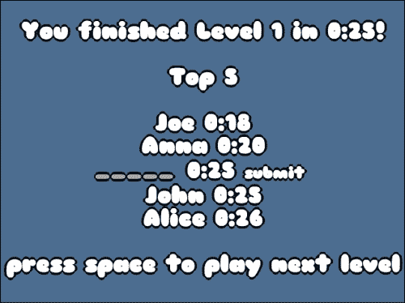
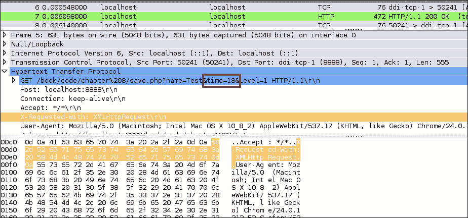
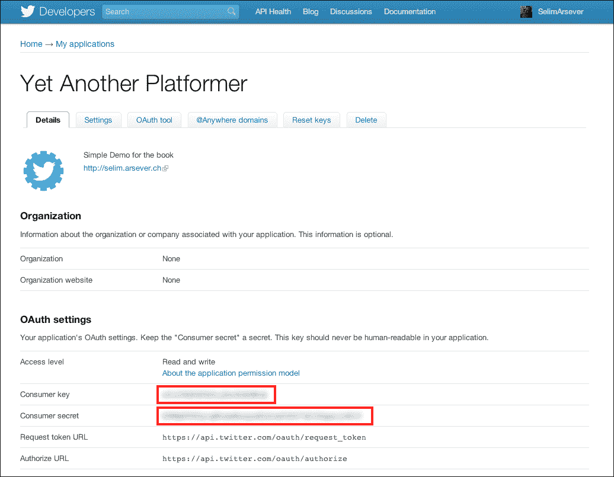
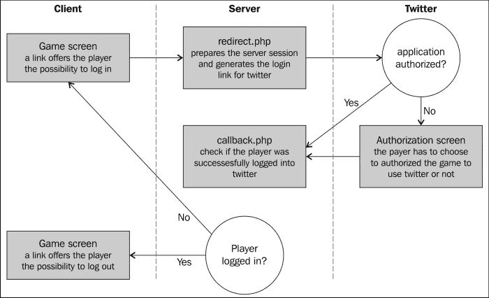
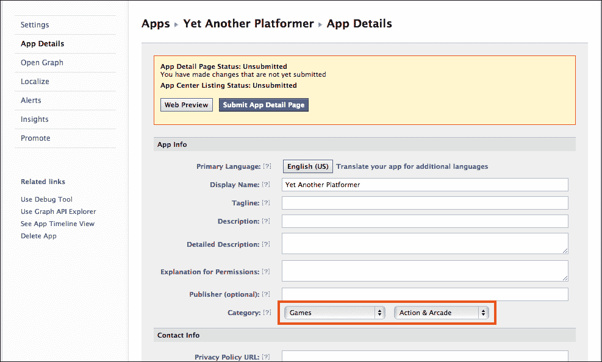

# 第八章。让我们变得社交

自第一款视频游戏诞生以来，一种简单的技术一直被用来保持它们的趣味性——**排行榜**。排行榜是让玩家继续玩你的游戏的一种简单方法。玩家将尝试每次表现都更好，超过他们的朋友，或者比世界上其他任何玩家表现更好。

社交网络通过允许游戏将玩家的得分发布到他/她的时间线（或动态）为这个简单的想法增加了一个新的维度。这有很多优点，其中一个是它将帮助潜在的新玩家了解你的游戏。如果他们看到他们的一个朋友刚玩了你的游戏，那么他们可能也想试试！

在本章中，我们首先将展示如何使用与前一章中看到的相同技术来实现一个简单的服务器端排行榜。然后，我们将看到如何允许玩家使用他/她的 Twitter 账户登入游戏并代表他/她发推文。

最后，我们将看到如何使用 Facebook 登入游戏，将事件发布到玩家的时间线，并创建成就。

当你使用 Facebook 或 Twitter 时，重要的是要意识到你必须小心遵循他们制定的规则，并且要随时了解规则的变化，以确保你的游戏合规。已经不止一次看到之前被允许使用这些服务的应用程序或游戏随后被禁止的情况。

我们将向您展示如何使用这两个社交网络，但是几乎任何提供相同功能的服务的基本机制都是相同的。

我们会按照以下顺序涵盖这些主题：

+   创建一个简单的自托管排行榜

+   使作弊变得更困难

+   将游戏与 Twitter 集成，以允许玩家发布他/她的得分

+   将游戏与 Facebook 集成，以允许玩家赢得成就

# 创建一个简单的排行榜

显然，创建排行榜将需要某种类型的数据库来保存分数。与上一章一样，我们将使用 PHP 和 MySQL 来实现游戏的服务器端。但是，与第七章 *制作一个多人游戏*不同，一起玩的方法在现实生活中可能是可行的。请求和保存高分是一个几乎不消耗服务器资源并且不经常调用的操作；对于每个用户，我们大约每 10 秒查询一次服务器，与我们在第七章 *制作一个多人游戏*中每秒多次查询服务器的情况相比，这次不是那么频繁。

首先，我们需要一个作为得分的度量标准。在这里，我们将简单地使用玩家完成一级所需的时间，单位为秒。以下的图表展示了我们将使用的用户互动工作流程：


作为用户界面，我们将使用两个屏幕，我们将以与上一章节界面相同的方式实现它们——简单的`div`元素，根据需要使它们可见或不可见。

第一个屏幕只是用来宣布级别的开始，并提示用户准备好。第二个屏幕更复杂。它显示玩家的结果、前五名玩家的列表，并且如果玩家得分属于其中之一，给予他/她将姓名保存到此列表的机会。以下截图显示了这将是什么样子：



我们选择使用这种机制而不是在游戏开始时询问用户的姓名，然后自动保存分数，因为这模仿了旧式街机游戏的行为。

这意味着有两个服务器端的动作：

1.  检索一个级别的前五名得分列表。

1.  为给定级别保存分数。

我们将用两个文件来实现这两个动作，分别是`highscore.php`和`save.php`。

## 保存高分

我们将使用的数据库表格有三列：

+   `Level`: 这是一个保存级别索引的整数。

+   `Name`: 这是一个保存用户名的字符串。

+   `Time`: 这是一个表示用户完成级别所用秒数的整数。

保存最高分的脚本非常简单——我们将传输姓名、分数和级别到服务器。然后我们将它们用以下 SQL 查询保存到数据库中：

```js
INSERT INTO scores (level, name, time) VALUES (1, "John", 36)
```

脚本的其余部分与我们在上一章中看到的非常相似，所以我们不会在这里重复，但如果你想要，你可以查看完整的源代码。

## 检索高分

要检索高分，你只需向服务器提供级别，然后得到分数即可，但我们选择了一个稍微复杂的机制。我们将决定当前用户是否属于前五名列表，并且如果是，则在哪个位置。这将允许你稍后实现防作弊措施。

因此，你将向服务器提供级别和用户的时间，它将返回一个 JSON 文件，其中包含生成排行榜屏幕所需的所有信息。我们选择了以下格式的 JSON：

```js
{ 
  "top" :[
    {"name": "Joe", "time": 14},
    {"name": "John", "time": 15}, 
 {"time": 17},
    {"name": "Anna", "time": 19}
  ],
 "intop": true, 
 "pos": 2
} 
```

这里的想法是有一个标志来指示玩家是否在前五名列表中，`intop`。如果这个标志为真，那么另一个名为`pos`的变量也存在。此变量保存数组`top`中保存玩家时间的索引。`top`数组的所有其他条目都是排行榜中玩家的分数，从第一到第五排序。如果`intop`为假，则数组仅保存其他玩家的分数。

为了生成这个响应，我们首先使用一个 SQL 查询：

```js
SELECT * FROM scores WHERE level=1 ORDER BY time ASC LIMIT 5
```

这个查询的开始和我们直到现在为止使用的其他查询类似，但在末尾（在上面的前面代码中突出显示）有一个修改器，指定了你希望结果按升序时间排序（`ORDER BY time ASC`）并且我们只需要五个结果（`LIMIT 5`）。

解析结果并生成 JSON 不需要做太多工作。唯一需要注意的细节是如果玩家的分数达到了要求，则需要插入玩家的分数。以下是此页面的完整代码：

```js
<?php
  session_start();

  include 'dbconnect.php';

  $time = $_GET['time'];
  $level = $_GET['level'];

  if(isset($time) && isset($level)){

    // JSON Object 
    $json = array('top'=>array(), 'intop'=>false);

    $query = 'SELECT * FROM scores WHERE level='.$level.' ORDER BY time ASC LIMIT 5';
    $result = mysqli_query($link, $query);
    $i=0;

    while ($obj = mysqli_fetch_object($result)) {
 if(!$json['intop'] && $time < $obj->time){
 $json['intop'] = true;
 $json['pos'] = $i;

 array_push($json['top'], array('time'=>$time));

 $i++;
 }
 if($i < 5){
        array_push($json['top'], array('time'=>$obj->time, 'name'=>$obj->name));
        $i++;
      }
    }

 if($i < 5 && !$json['intop']){
 $json['intop'] = true;
 $json['pos'] = $i;

 array_push($json['top'], array('time'=>$time));
 }

    mysqli_free_result($result);

    echo json_encode($json);
  }

  mysqli_close($link);
?>
```

此代码的突出部分处理了玩家的得分。

## 显示高分榜

在客户端，我们将生成带有结果的屏幕，并提供一个输入字段，允许玩家将其名称提交到排行榜中，如果他/她愿意的话。让我们看看执行此操作的代码：

```js
var finishedTime = Math.round((Date.now() - levelStart) / 1000);
  $.ajax({
    dataType: "json",
    url: "highscore.php",
    data: {
      level: currentLevel,
      time: finishedTime
    },
    async: false,
    success: function (json) {
      var top = "";
 for (var i = 0; i < json.top.length; i++){
 if(json.intop && json.pos === i){
 top += "<input id='name' placeholder='_____' size='5' />"
 + "<input id='timeScore' type='hidden' value='"+json.top[i].time+"'></input>"
 + "<input id='level' type='hidden' value='"+currentLevel+"'></input>"
 + " "+minSec(json.top[i].time)
 + " <a id='saveScore' href='#'>submit</a> <br>";
 } else {
 top += "" + json.top[i].name + " " + minSec(json.top[i].time) + "<br>";
 }
      }
      $("#top_list").html(top);
    }
  }).fail(function(a,b,c){
    var toto = "toto";
  });
```

生成列表本身的代码被突出显示了。在这里，我们创建了三个输入字段——一个用于玩家输入他/她的姓名，另外两个隐藏字段用于保存关卡号和玩家分数。它们后面跟着一个链接，用于提交分数。处理此链接的代码如下：

```js
$("#levelEnd").on("click","#saveScore",function(){
    $.get("save.php",{
      name: $("#name").val(),
      time: $("#timeScore").val(),
      level: $("#level").val()
    }, function(){
      $("#saveScore").fadeOut(500);
    });
    return false;
  });
```

在这里，我们简单地检索输入字段的值，然后将它们提交到服务器。作为对玩家的小反馈，一旦完成，我们就删除提交按钮。

# 加大作弊难度

避免作弊并没有通用的灵丹妙药。对于使用 JavaScript 编写的游戏来说尤其如此，因为它们的源代码非常容易访问。当然，你可以混淆你的代码，但这只会延缓真正有动力破解你的代码的人。然而，还有一些其他技术可以使在你的游戏中作弊变得更加困难或者效率更低。

## 服务器端验证

预防作弊最安全的方法是在服务器端进行操作。如果你还记得，在第七章中，我们在我们的 MMORPG 中的战斗机制中确实是这样做的，*Making a Multiplayer Game*。将相同的范式应用于平台游戏实际上意味着将每次按键都传输到服务器，并让服务器决定玩家的最终位置。

在大多数情况下，这不是一个现实的解决方案。但你仍然可以使用服务器端逻辑来验证玩家提交的分数。你可以在关卡中分布一系列不可见的检查点，在这些检查点上进行服务器的响应。如果用户提交了一个分数，而没有通过每一个检查点，那么肯定是有问题的。你还可以记录一系列指标，比如玩家死亡或跳跃的次数。

问题在于你必须真正为你的游戏定制验证方式；没有通用的方法。然而，非常重要的一点是，你的反作弊措施不应该将一个诚实的玩家标记为作弊者，因为那会引起很多沮丧。你还需要考虑要在这个领域投入多少精力，因为你在这方面花费的时间越多，你在游戏的其他领域花费的时间就越少。

对于您的游戏，我们将实现一些简单的东西。我们知道玩家的移动速度有多快，我们知道级别结束有多远，所以我们可以计算出玩家通过级别所需的最短时间。我们将把玩家的分数与此进行比较，如果不小，则进行验证。

要做到这一点，我们只需在`highscore.php`中添加这些行：

```js
// player walk may 7px in 30ms -> 233.1
$minTime = array(
 1 => 15, // 3500 / 233.1 
 2 => 15, // 3500 / 233.1 
 3 => 42, // 9800 / 233.1
 4 => 23 // 5460 / 233.1
);
$timeValid = !($minTime[intval($level)] < intval($time));
//...
while ($obj = mysqli_fetch_object($result)) {
  if(!$json['intop'] && $time < $obj->time && $timeValid){
    // ...
  }
```

如果玩家分数被检测为`impossible`，它仍将被显示，但玩家不会被提示输入他/她的姓名。

## 使您的变量不太易读

您可以做的一件事是通过在浏览器的检查器中打开并更改某个值，使作弊游戏变得更加困难，因为我们在发送回服务器之前使用隐藏的输入字段来存储值，以保存最高分。这在纯语义上是有意义的，并使我们的服务器端实现得到了休息，但非常容易被黑客入侵。以下截图显示了用户如果在 Chrome 的页面检查器中打开页面将会看到什么：


一个简单的经验法则是避免在 DOM 中存储任何重要信息，因为它对任何用户都是可访问的，即使是那些没有太多编程知识的用户也是如此。在我们的情况下，我们将从对`save.php`的调用中删除这些信息，并改用会话来存储这些值。在`highscore.php`中，我们可以简单地添加以下代码：

```js
if(!$json['intop'] && $time < $obj->time && $timeValid){
  $json['intop'] = true;
  $json['pos'] = $i;

  array_push($json['top'], array('time'=>$time));

 $_SESSION['level'] = $level;
 $_SESSION['time'] = $time;

  $i++;
}
```

`save.php`文件只需在会话中查找级别和时间：

```js
$name = $_GET['name'];
$time = $_SESSION['time'];
$level = $_SESSION['level'];
```

这个简单的改变已经使得游戏更难以作弊。

## 对代码进行混淆

对代码进行混淆是一个非常简单的步骤，但会对您有很大帮助。一旦您的代码被混淆，它在检查器中将几乎无法阅读。以下示例是要求排行榜的一段代码：

```js
if (status == "finished") {
  gameState = "menu";
  $("#level_nb_2").html(currentLevel);
  $("#level_nb_1").html(currentLevel + 1);

  var finishedTime = Math.round((Date.now() - levelStart) / 1000);
  $.ajax({
    dataType: "json",
    url: "highscore.php",
    data: {
      level: currentLevel,
      time: finishedTime
    },
    async: false,
    success: function (json) {
      var top = "";
      for (var i = 0; i < json.top.length; i++){
        if(json.intop && json.pos === i){
          top += "<input id='name' placeholder='_____' size='5' />"
            + "<input id='timeScore' type='hidden' value='"+json.top[i].time+"'></input>"
            + "<input id='level' type='hidden' value='"+currentLevel+"'></input>"
            + " "+minSec(json.top[i].time)
            + " <a id='saveScore' href='#'>submit</a> <br>";
        } else {
          top += "" + json.top[i].name + " " + minSec(json.top[i].time) + "<br>";
        }
      }
      $("#top_list").html(top);
    }
  }).fail(function(a,b,c){
    var toto = "toto";
  });

  $("#time").html(minSec(finishedTime));

  $("#levelEnd").fadeIn(2000, function(){
    $("#backgroundFront").css("background-position","0px 0px");
    $("#backgroundBack").css("background-position","0px 0px");
    gf.x(group, 0);

    tilemap = loadNextLevel(group);
    gf.x(player.div, 0);
    gf.y(player.div, 0);
    gf.setAnimation(player.div, playerAnim.jump);
  });
  status = "stand";
}
```

通过 UglifyJS 进行混淆后的相同代码看起来类似于以下内容：

```js
if("finished"==status){gameState="menu",$("#level_nb_2").html(currentLevel),$("#level_nb_1").html(currentLevel+1);var finishedTime=Math.round((Date.now()-levelStart)/1e3);$.ajax({dataType:"json",url:"highscore.php",data:{level:currentLevel,time:finishedTime},async:!1,success:function(a){for(var b="",c=0;a.top.length>c;c++)b+=a.intop&&a.pos===c?"<input id='name' placeholder='_____' size='5' /><input id='timeScore' type='hidden' value='"+a.top[c].time+"'></input>"+"<input id='level' type='hidden' value='"+currentLevel+"'></input>"+" "+minSec(a.top[c].time)+" <a id='saveScore' href='#'>submit</a> <br>":""+a.top[c].name+" "+minSec(a.top[c].time)+"<br>";$("#top_list").html(b)}}).fail(function(){}),$("#time").html(minSec(finishedTime)),$("#levelEnd").fadeIn(2e3,function(){$("#backgroundFront").css("background-position","0px 0px"),$("#backgroundBack").css("background-position","0px 0px"),gf.x(group,0),tilemap=loadNextLevel(group),gf.x(player.div,0),gf.y(player.div,0),gf.setAnimation(player.div,playerAnim.jump)}),status="stand"}
```

这已经更难调试了，同时，代码量更小！

## 使您的网络协议不太易读

一旦客户端代码修复好了，仍然有一个地方作弊者可以访问游戏变量——网络流量。让我们看看当玩家完成级别时，嗅探应用程序可以看到什么：



这是一个问题，因为即使不需要黑客客户端代码，玩家也可以简单地伪造一个带有正确信息的数据包来作弊。以下是您可以做的三件简单事情，使作弊者更难理解您的网络流量：

1.  为变量赋予随机名称，以便作弊者仅凭看它们就无法找出它们保存的值。

1.  对变量的内容进行编码。这对于此情况非常有用，因为在这里用户通常知道自己分数的值。他/她只需查找保存它的变量，就可以找出需要修改的内容。

1.  添加大量随机变量，以使很难知道哪些真正被使用了。

像以前一样，这只会让决心的玩家稍微难以作弊，但与以下各节中的所有其他技术结合起来，它可能会阻止大多数人。让我们实施这些技术。

### 编码数值

让我们首先开始编码数值。这可以用许多方式来完成，有些比其他更安全。在这里，我们的目标只是防止作弊者从值列表中搜索他/她的分数以确定哪个持有它。所以，我们不需要任何复杂的编码。我们将简单地使用左移（客户端上的`<<`）然后右移（服务器上的`>>`）。

这里是客户端代码：

```js
$.ajax({
  dataType: "json",
  url: "highscore.php",
  data: {
    level: currentLevel,
 time: finishedTime << 1
  },
  async: false,
  success: function (json) {
    // ...
  }
});
```

服务器端对应如下：

```js
$time = intval($_GET['time']) >> 1;
```

为了进一步迷惑用户，我们将以清晰的方式传输数值到许多其他变量中，这些变量在服务器端是无法读取的。

### 随机命名变量

这里没有太多需要解释的内容；只需替换变量的名称！如果你真的很偏执，那么每次调用服务器时都可以更改变量，但我们不会这样做。以下是客户端代码：

```js
$.ajax({
  dataType: "json",
  url: "highscore.php",
  data: {
 Nmyzsf: currentLevel,
 WfBCLQ: finishedTime << 1
  },
  async: false,
  success: function (json) {
    // ...
  }
});
```

服务器端代码如下：

```js
$time = intval($_GET['WfBCLQ']) >> 1;
$level = $_GET['Nmyzsf'];
```

### 添加随机变量

现在变量的名称不再传达它们的内容，非常重要的是你创建更多变量，否则很容易只是尝试每一个来找出哪一个包含分数。以下是您在客户端可能做的示例：

```js
$.ajax({
  dataType: "json",
  url: "highscore.php",
  data: {
 sXZZUj: Math.round(200*Math.random()),
 enHf8F: Math.round(200*Math.random()),
 eZnqBG: currentLevel,
 avFanB: Math.round(200*Math.random()),
 zkpCfb: currentLevel,
 PCXFTR: Math.round(200*Math.random()),
    Nmyzsf: currentLevel,
 FYGswh: Math.round(200*Math.random()),
 C3kaTz: finishedTime << 1,
 gU7buf: finishedTime,
 ykN65g: Math.round(200*Math.random()),
 Q5jUZm: Math.round(200*Math.random()),
 bb5d7V: Math.round(200*Math.random()),
 WTsrdm: finishedTime << 1,
 bCW5Dg: currentLevel,
 AFM8MN: Math.round(200*Math.random()),
 FUHt6K: Math.round(200*Math.random()),
    WfBCLQ: finishedTime << 1,
 d8mzVn: Math.round(200*Math.random()),
 bHxNpb: Math.round(200*Math.random()),
 MWcmCz: finishedTime,
 ZAat42: Math.round(200*Math.random())
  },
  async: false,
  success: function (json) {
    // ...
  }
});
```

服务器不需要做任何更改，因为这些新变量只是被忽略的。你可能想做一些事情，比如重复值，并在不会被使用的变量上使用玩家分数。

在做这些事情的同时，您必须非常小心地注释代码，以便记住哪些变量是正确的！

# 与 Twitter 集成

Twitter 是与其他人分享简单信息的绝佳方式。您可能希望以两种方式使用它：

+   允许玩家登录，从而提供一个唯一的用户名

+   允许玩家发布他/她在游戏中的最高分或进度

现在你将看到两种将你的游戏与之集成的可能性。

## Twitter 入门指南

有一种非常简单的方法可以使用 Twitter，甚至不需要您使用任何类型的 API。如果用户已经登录到 Twitter，您可以提示他/她通过打开一个 URL 提交一个预先写好的推文。这个 URL 的格式如下：

```js
http://twitter.com/home?status=Pre written status here!

```

此地址的突出部分是您为玩家编写的状态。我们在游戏中可以做的是在排行榜屏幕上的**提交**按钮旁提供一个`tweet` `this`链接：

```js
$.ajax({
  dataType: "json",
  url: "highscore.php",
  data: {
    // ...
  },
  async: false,
  success: function (json) {
    var top = "";
    for (var i = 0; i < json.top.length; i++){
      if(json.intop && json.pos === i){
        top += "<input id='name' placeholder='_____' size='5' />"
          + " "+minSec(json.top[i].time)
          + " <a id='saveScore' href='#'>submit</a>"
          + " <a id='tweetScore' target='_blank' href='http://twitter.com/home?status="+escape("I've just finished level "+currentLevel+" in YAP in "+minSec(json.top[i].time)+"!")+"'>tweet</a> <br>";
      } else {
        top += "" + json.top[i].name + " " + minSec(json.top[i].time) + "<br>";
      }
    }
    $("#top_list").html(top);
  }
});
```

突出显示的部分就是魔法发生的地方。您会注意到我们使用了 JavaScript 的`escape`函数来确保我们提供的字符串格式化为 URL。

这种方法非常容易实现，但有一些限制：

+   如果用户尚未登录，则必须先登录后才能发布推文。

+   您无法访问用户的 Twitter 账号来用于本地排行榜。这意味着如果玩家想要发送推文并节省时间，那么名字也必须在这里输入。

+   对于每条推文，都会打开一个新窗口，玩家必须确认。

如果您想要允许用户登录并自动发布推文，而无需每次都打开新窗口，则必须使用 Twitter 的 API。

## 获得完整的 Twitter API 访问权限

与 Twitter 集成的更完整的解决方案是要求用户允许将其账户连接到游戏。此基本机制使用 **OAuth**，这是一种得到很多公司支持的开放认证标准，如 Twitter、Google 和 Facebook。

要让玩家选择是否使用 Twitter 登录，我们将稍微更改启动屏幕：


如果玩家点击 **开始游戏**，那么他/她将开始游戏。如果他/她点击 **用 Twitter 登录**，那么他/她将被提示授权游戏与 Twitter，并然后返回游戏的启动屏幕。

### 在 Twitter 注册您的游戏

在做任何其他事情之前，您必须先在 Twitter 上注册您的游戏。要做到这一点，首先您需要登录 Twitter 开发者网站 ([`dev.twitter.com`](https://dev.twitter.com))。然后，您可以点击 **我的应用程序**：


在这里，您可以点击 **创建新应用**，填写所有必填字段，并同意 **规则** 条款和条件。一旦完成，您将收到一个屏幕提示，向您展示您新创建的应用程序的所有属性：



请注意此屏幕截图中的两个圈起来的代码区域；您稍后会需要它们。在这里还有一件您需要配置的事情。转到 **设置** 选项卡，滚动到 **应用程序类型**。这里，默认选择 **只读**。如果您想要能够代表用户发布推文，则需要将其更改为 **读写**：


就这样；你的游戏现在应该在 Twitter 方面正确配置了。

### 服务器端辅助库

您可以直接在 PHP 中实现与 Twitter API 的所有交互，但这将是繁琐的；幸运的是，存在许多库可以帮助您。PHP 的一个叫做 **twitteroauth**（[`github.com/abraham/twitteroauth`](http://github.com/abraham/twitteroauth)）。其他语言有其他库，所以不要犹豫，查看 Twitter 的开发者文档以了解更多信息。

twitteroauth 的非常好的一点是，你几乎可以将其安装在支持 PHP 的几乎任何类型的托管上。你只需要将库文件复制到与游戏文件相同的目录中即可。在我们的例子中，我们将它们复制到一个名为`twitter`的子目录中。

现在，您需要配置该库。为此，请从`twitteroauth`文件夹中打开`config.php`：

```js
define('CONSUMER_KEY', '(1)');
define('CONSUMER_SECRET', '(2)');
define('OAUTH_CALLBACK', '(3)');
```

在这个文件中，在`(1)`和`(2)`处，你必须写下你之前在 Twitter 开发者网站上的应用页面中记下的两个值。然后，在`(3)`处，你必须写下 twitteroauth 的`callback.php`文件的 URL。

最后一步是编辑`callback.php`，并用你游戏的索引文件的地址替换以下行：

```js
header('Location: ./index.php');
```

### 身份验证

这是用于使用 Twitter 对您的游戏进行身份验证和授权的工作流程：



这并不像看起来的那么复杂，而这个工作流程的一大部分已经由 twitteroauth 实现了。我们现在将创建一个带有**Twitter**按钮的登录页面。我们将使用一个简单的链接，指向 twitteroauth 的`redirect.php`文件。当玩家第一次点击它时，他/她将被重定向到 Twitter 网站上的一个页面，要求他/她授权该游戏：


然后，一旦玩家这样做，他/她将被重定向回您在`callback.php`文件中指定的 URL。如果玩家已经这样做过一次，他/她将能够直接登录。

从现在开始有用的是，在我们的 JavaScript 代码中知道玩家是否已经连接或没有。为此，让我们将我们的游戏 HTML 文件转换为 PHP 文件，并在其开头添加以下代码：

```js
<?php 
session_start();

require_once('twitter/twitteroauth/twitteroauth.php');
require_once('twitter/config.php');

/* Get user access tokens out of the session. */
$access_token = $_SESSION['access_token'];
$connection = new TwitterOAuth(CONSUMER_KEY, CONSUMER_SECRET, $access_token['oauth_token'], $access_token['oauth_token_secret']);
$user = $connection->get('account/verify_credentials');

?>
```

此代码启用了会话跟踪，包括`twitteroauth`库的一些文件，然后检查会话中是否存储了访问令牌。如果玩家使用 Twitter 登录，则会出现这种情况。

然后，服务器连接到 Twitter 以检索用户对象。这一切都很好，但 JavaScript 代码仍然对所有这些一无所知。我们需要的是创建一个自定义脚本，其中包含我们想要传输给客户端 JavaScript 的值：

```js
<script type="text/javascript">
<?php if($_SESSION['status'] == 'verified'){ ?>
  var twitter = true;
  var twitterName = "<?php print $user->screen_name; ?>";
<?php } else { ?>
  var twitter = false;  
<?php } ?>
</script>
```

现在，如果玩家使用 Twitter 登录，我们将全局变量`twitter`设置为`true`，并且全局变量`twitterName`保存玩家的屏幕名称。

你可能想做的最后一件事是向用户提供他/她已成功使用 Twitter 登录的反馈，并为他/她提供注销的可能性。为此，如果玩家已经登录，则我们将轻微更改开始屏幕：

```js
<div id="startScreen" class="screen">
 <?php if($_SESSION['status'] != 'verified'){ ?>
 <a class="button tweetLink" href="./twitter/redirect.php">Login with Twitter</a> 
 <?php } else { ?>
 <a class="button tweetLink" href="./twitter/clearsessions.php">Logout from Twitter</a>
 <?php }?>
  <a id="startButton"class="button" href="#">Start game</a>
</div>
```

通过这些相对较小的更改，您已经通过 Twitter 实现了身份验证。

### 在 Twitter 上发布高分

现在用户已连接到 Twitter，你可以让他/她以更无缝的方式发布他/她的时间。为此，我们将创建一个名为 `twitterPost.php` 的新的服务器端脚本。这个文件将使用 Twitter 的 `statuses/update` API。

让我们看看完整的脚本：

```js
<?php
session_start();
require_once('twitter/twitteroauth/twitteroauth.php');
require_once('twitter/config.php');

$time = $_SESSION['time'];
$level = $_SESSION['level'];
if(isset($time) && isset($level)){
  /* Get user access tokens out of the session. */
  $access_token = $_SESSION['access_token'];
  $connection = new TwitterOAuth(CONSUMER_KEY, CONSUMER_SECRET, $access_token['oauth_token'], $access_token['oauth_token_secret']);

 $parameters = array('status' => 'I\'ve just finished level '.$level.' for Yet Another Platformer in '.$time.' seconds!');
 $status = $connection->post('statuses/update', $parameters); 
}
?> 
```

你可能会认出我们在游戏页面开头添加的大部分代码（只有高亮部分是新的）。最后两行代码创建并发送到 Twitter 你想要发布的状态。这很简单直接，但我们可以做的更多——因为玩家已登录，你知道他/她的用户名，你可以用来制作排行榜。

在客户端代码中，我们将生成一个稍微不同版本的排行榜，如下所示：

```js
$.ajax({
  dataType: "json",
  url: "highscore.php",
  data: {
    // ...
  },
  async: false,
  success: function (json) {
    var top = "";
    for (var i = 0; i < json.top.length; i++){
      if(json.intop && json.pos === i){
 if (twitter){
 top += "<input id='name' type='hidden' val='"+twitterName+"'/>"
 + twitterName + " " + minSec(json.top[i].time)
 + " <a id='saveScore' href='#'>submit</a>"
 + " <a id='tweetScore' href='#'>tweet</a> <br>";
 } else {
          top += "<input id='name' placeholder='_____' size='5' />"
          + " "+minSec(json.top[i].time)
          + " <a id='saveScore' href='#'>submit</a>"
          + " <a target='_blank' href='http://twitter.com/home?status="+escape("I've just finished level "+currentLevel+" in YAP in "+minSec(json.top[i].time)+"!")+"'>tweet</a> <br>";
        }
      } else {
        top += "" + json.top[i].name + " " + minSec(json.top[i].time) + "<br>";
      }
    }
    $("#top_list").html(top);
  }
});
```

在这里，我们将包含玩家名称的输入字段隐藏起来，并填入用户的用户名。然后，在排行榜中写入用户名。这个好处是，服务器端代码完全不需要改变。

这就是我们在 Twitter 中实现的所有内容了，但我鼓励你去看一看完整的 Twitter API，并且发挥创造力！

# 与 Facebook 集成

在很多方面，与 Facebook 的集成类似于与 Twitter 的集成。然而，Facebook 提供了更多的游戏定向。在我们的情况下，我们将为已登录用户实施成就。我们将使用 Facebook 的 PHP SDK，但也支持其他语言。

至于 Twitter，我们需要首先在 Facebook 中注册我们的应用程序。要做到这一点，登录到 Facebook 的开发者网站（[`developers.facebook.com/`](https://developers.facebook.com/)）并点击页眉中的 **Apps**：


然后，点击 **Create New Apps** 并填写所需的信息。然后你将看到新创建的应用程序页面。在这里，你需要记下下面截图中显示的两个值（就像我们为 Twitter 所做的那样）：


如果你看一下上述截图中的红色箭头，你会注意到你可以选择你的应用和 Facebook 将如何交互。要完全访问 Facebook 的 Open Graph API，其中包括发布成就在内，你需要选择 **App on Facebook**。

这将允许你的游戏加载到 Facebook 的 iframe 中。不过，你需要在你的域名上安装有效的 HTTPS 证书。但是，如果你只希望你的游戏从你自己的服务器加载，那么你就不需要任何（你仍然需要在相应字段中输入一个地址，并且你可以简单地在你的不安全地址前加上 `https` 来使其有效）。

有一个最后需要做的步骤，即使你的 Facebook 应用程序能够提供成就——将它注册为游戏。要做到这点，只需在左侧点击 **App Details**。然后，在 **App Info** | **Category** 下选择 **Games**，如下面的截图所示：



## 与 Facebook 进行身份验证

Facebook 的基本身份验证机制与 Twitter 的非常相似。然而，关于访问的一个小差别在于，在 Twitter 中，您必须定义您的应用程序在开发者网站上需要读取和写入访问权限，而在 Facebook 中，您要求用户的访问权限的细粒度要高得多，只有在登录阶段才能指定这些。

让我们来看看身份验证所需的代码。就像对于 Twitter 一样，我们将首先编写在游戏文件的开头尝试获取用户的指令：

```js
<?php 
session_start();

// Twitter ... 

// Facebook
require 'facebook/facebook.php';

$app_id = '(1)';
$app_secret = '(2)';
$app_namespace = 'yap_bookdemo';
$app_url = 'http://yetanotherplatformer.com/';
$scope = 'publish_actions';

$facebook = new Facebook(array(
  'appId' => $app_id,
  'secret' => $app_secret,
));

// Get the current user
$facebookUser = $facebook->getUser();

?>
```

突出显示的行定义了我们希望我们的游戏能够在玩家的时间轴上发布条目。值`(1)`和`(2)`是你在应用程序配置页面中记录的值。

如果`$facebookUser`为空，这意味着用户已经登录，否则我们将不得不显示一个登录按钮。为此，我们将编写一个与我们为 Twitter 编写的代码非常相似的代码：

```js
<div id="startScreen" class="screen">
  ...
 <?php if(!$facebookUser){ 
 $loginUrl = $facebook->getLoginUrl(array(
 'scope' => $scope,
 'redirect_uri' => $app_url
 ));
 ?>
 <a class="button tweetLink" href="<?php print $loginUrl; ?>">Login with Facebook</a>
 <?php } else { 
 $logoutUrl = $facebook->getLogoutUrl(array(
 'next' => $app_url
 )); 
  ?>
    <a class="button tweetLink" href="<?php print $logoutUrl; ?>">Logout from Facebook</a>
  <?php } ?>
  <a id="startButton"class="button" href="#">Start game</a>
</div>
```

在这里，您可以看到 Facebook 的 PHP SDK 提供了一个方便的方法来生成用户登录或注销的 URL。

现在，我们将添加一小段代码来指示 JavaScript 代码用户是否已经登录到 Facebook。再一次，这里的代码与我们用于 Twitter 的代码非常相似：

```js
<script type="text/javascript">
   // ...
  <?php if($facebookUser){ ?>
    var facebook = true;
    var facebookId = "<?php print $facebookUser; ?>";
  <?php } else { ?>
    var facebook = false;  
  <?php } ?>
</script>
```

## 创建成就

现在我们将为我们的游戏创建一个成就。为此，您需要在服务器上有两个文件：

+   一个具有一系列`meta`标签的 HTML 文件

+   一幅图像文件，将在玩家的时间轴上代表成就

HTML 文件不仅作为成就的配置文件，还将链接到在您玩家的时间轴上发布的成就。为了使 Facebook 认可成就有效，您需要在头部定义以下七个`meta`标签：

+   `og:type`包含值`game.achievement`。它区分了成就与其他类型的 OpenGraph 实体。

+   `og:title`是成就的非常简短的描述。

+   `og:url`是当前文件的网址。

+   `og:description`是成就的较长描述。

+   `og:image`是前面提到的图像。它可以是 PNG、JPEG 或 GIF 格式，并且至少有 50 x 50 像素的大小。最大的长宽比是 3:1。

+   `game:points`是与此成就相关联的积分数。总共，您的游戏不能给出超过 1000 点，最小允许的数字是 1。具有更高点值的成就将更有可能显示在玩家的好友的新闻动态中。

+   `fb:app_id`是您的应用程序的 ID。

HTML 文件的正文可以是一个很好的页面，解释这个成就到底是什么，或者任何你真正想要的东西。一个完整的成就页面的非常简单的例子如下：

```js
<html> 
  <head>
    <meta property="og:type" content="game.achievement" />
    <meta property="og:title" content="Finished level 1" />
    <meta property="og:url" content="http://8bitentropy.com/yap/ach1.html" />
    <meta property="og:description" content="You just finished the first level!" />
    <meta property="og:image" content="http://8bitentropy.com/yap/ach1.png" />
    <meta property="game:points" content="50" />
    <meta property="fb:app_id" content="(1)" />
  </head>
  <body>
    <h1>Well done, you finished level 1!</h1>
  </body>
</html>
```

生成的成就将会在玩家的时间轴上显示如下截图：


但仅仅写这份文档还不足以完全配置您的成就。您需要将其提交给 Facebook。为了做到这一点，您必须在正确的 URL 上使用正确的参数进行`POST`请求。这个请求还应该关联一个应用程序令牌。

应用程序令牌是 Facebook 确保通信对象真的是您的游戏而不是其他应用程序的一种方式。最简单的方法是编写一个 PHP 页面来提交您的成就。下面是完整代码：

```js
<?php

require 'facebook/facebook.php';

$app_id = '(1)';
$app_secret = '(2)';
$app_namespace = 'yap_bookdemo';
$app_url = 'http://yetanotherplatformer.com/';
$scope = 'publish_actions';

$facebook = new Facebook(array(
  'appId' => $app_id,
  'secret' => $app_secret,
));

$app_access_token = get_app_access_token($app_id, $app_secret);
$facebook->setAccessToken($app_access_token);

$response = $facebook->api('/(1)/achievements', 'post', array(
 'achievement' => 'http://yetanotherplatformer.com//ach1.html',
));

print($response);

// Helper function to get an APP ACCESS TOKEN
function get_app_access_token($app_id, $app_secret) {
  $token_url = 'https://graph.facebook.com/oauth/access_token?'
   . 'client_id=' . $app_id
   . '&client_secret=' . $app_secret
   . '&grant_type=client_credentials';

  $token_response =file_get_contents($token_url);
  $params = null;
  parse_str($token_response, $params);
  return $params['access_token'];
}

?>
```

这段代码非常冗长，但您将会认出其中大部分内容。重要部分已经标出——首先，我们检索应用程序令牌，然后将其与将来的请求关联，最后使用 SDK 进行`POST`请求。

这个`POST`请求的地址格式如下："应用程序 ID" / "achievements"。传输的参数就是成就文件的 URL。

由于此处生成的错误消息（如果出现问题）可能相当难以理解，您可能首先希望使用 Facebook 提供的调试工具对成就文件进行验证，网址为[`developers.facebook.com/tools/debug/`](https://developers.facebook.com/tools/debug/)。

## 发布成就

现在 Facebook 已经注册了成就，我们可以将其授予我们的玩家。执行这个命令也是一个`POST`请求，必须关联一个应用程序令牌。为了简单起见，我们将创建一个简单的 PHP 页面，在被调用时授予成就。在现实情况下，这绝不是最佳方案，在那种情况下，您希望避免让用户自行调用这个文件。您可以在`highscore.php`文件中授予成就。

这是该文件的完整代码；它与我们用来注册成就的文件非常相似，不同之处已经标出：

```js
<?php 
session_start();

// Facebook
require 'facebook/facebook.php';

$app_id = '(1)';
$app_secret = '(2)';
$app_namespace = 'yap_bookdemo';
$app_url = 'http://yetanotherplatformer.com/';
$scope = 'publish_actions';

$facebook = new Facebook(array(
  'appId' => $app_id,
  'secret' => $app_secret,
));

// Get the current user
$facebookUser = $facebook->getUser();

$app_access_token = get_app_access_token($app_id, $app_secret);
$facebook->setAccessToken($app_access_token);

$response = $facebook->api('/'.$facebookUser.'/achievements', 'post', array(
 'achievement' => 'http://yetanotherplatformer.com/ach1.html'
));

print($response);

// Helper function to get an APP ACCESS TOKEN
function get_app_access_token($app_id, $app_secret) {
  ...
}

?>
```

这次，我们创建一个`POST`请求到一个 URL，格式为："用户 ID" / "achievements"。现在，我们只需在用户完成第一关时从游戏中异步调用此文件：

```js
if (status == "finished") {
  ...
 if(facebook && currentLevel === 1){
 $.get("ac h1.php");
 }
  ...
```

# 概要

在这一章中，我们学到了很多，尽管我们只是探索了新工具所可能具有的社交互动的表面。Facebook 和 Twitter 的 API 非常庞大且不断变化。如果您希望以最佳方式使用它们，我真的建议阅读它们的完整文档。

但是，当使用第三方服务时，尤其是免费的那些，您必须意识到您变得依赖它们了。它们可以随时更改任何内容，而不会通知您太多。它们可以决定不再让您的游戏使用它们的服务。始终记住这一点，如果可能的话，确保您在这些情况下有一个退出策略！

在下一章中，我们将探讨另一个热门话题——使你的游戏适用于移动设备！为此，我们将把我们的平台游戏扩展到可以在现代智能手机和平板电脑上运行。
