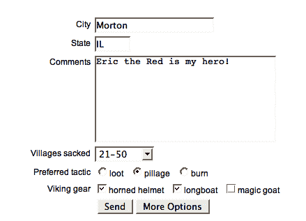
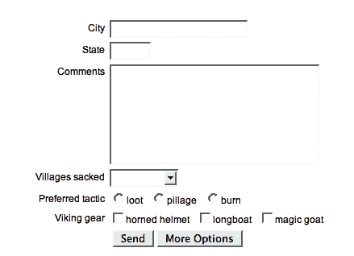
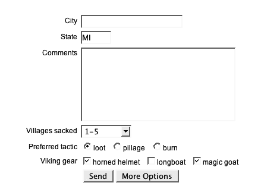

# 第十一章 表单插件

> 你最好找出来
> 
> 在你填写空白之前
> 
> —Devo,
> 
> "找出"

**Form** 插件是一个很好的例子，它使得一个困难、复杂的任务变得非常简单。它帮助我们以 AJAX 方式提交表单（即使表单包含文件上传字段），以及检查和操作表单字段的内容。

# AJAX 表单提交

这些方法有助于使用 AJAX 调用将表单内容提交到服务器。

## .ajaxSubmit()

| 发送表单内容到服务器而不刷新页面。

```js
.ajaxSubmit(success)
.ajaxSubmit(options)

```

|

### 参数 (第一个版本)

+   `success`：当服务器成功响应时执行的回调。

### 参数 (第二个版本)

+   `options`：配置提交的选项的映射。可以包含以下项目：

    +   `url` (可选)：表单将被提交到的 URL。默认值为表单的 `action` 属性值，如果没有找到则为当前页面的 URL。

    +   `type` (可选)：提交表单时要使用的方法（`GET` 或 `POST`）。默认值为表单的 `method` 属性值，如果没有找到则为 `GET`。

    +   `beforeSubmit` (可选)：在发送请求之前执行的回调。

    +   `dataType` (可选)：如何解释响应数据。可以是 `'xml', 'script'` 或 `'json'`。

    +   `target` (可选)：响应 HTML 将放置的元素。可以是选择器字符串、jQuery 对象或 DOM 元素引用。仅当省略 `dataType` 时有效。

    +   `success` (可选)：当服务器成功响应时执行的回调。

    +   `semantic` (可选)：是否强制 HTML 字段的严格排序。默认值为 `false`。

    +   `resetForm` (可选)：一个布尔值，指示在成功提交后将表单值重置为默认值。默认值为 `false`。

    +   `clearForm` (可选)：一个布尔值，指示是否在成功提交后清除表单值。默认值为 `false`。

### 返回值

用于链接目的的 jQuery 对象。

### 讨论

`.ajaxSubmit` 方法使用提供的 `url` 和 `type` 信息发起一个 AJAX 请求，同时使用表单中当前存在的数据。表单内容使用 `.formToArray` 方法进行编码，而文件上传等细节则在幕后处理。

如果使用 `beforeSubmit` 选项提供了回调函数，则在发送请求之前将触发该回调。这给我们一个机会来进行最后一分钟的验证或清理。如果验证程序检测到用户必须更正的错误，程序可以返回 `false` 阻止表单提交。回调函数通过由 `.formToArray()` 返回的表单数据、引用表单的 jQuery 对象以及提供给 `.ajaxSubmit()` 的选项对象来传递。有关此回调函数的示例，请查看后面关于 `.ajaxForm()` 的讨论中的示例。

当提供了`dataType`时，响应数据将相应地进行解释。所执行的处理与支持的数据类型的`$.ajax`函数相同。任何`script`响应都将被解释为 JavaScript 并在全局上下文中执行，而`json`响应将被解析为 JavaScript 对象或数组。指定`xml`数据类型的调用在接收到响应时不会引起任何解析。

如果未提供`dataType`，则可以使用`target`选项。目标引用的 DOM 元素将被填充为 AJAX 请求的响应，解释为纯 HTML。`dataType`和`target`选项是互斥的。

在由于`dataType`或`target`选项而执行了任何相关处理后，将执行`success`回调。此函数会提供响应数据以进行操作。有关解释和操作响应数据的方法，请参见第七章中的`$.ajax`函数讨论。

`semantic`标志以执行速度为代价强制使用严格的语义排序。有关更多信息，请参见稍后的`.formToArray()`讨论。

如果`resetForm`或`clearForm`设置为`true`，则在执行`success`回调（如果提供）之前会执行相应的操作。有关这些操作的更多信息，请参见稍后的`.clearForm`和`.resetForm`方法讨论。

如果要提交的表单包含文件上传字段，则文件数据将使用`multipart/form-data` MIME 类型正确上传。无需采取进一步操作。

请注意，`.ajaxSubmit`方法会立即执行。由于通常在单击提交按钮时发出 AJAX 请求，因此通常更方便使用`.ajaxForm`方法。但是，`.ajaxSubmit()`的直接操作可能是实现此插件与其他插件（如流行的**Validation**插件）之间交互的最简便方法。

## .ajaxForm()

| 准备一个表单以进行自动 AJAX 提交。

```js
.ajaxForm(options)
```

|

### 参数

+   `options`：配置提交的选项映射。可以包含以下项目（这些项目将原样传递给`.ajaxSubmit()`）：

    +   `url`（可选）：表单将提交到的 URL。默认值为表单的`action`属性值，如果找不到则为当前页面的 URL。

    +   `type`（可选）：提交表单时使用的方法（`GET`或`POST`）。默认值为表单的`method`属性值，如果找不到则为`GET`。

    +   `beforeSubmit`（可选）：在发送请求之前执行的回调。

    +   `dataType`（可选）：响应数据的解释方式。可以是`'xml'，'script'`或`'json'`。

    +   `target`（可选）：将响应 HTML 放置到其中的元素。可以是选择器字符串、jQuery 对象或 DOM 元素引用。仅当省略`dataType`时有效。

    +   `success`（可选）：服务器成功响应时执行的回调。

    +   `semantic`（可选）：是否强制使用严格的 HTML 字段顺序。默认值为 `false`。

    +   `resetForm`（可选）：一个布尔值，指示在成功提交后是否将表单值重置为默认值。默认值为 `false`。

    +   `clearForm`（可选）：一个布尔值，指示在成功提交后是否清除表单值。默认值为 `false`。

### 返回值

jQuery 对象，用于链式调用目的。

### 讨论

`.ajaxForm` 方法通过 AJAX 准备表单以供稍后提交。当提交表单时，AJAX 请求将使用提供的 `url` 和 `type` 信息以及当前在表单中的数据。表单内容使用 `.formToArray` 方法进行编码，并且诸如文件上传之类的复杂性在幕后处理。

与 `.ajaxSubmit` 方法不同，`.ajaxForm` 方法不会导致立即操作。相反，它将处理器绑定到表单的 `submit` 事件和表单按钮的 `click` 事件，从而导致表单内容作为 AJAX 请求发送。这消除了设置 AJAX 表单的一些工作。

此外，`.ajaxForm` 方法能够模拟标准表单提交的其他方面，而`.ajaxSubmit` 方法则不能。当 `.ajaxForm()` 执行时，包括被点击的提交按钮的名称和值在内的请求会被包含在其中。此外，当表单包含一个类型为 `image` 的 `<input>` 字段时，`.ajaxForm()` 可以捕获鼠标坐标并将它们与请求一起发送。

为了获得最佳效果，在使用图像输入时，**Dimensions** 插件也应该存在。Form 插件将自动检测 Dimensions 的存在，并在可能的情况下使用它。

`.ajaxForm` 方法可用于包含任何标准字段类型的表单：

```js
<form id="test-form" name="test-form" action="submit.php" method="post">
  <div class="form-row">
    <label for="city">City</label>
    <input type="text" id="city" name="city" size="20" />
  </div>
  <div class="form-row">
    <label for="state">State</label>
    <input type="text" id="state" name="state" size="5" value="MI" />
  </div>
  <div class="form-row">
    <label for="comment">Comments</label>
    <textarea id="comment" name="comment" rows="8" cols="30">
    </textarea>
  </div>

  <div class="form-row">
    <label for="sacks">Villages sacked</label>
    <select name="villages" id="villages">
      <option value="0">none</option>
      <option value="5" selected="selected">1-5</option>
      <option value="10">6-10</option>
      <option value="20">11-20</option>
      <option value="50">21-50</option>
      <option value="100">51-100</option>
      <option value="more">over 100</option>
    </select>
  </div>
  <div class="form-row multi">
    <span class="multi-label">Preferred tactic</span>
    <input type="radio" name="tactic" value="loot" id="loot" checked="checked" /><label for="loot">loot</label>
    <input type="radio" name="tactic" value="pillage" id="pillage" /><label for="pillage">pillage</label>
    <input type="radio" name="tactic" value="burn" id="burn" /><label for="burn">burn</label>
  </div>

  <div class="form-row multi">
    <span class="multi-label">Viking gear</span>
    <input type="checkbox" name="gear[helmet]" value="yes" id="helmet" checked="checked" /><label for="helmet">horned helmet</label>
    <input type="checkbox" name="gear[longboat]" value="yes" id="longboat" /><label for="pillage">longboat</label>
    <input type="checkbox" name="gear[goat]" value="yes" id="goat" checked="checked"/><label for="goat">magic goat</label>
  </div>

  <div class="form-row buttons">
    <input type="submit" id="submit" name="submit" value="Send" />
    <input type="button" id="more" name="more" value="More Options" />
  </div>
</form>
```

要准备表单进行提交，我们只需要在 DOM 就绪时调用 `.ajaxForm()` 一次。

```js
$(document).ready(function() {
  $('#test-form').ajaxForm({
     target: '.log'
  });
});
```

用户随后可以填写表单字段：



当稍后点击**发送**按钮时，服务器将接收到所有表单信息，而无需浏览器刷新。为了测试目的，我们可以使用 PHP 的 `print_r` 函数来显示已发布的表单内容：

```js
Array
(
    [city] => Morton
    [state] => IL
    [comment] => Eric the Red is my hero!
    [villages] => 50
    [tactic] => pillage
    [gear] => Array
        (
            [helmet] => yes
            [longboat] => yes
        )

    [submit] => Send
)
```

如果使用 `beforeSubmit` 选项提供回调函数，则在发送请求之前将触发回调。回调以由 `.formToArray()` 返回的表单数据、引用表单的 jQuery 对象和提供给 `.ajaxForm()` 的选项对象作为参数传递。此回调主要用于执行表单验证：

```js
$(document).ready(function() {
  $('#test-form').ajaxForm({
     target: '.ajax-form .log',
     beforeSubmit: function(formData, $form, options) {
       if ($form.find('#city').val() == '') {
         alert('You must enter a city.');
         return false;
       }
     }
  });
});
```

如果验证例程检测到用户必须更正的错误，则该例程可以返回 `false` 以防止提交表单。在我们的示例中，**城市**字段必须输入一个值，否则将显示警报并且不会提交。

当提供了`dataType`时，响应数据将相应地进行解释。执行的处理与`$.ajax`函数相同，适用于支持的数据类型。任何`script`响应都将被解释为 JavaScript 并在全局上下文中执行，而`json`响应将被解析为 JavaScript 对象或数组。指定`xml`数据类型的调用在接收到响应时不会引起任何解析。

如果未提供`dataType`，则可以使用`target`选项。由目标引用的 DOM 元素将填充为 AJAX 请求的响应，解释为纯 HTML。`dataType`和`target`选项是互斥的。

在由于`dataType`或`target`选项而执行了任何相关处理后，将执行`success`回调。此函数被给予响应数据以便执行操作。有关解释和操作响应数据的方法，请参见第七章中的`$.ajax`函数讨论。

`semantic`标志以执行速度为代价强制执行严格的语义顺序。有关更多信息，请参见稍后的`.formToArray()`讨论。

如果`resetForm`或`clearForm`设置为`true`，则会在执行`success`回调（如果提供）之前执行相应的操作。有关这些操作的更多信息，请参见稍后的`.clearForm`和`.resetForm`方法讨论。

如果要提交的表单包含文件上传字段，则文件数据将使用`multipart/form-data` MIME 类型正确上传。无需采取进一步的操作。

## .ajaxFormUnbind()

| 将表单恢复到其非 AJAX 状态。

```js
.ajaxFormUnbind()

```

|

### 参数

无。

### 返回值

用于链接目的的 jQuery 对象。

### 讨论

在表单上调用`.ajaxForm()`会将处理程序绑定到表单的`submit`事件以及其中任何按钮和图像输入的`click`事件上。如果以后表单不再使用 AJAX 提交，我们可以在同一表单上调用`.ajaxFormUnbind()`来移除这些处理程序，而不会中断可能已绑定到表单元素的任何其他处理程序。

# 检索表单值

这些方法允许脚本读取和转换 Web 表单中字段的值。

## .formToArray()

| 将表单中的值收集到对象数组中。

```js
.formToArray([semantic])
```

|

### 参数

+   `semantic`（可选）：是否强制执行字段的严格 HTML 排序。默认值为`false`。

### 返回值

一个对象数组，每个对象代表表单中的一个字段。

### 讨论

`.formToArray`方法获取表单的值，并将它们组织成适合传递给 jQuery AJAX 函数（如`$.ajax(), $.post()`和`.load()`）的数据结构。它可以处理具有任何标准字段类型的表单。

给定在`.ajaxFor()`讨论中说明的表单，`.formToArray`方法将返回一个 JavaScript 数组，其中包含表单的值：

```js
[
  {name: city, value: Morton},
  {name: state, value: IL},
  {name: comment, value: Eric the Red is my hero!},
  {name: villages, value: 50},
  {name: tactic, value: pillage},
  {name: gear[helmet], value: yes},
  {name: gear[longboat], value: yes}
]
```

数组中的每个对象都有`name`和`value`属性。未选中的复选框元素不会在数组中表示。

如果将`semantic`参数设置为`true`，则数组中列出的字段将保证按照它们在 HTML 源代码中的顺序排序。如果表单中不包含`<input>`类型为`image`的元素，则这已经是事实。除非需要，否则避免使用此选项，因为涉及的额外处理会减慢方法的速度。

## .formSerialize()

| 将表单中的值收集到序列化字符串中。

```js
.formSerialize([semantic])
```

|

### 参数

+   `semantic`（可选）：是否强制严格的 HTML 字段排序。默认值为`false`。

### 返回值

适合提交的表单字段的字符串表示。

### 讨论

`.formSerialize`方法获取表单的值，并将其转换为适合作为`GET`请求的查询字符串传递的字符串。它可以处理任何标准字段类型的表单。

考虑到在`.ajaxFor()`讨论中所示的表单，`.formSerialize`方法将返回表单值的字符串表示：

```js
city=Morton&state=IL&comment=Eric%20the%20Red%20is%20my%20hero!
  &villages=50&tactic=pillage&gear%5Bhelmet%5D=yes
  &gear%5Blongboat%5D=yes
```

每个字段在字符串中显示为键值对。未选中的复选框元素不会在字符串中表示。字符串根据需要进行 URL 编码。

如果将`semantic`参数设置为`true`，那么字符串中列出的字段将保证按照它们在 HTML 源代码中的顺序排序。如果表单中不包含`<input>`类型为`image`的元素，则这已经是事实。除非需要，否则避免使用此选项，因为涉及的额外处理会减慢方法的速度。

## .fieldSerialize()

| 将一组字段的值收集到序列化字符串中。

```js
.fieldSerialize([successful])
```

|

### 参数

+   `successful`（可选）：是否修剪包含的字段值以获取成功的字段。默认值为`true`。

### 返回值

适合提交的表单字段的字符串表示。

### 讨论

类似于之前的`.formSerialize`方法，`.fieldSerialize`方法获取表单的值，并将其转换为适合作为`GET`请求的查询字符串传递的字符串。然而，`.fieldSerialize()`作用于一个引用单个字段而不是整个表单的 jQuery 对象上。

它可以处理任何标准类型的字段，例如`<select>`菜单：

```js
<select name="villages" id="villages">
  <option value="0">none</option>
  <option value="5" selected="selected">1-5</option>
  <option value="10">6-10</option>
  <option value="20">11-20</option>
  <option value="50">21-50</option>
  <option value="100">51-100</option>
  <option value="more">over 100</option>
</select>
```

用户可以选择任何选项：


值从当前选择的选项中获取，并且`.fieldSerialize`方法将返回此值的字符串表示：

```js
villages=50

```

每个给定的字段在字符串中显示为键值对。未选中的复选框元素不会在字符串中表示。字符串根据需要进行 URL 编码。

默认情况下，如果字段不成功，则不会在字符串中表示它们，如 HTML 表单的 W3C 规范中所定义：

[`www.w3.org/TR/html4/interact/forms.html#h-17.13.2`](http://www.w3.org/TR/html4/interact/forms.html#h-17.13.2)

成功的字段是在正常表单提交操作期间提交到服务器的字段。例如，当前选中的复选框是成功的；未选中的不是。很少会想要不成功字段的值，但如果需要，可以将`.fieldSerialize()`的`successful`参数设置为`false`。

在`.ajaxFor()`讨论中所示的表单中，当`successful`设置为`true`时，`.fieldSerializer()`仅包括选中的单选按钮和复选框：

```js
tactic=loot&gear%5Bhelmet%5D=yes&gear%5Bgoat%5D=yes

```

但是当`successful`设置为`false`时，`fieldSerializer()`也包括未选中的选项：

```js
tactic=loot&tactic=pillage&tactic=burn&gear%5Bhelmet%5D=yes
  &gear%5Blongboat%5D=yes&gear%5Bgoat%5D=yes
```

## `.fieldValue()`

| 将一组字段的值收集到一个字符串数组中。

```js
.fieldValue([successful])
$.fieldValue(element[, successful])

```

|

### 参数（第一个版本）

+   `successful`（可选）：是否将包含的字段值修剪为成功的值。默认值为`true`。

### 参数（第二个版本）

+   `element`：要检索其值的表单输入元素。

+   `successful`（可选）：是否将包含的字段值修剪为成功的值。默认值为`true`。

### 返回值

一个包含字段值的字符串数组。

### 讨论

`.fieldValue()`方法和`$.fieldValue()`函数都会获取表单的值，并将它们作为字符串数组返回。`.fieldValue()`方法作用于引用单个字段的 jQuery 对象，而`$.fieldValue()`函数在其第一个参数作为字段元素时执行相同的任务。

这些操作可以处理任何标准类型的字段，比如`<select>`菜单：

```js
<select name="villages" id="villages">
  <option value="0">none</option>
  <option value="5" selected="selected">1-5</option>
  <option value="10">6-10</option>
  <option value="20">11-20</option>
  <option value="50">21-50</option>
  <option value="100">51-100</option>
  <option value="more">over 100</option>
</select>
```

用户随后可以选择任何选项：


该值从当前选定的选项中获取，并且`.fieldValue()`方法将以数组表示此值：

```js
[50]

```

给定的每个字段都以数组中的字符串形式出现。未选中的复选框元素不会在数组中表示。

默认情况下，如果字段在 W3C HTML 表单规范中定义的不成功，则不会在数组中表示这些字段：

[`www.w3.org/TR/html4/interact/forms.html#h-17.13.2`](http://www.w3.org/TR/html4/interact/forms.html#h-17.13.2)

成功的字段是在正常表单提交操作期间提交到服务器的字段。例如，当前选中的复选框是成功的；未选中的不是。很少会想要不成功字段的值，但如果需要，可以将`.fieldValue()`的`successful`参数设置为`false`。

在`.ajaxFor()`讨论中所示的表单中，当`successful`设置为`true`时，`.fieldValue()`仅包括选中的单选按钮和复选框：

```js
[loot, yes, yes]

```

但是当`successful`设置为`false`时，`.fieldValue()`也包括未选中的选项：

```js
[loot, pillage, burn, yes, yes, yes]

```

`.fieldValue` 方法始终返回一个数组；如果在被操作元素集中没有要报告的值，则结果数组将为空。相比之下，如果所询问的字段元素不成功，`$.fieldValue` 函数将返回 `null`。

# 表单操作

这些方法使脚本可以轻松地更改页面上表单的当前内容。

## .clearForm()

| 清除表单中的所有数据。

```js
.clearForm()
```

|

### 参数

无。

### 返回值

jQuery 对象，用于链式调用。

### 讨论

此方法查找匹配元素内的所有输入字段（<input>、`<select>` 和 `<textarea>` 元素），并清除它们的值。此方法通常应用于 `<form>` 元素，但也可以与任何字段容器（如 `<fieldset>`）一起使用。

所有字段都将清空，而不考虑其默认值：



根据其类型清除字段，如下所示：

+   文本字段和文本区域的值设置为空字符串。

+   选择元素设置为 -1，表示无选择。

+   复选框和单选按钮未选中。

+   其他字段，如提交按钮和图像输入，不受影响。

请注意，尽管隐藏字段具有值，但它们不受清除操作的影响。

## .clearFields()

| 清除输入字段中的所有数据。

```js
.clearFields()

```

|

### 参数

无。

### 返回值

jQuery 对象，用于链式调用。

### 讨论

此方法清除所有匹配的输入字段元素的值（<input>、`<select>` 和 `<textarea>` 元素）。

`.clearFields` 方法与 `.clearForm()` 仅在 `.clearForm()` 发送到匹配表单元素的 jQuery 对象时有所不同，而 `.clearFields()` 发送到匹配的字段本身的 jQuery 对象时有所不同：


根据其类型清除字段，如下所示：

+   文本字段和文本区域的值设置为空字符串。

+   选择元素设置为 -1，表示“无选择”。

+   复选框和单选按钮未选中。

+   其他字段，如提交按钮和图像输入，不受影响。

请注意，尽管隐藏字段具有值，但它们不受清除操作的影响。

## .resetForm()

| 将表单重置为其初始值。

```js
.resetForm()
```

|

### 参数

无。

### 返回值

jQuery 对象，用于链式调用。

### 讨论

此方法将表单中的所有字段返回到其初始值（在 HTML 源代码中定义的值）：



使用 DOM API 的本地 `.reset` 方法完成此操作。因此，`.resetForm()` 只能应用于引用 `<form>` 元素的 jQuery 对象，而不像 `.clearForm()` 那样，后者可以应用于引用任何包含元素的 jQuery 对象。
