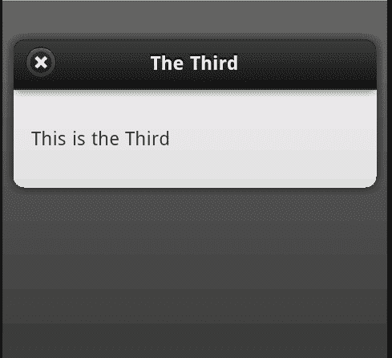
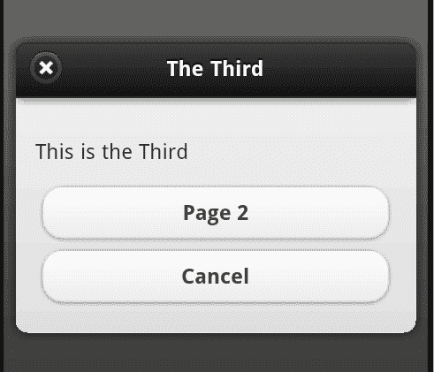
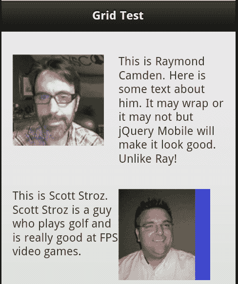
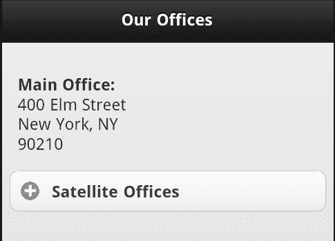
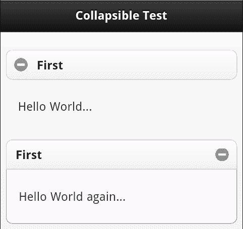

# 第七章。创建模态对话框、网格和可折叠块

在这一章中，我们将看到对话框、网格和可折叠块。在之前的章节中，我们已经处理过页面、按钮和表单控件。虽然 jQuery Mobile 为它们提供了很好的支持，但在框架中还有更多的 UI 控件可供使用。

在本章中，我们将：

+   讨论如何链接到和创建对话框以及如何处理离开它们

+   演示网格及如何将其添加到你的页面

+   展示可折叠块如何让你在很小的空间内装入大量信息

# 创建对话框

对话框：至少在 jQuery Mobile 框架下：是覆盖现有页面的小窗口。通常为用户提供短消息或问题。它们通常还包括一个按钮，允许用户关闭对话框并返回网站。在 jQuery Mobile 中创建对话框只需要简单地为链接添加一个属性：`data-rel="dialog"`。下面的示例演示了一个样例：

```js
Listing 7-1: test1.html
<!DOCTYPE html>
<html>
<head>
<title>Dialog Test</title>
<meta name="viewport" content="width=device-width, initial- scale=1">
<link rel="stylesheet" href="http://code.jquery.com/mobile/ latest/jquery.mobile.min.css" />
<script src="img/jquery- 1.7.1.min.js"></script>
<script src="img/ jquery.mobile.min.js"></script>
</head>
<body>
<div data-role="page" id="first">
<div data-role="header">
<h1>Dialog Test</h1>
</div>
<div data-role="content">
<p>
<a href="#page2">Another Page (normal)</a>
</p>
<p>
<a href="#page3" data-rel="dialog">A Dialog (dialog)</a>
</p>
</div>
</div>
<div data-role="page" id="page2">
<div data-role="header">
<h1>The Second</h1>
</div>
<div data-role="content">
<p>
This is the Second
</p>
</div>
</div>
<div data-role="page" id="page3">
<div data-role="header">
<h1>The Third</h1>
</div>
<div data-role="content">
<p>
This is the Third
</p>
</div>
</div>
</body>
</html>

```

这是一个简单的多页面 jQuery Mobile 站点。请注意我们如何链接到第二和第三页。第一个链接很典型。然而，第二个链接包括了前面提到的`data-rel`属性。请注意第二和第三页都是以通常方式定义的。所以我们在此处的唯一改变是在链接上。当点击第二个链接时，页面将完全不同地呈现：



记住，该页面并未有不同的定义。你在上一屏幕截图中看到的变化是由链接本身的更改驱动的。就是这样！点击小的**X**按钮将隐藏对话框并将用户带回原始页面。

该页面内的任意链接也将处理关闭对话框。如果你希望添加一个类似取消的按钮或链接，可以在链接中使用`data-rel="back"`。链接的目标应为启动对话框的页面。`列表 7-2`展示了之前模板的修改版本。在这个版本中，我们只是在对话框中添加了两个按钮。第一个按钮将打开第二页，而第二个将作为一个**取消**操作。

```js
Listing 7-2: test2.html
<!DOCTYPE html>
<html>
<head>
<title>Dialog Test (2)</title>
<meta name="viewport" content="width=device-width, initial- scale=1">
<link rel="stylesheet" href="http://code.jquery.com/mobile/ latest/jquery.mobile.min.css" />
<script src="img/jquery- 1.7.1.min.js"></script>
<script src="img/jquery.mobile.min.js"></script>
</head>
<body>
<div data-role="page" id="first">
<div data-role="header">
<h1>Dialog Test</h1>
</div>
<div data-role="content">
<p>
<a href="#page2">Another Page (normal)</a>
</p>
<p>
<a href="#page3" data-rel="dialog">A Dialog (dialog)</a>
</p>
</div>
</div>
<div data-role="page" id="page2">
<div data-role="header">
<h1>The Second</h1>
</div>
<div data-role="content">
<p>
This is the Second
</p>
</div>
</div>
<div data-role="page" id="page3">
<div data-role="header">
<h1>The Third</h1>
</div>
<div data-role="content">
<p>
This is the Third
</p>
<a href="#page2" data-role="button">Page 2</a>
<a href="#first" data-role="button" data- rel="back">Cancel</a>
</div>
</div>
</body>
</html>

```

这个模板中的主要变化是对话框中按钮的添加，包含在`page3 div`中。请注意第一个链接被设置为按钮，但在外面却是一个简单的链接。第二个按钮包含了添加的`data-rel="back"`属性。这将简单地关闭对话框。下面的截图展示了添加按钮后对话框的样子：



# 使用网格布局内容

网格是 jQuery Mobile 中少数不使用特定数据属性的特性之一。相反，你只需为内容指定 CSS 类即可使用网格布局。

网格有四种类型：两列、三列、四列和五列。（你可能不会想在手机设备上使用五列。最好是留给平板。）

你可以通过使用 `ui-grid-X` 类开始一个网格，其中 `X` 可以是 `a, b, c`, 或 `d`。`ui-grid-a` 表示两列网格，`ui-grid-b` 是三列网格。你大概能猜到 `c` 和 `d` 代表什么。

所以要开始一个两列网格，你需要用以下代码包裹你的内容：

```js
<div class="ui-grid-a">
Content
</div>

```

在 `div` 标签内，你可以为内容的每个 "单元格" 使用一个 `div`。网格调用的类以 `ui-block-X` 开头，`X` 从 `a` 到 `d`。`ui-block-a` 会被用于第一个单元格，`ui-block-b` 用于下一个，以此类推。这与 HTML 表格非常相似。

综合起来，下面的代码片段展示了一个简单的两列网格，其中有两个单元格的内容：

```js
<div class="ui-grid-a">
<div class="ui-block-a">Left</div>
<div class="ui-block-b">Right</div>
</div>

```

单元格内的文本会自动换行。`7-3` 展示了一个简单的网格，其中一个单元格中有大量文本：

```js
Listing 7-3: test3.html
<!DOCTYPE html>
<html>
<head>
<title>Grid Test</title>
<meta name="viewport" content="width=device-width, initial- scale=1">
<link rel="stylesheet" href="http://code.jquery.com/mobile/ latest/jquery.mobile.min.css" />
<script src="img/jquery- 1.7.1.min.js"></script>
<script src="img/jquery.mobile.min.js"></script>
</head>
<body>
<div data-role="page" id="first">
<div data-role="header">
<h1>Grid Test</h1>
</div>
<div data-role="content">
<div class="ui-grid-a">
<div class="ui-block-a">
<p>
This is my left hand content. There won't be a lot of it.
</p>
</div>
<div class="ui-block-b">
<p>
This is my right hand content. I'm going to fill it with some dummy text.
</p>
<p>
Bacon ipsum dolor sit amet andouille capicola spare ribs, short loin venison sausage prosciutto turducken turkey flank frankfurter pork belly short ribs. Venison frankfurter filet mignon, jowl meatball hamburger pastrami pork chop drumstick. Fatback pancetta boudin, ribeye shoulder capicola cow leberkäse bresaola spare ribs prosciutto venison ball tip jowl andouille. Beef ribs t-bone swine, tail capicola turkey pork belly leberkäse frankfurter jowl. Shankle ball tip sirloin frankfurter bacon beef ribs. Tenderloin beef ribs pork chop, pancetta turkey bacon short ribs ham flank chuck pork belly. Tongue strip steak short ribs tail swine.
</p>
</div>
</div>
</div>
</div>
</body>
</html>

```

在移动浏览器中，你可以清楚地看到两列：


然后就是简单地切换到其他类来处理其他类型的网格。例如，设置一个四列网格类似于以下代码片段：

```js
<div class="ui-grid-c">
<div class="ui-block-a">1st cell</div>
<div class="ui-block-b">2nd cell</div>
<div class="ui-block-c">3rd cell</div>
</div>

```

同样，记住你的目标受众。任何超过两列的都可能在手机上显得太窄。

要在网格中创建多行，只需重复块。下面的代码片段展示了一个有两行单元格的网格的简单示例：

```js
<div class="ui-grid-a">
<div class="ui-block-a">Left Top</div>
<div class="ui-block-b">Right Top</div>
<div class="ui-block-a">Left Bottom</div>
<div class="ui-block-b">Right Bottom</div>
</div>

```

请注意，这里没有行的概念。 jQuery Mobile 可以处理当块重新以标记为 `ui-block-a` 开始时，它应该创建一个新的行。下面的代码片段，`7-4` 是一个简单的例子：

```js
Listing 7-4:test4.html
<!DOCTYPE html>
<html>
<head>
<title>Grid Test (2)</title>
<meta name="viewport" content="width=device-width, initial- scale=1">
<link rel="stylesheet" href="http://code.jquery.com/mobile/ latest/jquery.mobile.min.css" />
<script src="img/jquery- 1.7.1.min.js"></script>
<script src="img/ jquery.mobile.min.js"></script>
</head>
<body>
<div data-role="page" id="first">
<div data-role="header">
<h1>Grid Test</h1>
</div>
<div data-role="content">
<div class="ui-grid-a">
<div class="ui-block-a">
<p>

</p>
</div>
<div class="ui-block-b">
<p>
This is Raymond Camden. Here is some text about him. It may wrap or it may not but jQuery Mobile will make it look good. Unlike Ray!
</p>
</div>
<div class="ui-block-a">
<p>
This is Scott Stroz. Scott Stroz is a guy who plays golf and is really good at FPS video games.
</p>
</div>
<div class="ui-block-b">
<p>

</p>
</div>
</div>
</div>
</div>
</body>
</html>

```

下面的截图显示了结果：



# 使用可折叠内容

在本章中，我们要看的最后一个小部件支持可折叠内容。这只是可以折叠和展开的内容。创建一个可折叠内容小部件就像简单地用 `div` 包裹它，加上 `data-role="collapsible"`，并包含内容的标题。考虑以下简单的例子：

```js
<div data-role="collapsible">
<h1>My News</h1>
<p>This is the latest news about me...
</div>

```

渲染时，jQuery Mobile 会将标题转换为可展开和折叠内容的可点击横幅。让我们看一个真实的例子。想象一下，你想要分享公司主要地址的位置。你还想要包括分公司。由于大多数人不会关心其他办公室，我们可以使用一个简单的可折叠内容小部件来默认隐藏内容。下面的代码片段，`7-5` 展示了一个例子：

```js
Listing 7-5: test5.html
<!DOCTYPE html>
<html>
<head>
<title>Collapsible Content</title>
<meta name="viewport" content="width=device-width, initial- scale=1">
<link rel="stylesheet" href="http://code.jquery.com/mobile/ latest/jquery.mobile.min.css" />
<script src="img/jquery- 1.7.1.min.js"></script>
<script src="img/ jquery.mobile.min.js"></script>
</head>
<body>
<div data-role="page" id="first">
<div data-role="header">
<h1>Our Offices</h1>
</div>
<div data-role="content">
<p>
<strong>Main Office:</strong><br/>
400 Elm Street<br/>
New York, NY<br/>
90210
</p>
<div data-role="collapsible">
<h3>Satellite Offices</h3>
<p>
<strong>Asia:</strong>
Another Address Here
</p>
<p>
<strong>Europe:</strong>
Another Address Here
</p>
<p>
<strong>Mars:</strong>
Another Address Here
</p>
</div>
</div>
</div>
</body>
</html>

```

你可以看到其他办公室都被使用新的可折叠内容角色的 `div` 标签包裹着。查看时，请注意它们是隐藏的：



点击标题旁边的 **+** 将其打开，再次点击将其重新关闭：


默认情况下，jQuery Mobile 会折叠和隐藏内容。当然，您也可以告诉 jQuery Mobile 初始化块时打开而不是关闭。要这样做，只需在初始的`div`标签中添加`data-collapsed="false"`。例如：

```js
<div data-role="collapsible" data-collapsed="false">
<h1>My News</h1>
<p>This is the latest news about me...
</div>

```

这个区域仍然具有折叠和打开的能力，但默认情况下会打开。

可折叠内容块的另一个选项是对折叠区域的内容进行主题化。通过提供`data-content-theme`属性，您可以指定一个背景颜色，使区域更具连贯性。主题化在第十一章中有介绍，*主题化 jQuery Mobile*，但我们可以看一个快速示例。在以下截图中，第一个区域没有使用该功能，而第二个区域使用了：



注意到图标也向右移动了。这展示了另一个选项，`data-iconpos`。在`code`文件夹中的`test5-2.html`中找到的以下代码片段演示了这些选项：

```js
<div data-role="collapsible">
<h3>First</h3>
<p>
Hello World...
</p>
</div>
<div data-role="collapsible" data-content-theme="c" data- iconpos="right">
<h3>First</h3>
<p>
Hello World again...
</p>
</div>

```

最后，您可以将多个可折叠区域合并成一个称为手风琴的单元。只需将多个可折叠块放入一个新的`div`标签中即可完成此操作。这个`div`标签使用`data-role="collapsible-set"`将内部块作为一个单位。`清单 7-6`演示了一个示例。它采用了早期的办公地址示例，并为每个唯一的地址使用了一个可折叠集：

```js
Listing 7-6: test6.html
<!DOCTYPE html>
<html>
<head>
<title>Collapsible Content</title>
<meta name="viewport" content="width=device-width, initial- scale=1">
<link rel="stylesheet" href="http://code.jquery.com/mobile/ latest/jquery.mobile.min.css" />
<script src="img/jquery- 1.7.1.min.js"></script>
<script src="img/jquery.mobile.min.js"></script>
</head>
<body>
<div data-role="page" id="first">
<div data-role="header">
<h1>Our Offices</h1>
</div>
<div data-role="content">
<div data-role="collapsible-set">
<div data-role="collapsible">
<h3>Main Office</h3>
<p>
400 Elm Street<br/>
New York, NY<br/>
90210
</p>
</div>
<div data-role="collapsible">
<h3>Asia</h3>
<p>
Another Address Here
</p>
</div>
<div data-role="collapsible">
<h3>Europe</h3>
<p>
Another Address Here
</p>
</div>
<div data-role="collapsible">
<h3>Mars</h3>
<p>
Another Address Here
</p>
</div>
</div>
</div>
</div>
</body>
</html>

```

在`清单 7-6`中，我们只需使用一个可折叠集的`div`标签包装四个可折叠块。完成后，jQuery Mobile 将它们分组在一起，并在打开另一个时自动关闭一个：


# 概要

在本章中，我们更多地了解了 jQuery Mobile 如何增强基本的 HTML，以为我们的移动页面提供额外的布局控件。通过对话框，我们学会了向用户提供基本、快速、模态消息的方法。通过网格，我们学到了一种新的方法来轻松地将内容布局在列中。最后，通过可折叠的内容块，我们学到了一种很酷的方式来分享额外的内容，而不占用太多的屏幕空间。

在下一章中，我们将演示一个完整的、真实的示例，创建一个基本的笔记跟踪器。它利用了额外的 HTML5 功能，以及你在过去几章中学到的一些 UI 技巧。
