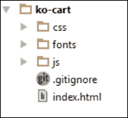
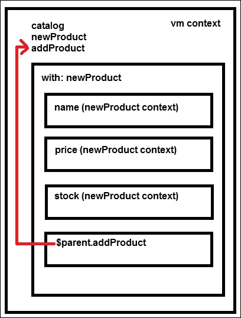

# 第一章 自动刷新 UI，使用 KnockoutJS

如果你正在阅读这本书，那是因为你已经发现管理 web 用户界面是相当复杂的。 **DOM**（Document Object Model 的缩写）仅使用本地 JavaScript 进行操作是非常困难的。这是因为每个浏览器都有自己的 JavaScript 实现。为了解决这个问题，过去几年中诞生了不同的 DOM 操作库。最常用于操作 DOM 的库是 jQuery。

越来越常见的是找到帮助开发人员在客户端管理越来越多功能的库。正如我们所说，开发人员已经获得了轻松操作 DOM 的可能性，因此可以管理模板和格式化数据。此外，这些库为开发人员提供了轻松的 API 来发送和接收来自服务器的数据。

然而，DOM 操作库并不为我们提供同步输入数据与代码中模型的机制。我们需要编写代码来捕捉用户操作并更新我们的模型。

当一个问题在大多数项目中经常出现时，在几乎所有情况下，它肯定可以以类似的方式解决。然后，开始出现了管理 HTML 文件与 JavaScript 代码之间连接的库。这些库实现的模式被命名为 MV*（Model-View-Whatever）。星号可以被更改为：

+   控制器，MVC（例如，AngularJS）

+   ViewModel，MVVM（例如，KnockoutJS）

+   Presenter（MVP）（例如，ASP.NET）

在这本书中我们要使用的库是 Knockout。它使用视图模型将数据和 HTML 进行绑定，因此它使用 MVVM 模式来管理数据绑定问题。

在本章中，你将学习这个库的基本概念，并开始在一个真实项目中使用 Knockout 的任务。

# KnockoutJS 和 MVVM 模式

**KnockoutJS** 是一个非常轻量级的库（仅 20 KB 经过压缩），它赋予对象成为视图和模型之间的纽带的能力。这意味着你可以使用清晰的底层数据模型创建丰富的界面。

为此，它使用声明性绑定来轻松将 DOM 元素与模型数据关联起来。数据与表示层（HTML）之间的这种链接允许 DOM 自动刷新显示的值。

Knockout 建立了模型数据之间的关系链，隐式地转换和组合它。Knockout 也是非常容易扩展的。可以将自定义行为实现为新的声明性绑定。这允许程序员在几行代码中重用它们。

使用 KnockoutJS 的优点有很多：

+   它是免费且开源的。

+   它是使用纯 JavaScript 构建的。

+   它可以与其他框架一起使用。

+   它没有依赖关系。

+   它支持所有主流浏览器，甚至包括古老的 IE 6+、Firefox 3.5+、Chrome、Opera 和 Safari（桌面/移动）。

+   它完全有 API 文档、实时示例和交互式教程。

Knockout 的功能很明确：连接视图和模型。它不管理 DOM 或处理 AJAX 请求。为了这些目的，我建议使用 jQuery。 Knockout 给了我们自由发展我们自己想要的代码。


MVVM 模式图

# 一个真实的应用程序—koCart

为了演示如何在实际应用中使用 Knockout，我们将构建一个名为 koCart 的简单购物车。

首先，我们将定义用户故事。我们只需要几句话来知道我们想要实现的目标，如下所示：

+   用户应该能够查看目录

+   我们应该有能力搜索目录

+   用户可以点击按钮将物品添加到目录中

+   应用程序将允许我们从目录中添加、更新和删除物品

+   用户应该能够向购物车中添加、更新和删除物品

+   我们将允许用户更新他的个人信息。

+   应用程序应该能够计算购物车中的总金额

+   用户应该能够完成订单

通过用户故事，我们可以看到我们的应用程序有以下三个部分：

+   目录，包含和管理店内所有的商品。

+   购物车负责计算每行的价格和订单总额。

+   订单，用户可以在其中更新他的个人信息并确认订单。

# 安装组件

为了开发我们的真实项目，我们需要安装一些组件并设置我们的第一个布局。

这些都是你需要下载的组件:

+   Bootstrap: [`github.com/twbs/bootstrap/releases/download/v3.2.0/bootstrap-3.2.0-dist.zip`](https://github.com/twbs/bootstrap/releases/download/v3.2.0/bootstrap-3.2.0-dist.zip)

+   jQuery: [`code.jquery.com/jquery-2.1.1.min.js`](https://code.jquery.com/jquery-2.1.1.min.js)

+   KnockoutJS: [`knockoutjs.com/downloads/knockout-3.2.0.js`](http://knockoutjs.com/downloads/knockout-3.2.0.js)

由于我们在前几章只在客户端工作，我们可以在客户端模拟数据，现在不需要服务器端。 所以我们可以选择我们通常用于项目的任何地方来开始我们的项目。 我建议您使用您通常用来做项目的环境。

首先，我们创建一个名为`ko-cart`的文件夹，然后在其中创建三个文件夹和一个文件：

1.  在`css`文件夹中，我们将放置所有的 css。

1.  在`js`文件夹中，我们将放置所有的 JavaScript。

1.  在`fonts`文件夹中，我们会放置 Twitter Bootstrap 框架所需的所有字体文件。

1.  创建一个`index.html`文件。

现在你应该设置你的文件，就像以下截图所示：



初始文件夹结构

然后我们应该设置`index.html`文件的内容。记得使用`<script>`和`<link>`标签设置所有我们需要的文件的链接：

```js
<!DOCTYPE html>
<html>
<head>
  <title>KO Shopping Cart</title>
  <meta name="viewport" content="width=device-width, initial-scale=1">
  <link rel="stylesheet" type="text/css" href="css/bootstrap.min.css">
</head>
<body>
  <script type="text/javascript" src="img/jquery.min.js">
  </script>
  <script type="text/javascript" src="img/bootstrap.min.js">
  </script>
  <script type="text/javascript" src="img/knockout.debug.js">
  </script>
</body>
</html>
```

有了这些行代码，我们就有了开始应用程序所需的一切。

# 视图-模型

**视图模型**是 UI 上的数据和操作的纯代码表示。它不是 UI 本身。它没有任何按钮或显示样式的概念。它也不是持久化的数据模型。它保存用户正在处理的未保存数据。视图模型是纯 JavaScript 对象，不了解 HTML。以这种方式将视图模型保持抽象，让它保持简单，这样您就可以管理更复杂的行为而不会迷失。

要创建一个视图模型，我们只需要定义一个简单的 JavaScript 对象：

```js
var vm = {};
```

然后要激活 Knockout，我们将调用以下行：

```js
ko.applyBindings(vm);
```

第一个参数指定我们要与视图一起使用的视图模型对象。可选地，我们可以传递第二个参数来定义我们想要搜索`data-bind`属性的文档的哪个部分。

```js
ko.applyBindings(vm, document.getElementById('elementID'));
```

这将限制激活到具有`elementID`及其后代的元素，这在我们想要有多个视图模型并将每个视图模型与页面的不同区域关联时非常有用。

## 视图

**视图**是表示视图模型状态的可见、交互式 UI。它显示来自视图模型的信息，向视图模型发送命令（例如，当用户点击按钮时），并在视图模型状态更改时更新。在我们的项目中，视图由 HTML 标记表示。

为了定义我们的第一个视图，我们将构建一个 HTML 来显示一个产品。将这个新内容添加到容器中：

```js
<div class="container-fluid">
  <div class="row">
    <div class="col-md-12">
      <!-- our app goes here →
      <h1>Product</h1>
      <div>
        <strong>ID:</strong>
        <span data-bind="text:product.id"></span><br/>
        <strong>Name:</strong>
        <span data-bind="text:product.name"></span><br/>
        <strong>Price:</strong>
        <span data-bind="text:product.price"></span><br/>
        <strong>Stock:</strong>
        <span data-bind="text:product.stock"></span>
      </div> 
    </div>
  </div>
</div>
```

查看`data-bind`属性。这被称为**声明性绑定**。尽管这个属性对 HTML 来说并不是本机的，但它是完全正确的。但由于浏览器不知道它的含义，您需要激活 Knockout（`ko.applyBindings`方法）才能使其生效。

要显示来自产品的数据，我们需要在视图模型内定义一个产品：

```js
var vm = {
  product: {
    id:1,
    name:'T-Shirt',
    price:10,
    stock: 20
  }
};
ko.applyBindings(vm);//This how knockout is activated

```

在脚本标签的末尾添加视图模型：

```js
<script type="text/javascript" src="img/viewmodel.js"></script>
```

### 提示

**下载示例代码**

您可以从您在[`www.packtpub.com`](http://www.packtpub.com)的帐户中购买的所有 Packt 图书中下载示例代码文件。如果您在其他地方购买了这本书，您可以访问[`www.packtpub.com/support`](http://www.packtpub.com/support)并注册以直接通过电子邮件将文件发送给您。

这将是我们应用的结果：


数据绑定的结果

## 模型

此数据表示业务域内的对象和操作（例如，产品）和任何 UI 无关。使用 Knockout 时，您通常会调用一些服务器端代码来读取和写入此存储的模型数据。

模型和视图模型应该彼此分离。为了定义我们的产品模型，我们将按照一些步骤进行：

1.  在我们的`js`文件夹内创建一个文件夹。

1.  将其命名为`models`。

1.  在`models`文件夹内，创建一个名为`product.js`的 JavaScript 文件。

`product.js`文件的代码如下：

```js
var Product = function (id,name,price,stock) {
  "use strict";
  var
    _id = id,
    _name = name,
    _price = price,
    _stock = stock
  ;

  return {
    id:_id,
    name:_name,
    price:_price,
    stock:_stock
  };
};
```

此函数创建一个包含产品接口的简单 JavaScript 对象。使用这种模式定义对象，称为**揭示模块模式**，允许我们清晰地将公共元素与私有元素分开。

要了解更多关于揭示模块模式的信息，请访问链接 [`carldanley.com/js-revealing-module-pattern/`](https://carldanley.com/js-revealing-module-pattern/)。

将此文件与您的`index.html`文件链接，并将其设置在所有脚本标签的底部。

```js
<script type="text/javascript" src="img/product.js">
</script>
```

现在我们可以使用产品模型定义视图模型中的产品：

```js
var vm = {
  product: Product(1,'T-Shirt',10,20);
};
ko.applyBindings(vm);
```

如果我们再次运行代码，将看到相同的结果，但我们的代码现在更易读了。视图模型用于存储和处理大量信息，因此视图模型通常被视为模块，并且在其上应用了揭示模块模式。此模式允许我们清晰地公开视图模型的 API（公共元素）并隐藏私有元素。

```js
var vm = (function(){
  var product = Product(1,'T-Shirt', 10, 20);
  return {
    product: product
  };
})();
```

当我们的视图模型开始增长时使用此模式可以帮助我们清晰地看到哪些元素属于对象的公共部分，哪些是私有的。

# 可观察对象自动刷新 UI

最后一个示例向我们展示了 Knockout 如何绑定数据和用户界面，但它没有展示自动 UI 刷新的魔法。为了执行此任务，Knockout 使用可观察对象。

**可观察对象**是 Knockout 的主要概念。这些是特殊的 JavaScript 对象，可以通知订阅者有关更改，并且可以自动检测依赖关系。为了兼容性，`ko.observable`对象实际上是函数。

要读取可观察对象的当前值，只需调用可观察对象而不带参数。在这个例子中，`product.price()`将返回产品的价格，`product.name()`将返回产品的名称。

```js
var product = Product(1,"T-Shirt", 10.00, 20);
product.price();//returns 10.00
product.name();//returns "T-Shirt"
```

要将新值写入可观察对象，请调用可观察对象并将新值作为参数传递。例如，调用`product.name('Jeans')`将把`name`值更改为`'Jeans'`。

```js
var product = Product(1,"T-Shirt", 10.00, 20);
product.name();//returns "T-Shirt"
product.name("Jeans");//sets name to "Jeans"
product.name();//returns "Jeans"
```

有关可观察对象的完整文档在官方 Knockout 网站上 [`knockoutjs.com/documentation/observables.html`](http://knockoutjs.com/documentation/observables.html)。

为了展示可观察对象的工作原理，我们将在模板中添加一些输入数据。

在包含产品信息的`div`上添加这些 HTML 标签。

```js
<div>
  <strong>ID:</strong>
  <input class="form-control" type="text" data-bind="value:product.id"/><br/>
  <strong>Name:</strong>
  <input class="form-control" type="text" data-bind="value:product.name"><br/>
  <strong>Price:</strong>
  <input class="form-control" type="text" data-bind="value:product.price"/><br/>
  <strong>Stock:</strong>
  <input class="form-control" type="text" data-bind="value:product.stock"><br/>
</div>
```

我们已经使用`value`属性将输入与视图模型链接起来。运行代码并尝试更改输入中的值。发生了什么？什么都没有。这是因为变量不是可观察对象。更新您的`product.js`文件，为每个变量添加`ko.observable`方法：

```js
"use strict";
function Product(id, name, price, stock) {
  "use strict";
  var
    _id = ko.observable(id),
    _name = ko.observable(name),
    _price = ko.observable(price),
    _stock = ko.observable(stock)
  ;

  return {
    id:_id,
    name:_name,
    price:_price,
    stock:_stock
  };
}
```

请注意，当我们更新输入中的数据时，我们的产品值会自动更新。当您将`name`值更改为`Jeans`时，文本绑定将自动更新关联的 DOM 元素的文本内容。这就是视图模型的更改如何自动传播到视图的方式。


可观察模型会自动更新

## 使用 observables 管理集合

如果你想检测并响应一个对象的变化，你会使用 observables。如果你想检测并响应一组东西的变化，请使用`observableArray`。这在许多情况下都很有用，比如显示或编辑多个值，并且需要在添加和删除项时重复出现和消失 UI 的部分。

要在我们的应用程序中显示一组产品，我们将按照一些简单的步骤进行：

1.  打开`index.html`文件，删除`<body>`标签内的代码，然后添加一个表格，我们将列出我们的目录：

    ```js
    <h1>Catalog</h1>
    <table class="table">
      <thead>
        <tr>
          <th>Name</th>
          <th>Price</th>
          <th>Stock</th>
        </tr>
      </thead>
      <tbody>
        <tr>
          <td></td>
          <td></td>
          <td></td>
        </tr>
      </tbody>
    </table>
    ```

1.  在视图模型内定义一个产品数组：

    ```js
    "use strict";
    var vm = (function () {

      var catalog = [
        Product(1, "T-Shirt", 10.00, 20),
        Product(2, "Trousers", 20.00, 10),
        Product(3, "Shirt", 15.00, 20),
        Product(4, "Shorts", 5.00, 10)
      ];

      return {
        catalog: catalog
      };
    })();
    ko.applyBindings(vm);
    ```

1.  Knockout 中有一个绑定，用于在集合中的每个元素上重复执行一段代码。更新表格中的`tbody`元素：

    ```js
    <tbody data-bind="foreach:catalog">
      <tr>
        <td data-bind="text:name"></td>
        <td data-bind="text:price"></td>
        <td data-bind="text:stock"></td>
      </tr>
    </tbody>
    ```

我们使用`foreach`属性来指出该标记内的所有内容都应该针对集合中的每个项目进行重复。在该标记内部，我们处于每个元素的上下文中，所以你可以直接绑定属性。在浏览器中观察结果。

我们想知道目录中有多少个项目，所以在表格上方添加这行代码：

```js
<strong>Items:</strong>
<span data-bind="text:catalog.length"></span>
```

## 在集合中插入元素

要向产品数组中插入元素，应该发生一个事件。在这种情况下，用户将点击一个按钮，这个动作将触发一个操作，将一个新产品插入集合中。

在未来的章节中，你将会了解更多关于事件的内容。现在我们只需要知道有一个名为`click`的绑定属性。它接收一个函数作为参数，当用户点击元素时，该函数会被触发。

要插入一个元素，我们需要一个表单来插入新产品的值。将此 HTML 代码写在`<h1>`标签的下方：

```js
<form class="form-horizontal" role="form" data-bind="with:newProduct">
  <div class="form-group">
    <div class="col-sm-12">
      <input type="text" class="form-control" placeholder="Name" data-bind="textInput:name">
      </div>
    </div>
    <div class="form-group">
      <div class="col-sm-12">
      <input type="password" class="form-control" placeholder="Price" data-bind="textInput:price">
      </div>
    </div>
    <div class="form-group">
      <div class="col-sm-12">
      <input type="password" class="form-control" placeholder="Stock" data-bind="textInput:stock">
      </div>
    </div>
    <div class="form-group">
      <div class="col-sm-12">
      <button type="submit" class="btn btn-default" data-bind="{click:$parent.addProduct}">
        <i class="glyphicon glyphicon-plus-sign">
        </i> Add Product
      </button>
    </div>
  </div>
</form>
```

在这个模板中，我们找到了一些新的绑定：

+   `with` 绑定：它创建一个新的绑定上下文，以便后代元素在指定对象的上下文中绑定，本例中为`newProduct`。

    [`knockoutjs.com/documentation/with-binding.html`](http://knockoutjs.com/documentation/with-binding.html)

+   `textInput` 绑定：`textInput` 绑定将文本框（`<input>`）或文本区域（`<textarea>`）与视图模型属性连接起来，提供视图模型属性和元素值之间的双向更新。与`value`绑定属性不同，`textInput` 提供了对于所有类型的用户输入，包括自动完成、拖放和剪贴板事件的 DOM 的即时更新。它从 Knockout 的 3.2 版本开始提供。

    [`knockoutjs.com/documentation/textinput-binding.html`](http://knockoutjs.com/documentation/textinput-binding.html)

+   `click` 绑定：`click` 绑定添加了一个事件处理程序，使得当关联的 DOM 元素被点击时，您选择的 JavaScript 函数被调用。在调用处理程序时，Knockout 将当前模型值作为第一个参数提供。这在为集合中的每个项目渲染 UI，并且您需要知道哪个项目的 UI 被点击时特别有用。

    [`knockoutjs.com/documentation/click-binding.html`](http://knockoutjs.com/documentation/click-binding.html)

+   `$parent` 对象：这是一个绑定上下文属性。我们用它来引用`foreach`循环外的数据。

欲了解有关绑定上下文属性的更多信息，请阅读 Knockout 文档：[`knockoutjs.com/documentation/binding-context.html`](http://knockoutjs.com/documentation/binding-context.html)。



使用 with 设置上下文和 parent 通过它们导航

现在是时候向我们的视图模型添加 `newProduct` 对象了。首先，我们应该定义一个带有空数据的新产品：

```js
var newProduct = Product("","","","");
```

我们已经定义了一个字面对象，将包含我们要放入新产品的信息。此外，我们已经定义了一个清除或重置对象的方法，一旦插入完成就会进行。现在我们定义我们的`addProduct` 方法：

```js
var addProduct = function (context) {
  var id = new Date().valueOf();//random id from time
  var newProduct = Product(
    id,
    context.name(),
    context.price(),
    context.stock()
  );
  catalog.push(newProduct);
  newProduct.clear();
};
```

此方法创建一个从点击事件接收到的数据的新产品。

点击事件始终将上下文作为第一个参数发送。还要注意，您可以在可观察数组中使用`push`等数组方法。请查看 Knockout 文档 ([`knockoutjs.com/documentation/observableArrays.html`](http://knockoutjs.com/documentation/observableArrays.html)) 以查看数组中可用的所有方法。

我们应该实现一个私有方法，一旦将新产品添加到集合中，就会清除新产品的数据：

```js
var clearNewProduct = function () {
  newProduct.name("");
  newProduct.price("");
  newProduct.stock("");
};
```

更新视图模型：

```js
return {
    catalog: catalog,
    newProduct: newProduct,
    addProduct: addProduct
};
```

如果您运行代码，您将注意到当您尝试添加新产品时什么也不会发生。这是因为，尽管我们的产品具有可观察属性，但我们的数组不是一个可观察的数组。因此，Knockout 不会监听更改。我们应该将数组转换为`observableArray`可观察的数组。

```js
var catalog = ko.observableArray([
  Product(1, "T-Shirt", 10.00, 20),
  Product(2, "Trousers", 20.00, 10),
  Product(3, "Shirt", 15.00, 20),
  Product(4, "Shorts", 5.00, 10)
]);
```

现在 Knockout 正在监听该数组的变化，但不会监听每个元素内部发生的事情。Knockout 只告诉我们在数组中插入或删除元素的情况，但不告诉我们修改元素的情况。如果您想知道元素内发生了什么，那么对象应具有可观察的属性。

`observableArray` 只会跟踪它所持有的对象，并在添加或删除对象时通知监听者。

在幕后，`observableArray` 实际上是一个值为数组的可观察属性。因此，您可以像调用任何其他可观察属性一样，以无参数的方式将`observableArray`可观察属性作为函数进行调用，从而获取底层的 JavaScript 数组。然后您可以从那个底层数组中读取信息。

```js
<strong>Items:</strong>
<span data-bind="text:catalog().length"></span>
```

## 计算可观察属性

想要思考一下我们在界面中显示的某些值是否取决于 Knockout 已经观察到的其他值并不奇怪。例如，如果我们想要按名称搜索我们目录中的产品，显然我们在列表中显示的目录产品与我们在搜索框中输入的术语相关联。在这些情况下，Knockout 为我们提供了**计算可观察对象**。

您可以在 Knockout 文档中详细了解[计算可观察对象](http://knockoutjs.com/documentation/computedObservables.html)。

要开发搜索功能，请定义一个文本框，我们可以在其中写入要搜索的术语。我们将把它绑定到`searchTerm`属性。要在编写时更新值，我们应该使用`textInput`绑定。如果我们使用值绑定，当元素失去焦点时，值将被更新。将此代码放在产品表上方：

```js
<div class="input-group">
  <span class="input-group-addon">
    <i class="glyphicon glyphicon-search"></i> Search</span>
  <input type="text" class="form-control" data-bind="textInput: searchTerm">
</div>
```

要创建一个过滤目录，我们将检查所有项目，并测试`searchTerm`是否在项目的`name`属性中。

```js
var searchTerm = ko.observable(''); 
var filteredCatalog = ko.computed(function () {
  //if catalog is empty return empty array
  if (!catalog()) {
    return [];
  }
  var filter = searchTerm().toLowerCase();
  //if filter is empty return all the catalog
  if (!filter) {
    return catalog();
  }
  //filter data
  var filtered = ko.utils.arrayFilter(catalog(), function (item) {
    var fields = ["name"]; //we can filter several properties
    var i = fields.length;
    while (i--) {
      var prop = fields[i];
      var strProp = ko.unwrap(item[prop]).toLocaleLowerCase();
      if (strProp.indexOf(filter) !== -1){
        return true;
      };
    }
    Return false;
  });
  return filtered;
});
```

`ko.utils`对象在 Knockout 中没有文档。它是库内部使用的对象。它具有公共访问权限，并具有一些可以帮助我们处理可观察对象的函数。互联网上有很多关于它的非官方示例。

它的一个有用函数是`ko.utils.arrayFilter`。如果您看一下第 13 行，我们已经使用了此方法来获取过滤后的数组。

此函数以数组作为第一个参数。请注意，我们调用`catalog`数组可观察对象以获取元素。我们不传递可观察对象本身，而是传递可观察对象的内容。

第二个参数是决定项目是否在过滤数组中的函数。如果项目符合过滤数组的条件，它将返回`true`。否则返回`false`。

在此片段的第 14 行，我们可以找到一个名为`fields`的数组。此参数将包含应符合条件的字段。在这种情况下，我们只检查过滤值是否在`name`值中。如果我们非常确定只会检查`name`字段，我们可以简化过滤函数：

```js
var filtered = ko.utils.arrayFilter(catalog(), function (item) {
  var strProp = ko.unwrap(item["name"]).toLocaleLowerCase();
  return (strProp.indexOf(filter) > -1);
});
```

`ko.unwrap`函数返回包含可观察对象的值。当我们不确定变量是否包含可观察对象时，我们使用`ko.unwrap`，例如：

```js
var notObservable = 'hello';
console.log(notObservable()) //this will throw an error.
console.log(ko.unwrap(notObservable)) //this will display 'hello');
```

将过滤后的目录暴露到公共 API 中。请注意，现在我们需要使用过滤后的目录而不是原始产品目录。因为我们正在应用**揭示模块模式**，我们可以保持原始 API 接口，只需使用过滤后的目录更新目录的值即可。只要我们始终保持相同的公共接口，就不需要通知视图我们将使用不同的目录或其他元素：

```js
return {
  searchTerm: searchTerm,
  catalog: filteredCatalog,
  newProduct: newProduct,
  addProduct: addProduct
};
```

现在，尝试在搜索框中键入一些字符，并在浏览器中查看目录如何自动更新数据。

太棒了！我们已经完成了我们的前三个用户故事：

+   用户应能够查看目录

+   用户应能够搜索目录

+   用户应能够向目录添加项目

让我们看看最终结果：


# 总结

在本章中，你学会了 Knockout 库的基础知识。我们创建了一个简单的表单来将产品添加到我们的目录中。你还学会了如何管理 observable 集合并将其显示在表中。最后，我们使用计算观察对象开发了搜索功能。

你已经学会了三个重要的 Knockout 概念：

+   **视图模型**：这包含代表视图状态的数据。它是一个纯 JavaScript 对象。

+   **模型**：这包含了来自业务领域的数据。

+   **视图**：这显示了我们在视图模型中存储的数据在某一时刻的情况。

为构建响应式 UI，Knockout 库为我们提供了一些重要的方法：

+   `ko.observable`：用于管理变量。

+   `ko.observableArray`：用于管理数组。

+   `ko.computed`：它们对其内部的 observable 的更改作出响应。

要迭代数组的元素，我们使用`foreach`绑定。当我们使用`foreach`绑定时，我们会创建一个新的上下文。这个上下文是相对于每个项目的。如果我们想要访问超出此上下文的内容，我们应该使用`$parent`对象。

当我们想要为变量创建一个新的上下文时，我们可以将`with`绑定附加到任何 DOM 元素。

我们使用`click`绑定将点击事件附加到元素上。点击事件函数始终将上下文作为第一个参数。

要从我们不确定是否为 observable 的变量中获取值，我们可以使用`ko.unwrap`函数。

我们可以使用`ko.utils.arrayFilter`函数来筛选集合。

在下一章中，我们将使用模板来保持我们的代码易维护和干净。模板引擎帮助我们保持代码整洁，且方便我们以简单的方式更新视图。

本章开发的代码副本在此处：

[`github.com/jorgeferrando/knockout-cart/archive/chapter1.zip`](https://github.com/jorgeferrando/knockout-cart/archive/chapter1.zip)。
