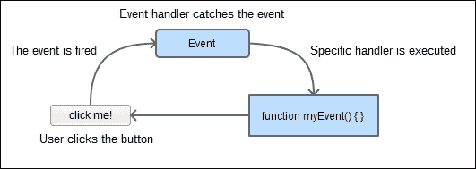
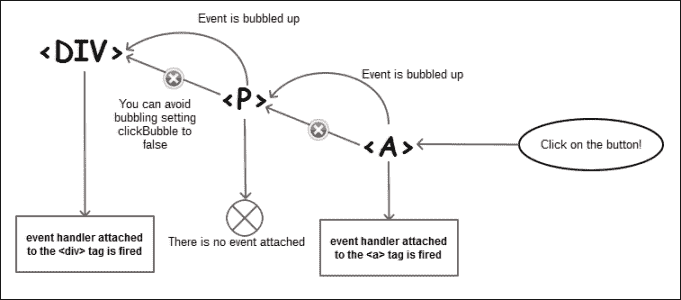
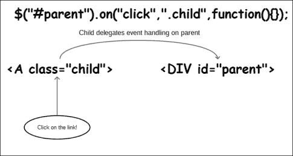
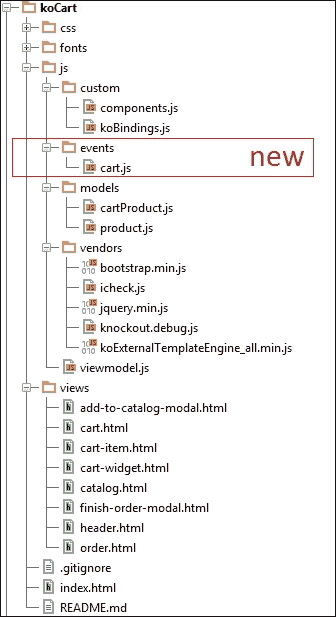

# 第四章 管理 KnockoutJS 事件

我们的应用程序与用户之间的交互是我们需要解决的最重要问题。在过去的三章中，我们一直专注于业务需求，现在是时候考虑如何使最终用户更容易使用我们的应用程序了。

事件驱动编程是一种强大的范式，它能让我们更好地隔离我们的代码。KnockoutJS 给了我们几种处理事件的方式。如果我们想使用声明范式，可以使用点击绑定或者事件绑定。

有两种不同的方式来声明事件。声明范式说我们可以在我们的 HTML 中写 JavaScript 和自定义标签。另一方面，命令范式告诉我们应该将 JavaScript 代码与 HMTL 标记分开。为此，我们可以使用 jQuery 来编写不显眼的事件，也可以编写自定义事件。我们可以使用 `bindingHandlers` 来包装自定义事件，以便在我们的应用程序中重复使用它们。

# 事件驱动编程

当我们使用顺序编程来编写我们的应用程序时，我们会准确地知道我们的应用程序将会如何行为。通常情况下，我们在我们的应用程序与外部代理没有交互时使用这种编程范式。在网页开发中，我们需要使用事件驱动的编程范式，因为最终用户会主导应用程序的流程。

即使我们之前还没谈论过事件，我们知道它们是什么，因为我们一直在使用网页开发中最重要的事件之一，即点击事件。

用户可以触发许多事件。正如我们之前提到的，点击事件是用户可以在键盘上按键的地方；我们还可以从计算机那里接收事件，比如就绪事件，以通知我们 DOM 元素都已加载完毕。现在，如果我们的屏幕是可以触摸的，我们也有触摸事件。

我们还可以定义我们自定义的事件。如果我们想要通知实体但又不想创建它们之间的依赖关系，这就很有用。例如，假设我们想向购物车中添加物品。现在添加物品到购物车的责任在于视图模型。我们可以创建一个购物车实体，它封装了所有的购物车行为：添加、编辑、删除、显示、隐藏等等。如果我们开始在我们的代码中写： `cart.add`, `cart.delete` 或 `cart.show`，那么我们的应用程序将依赖于 `cart` 对象。如果我们在我们的应用程序中创建事件，那么我们只需要触发它们，然后忘记接下来会发生什么，因为事件处理程序将为我们处理。

事件驱动编程能够减少耦合，但也降低内聚。我们应该选择在多大程度上要保持你的代码可读。事件驱动编程有时候是一个好的解决方案，但有一条规则我们应该始终遵循：KISS（保持简单，傻瓜）。所以，如果一个事件是一个简单的解决方案，就采用它。如果事件只是增加了代码行数，却没有给我们带来更好的结果，也许你应该考虑依赖注入作为更好的方法。



事件驱动的编程工作流程

# 点击事件

在过去的三章中，我们一直在使用点击绑定。在这一章中，您将学习更多关于这个事件。点击事件是用户与应用程序进行交互的基本事件，因为鼠标一直是外设的首选（也是键盘）。

您可能已经了解到，如果将函数附加到点击绑定上，那么这个函数将会随着点击事件触发。问题在于，在 Knockout 中，点击事件不接受参数。据我们所知，我们点击函数的参数是预定义的。

## 传递更多参数

如我们所提到的，我们绑定到点击事件的函数具有预定义的签名：`function functionName(data, event){...}`，并且这两个参数已经被分配：data 是绑定到元素的数据，event 是点击事件对象。那么如果我们想传递更多的参数会发生什么呢？我们有三种解决方案，如下所示：

+   第一种是在视图模型中绑定参数：

    ```js
    function clickEventFunctionWithParams(p1, p2, data, event) {
      //manageEvent
    }

    function clickEventFunction(data, event) {
      clickEventFunctionWithParams('param1', 'param2', data, event);
    }
    ```

+   第二种选择是内联编写函数。如果我们想直接从模板中的上下文对象传递参数，那么这是一个有趣的选择。

    ```js
    <button data-bind="click: function(data, event) {
      clickEventFunctionWithParams($parent.someVariable, $root.otherVariable, data, event);
    }">Click me</button>
    ```

+   我们的第三个和最终的解决方案是第二个的变体，但更加优雅：

    ```js
    <button data-bind="
      click: clickEventFunctionWithParams.bind($data, 'param1', 'param2')"
    >Click me</button>
    ```

我们可以使用最接近我们需求的那个。例如，如果我们想要传递的参数是视图模型中的常量或可观察对象，我们可以使用第一个。但是，如果我们需要传递上下文变量，比如`$parent`，我们可以使用最后一个。

`bind`函数是 JavaScript 原生的。它使用`$data`作为上下文创建另一个函数，然后将其余的参数应用到自身。您可以在[`developer.mozilla.org/en-US/docs/Web/JavaScript/Reference/Global_Objects/Function/bind`](https://developer.mozilla.org/en-US/docs/Web/JavaScript/Reference/Global_Objects/Function/bind)找到更多信息。

## 允许默认点击操作

默认情况下，KnockoutJS 阻止了点击时的默认操作。这意味着如果您在锚标签(`<a>`)中使用了点击操作，浏览器将执行我们已经链接的操作，而不会导航到链接的`href`。这种默认行为非常有用，因为如果您使用点击绑定，通常是因为您想执行不同的操作。如果您想允许浏览器执行默认操作，只需在函数末尾返回`true`：

```js
function clickEventFunction(data, event) {
  //run your code...

  //it allows to run the default behavior.
  //In anchor tags navigates to href value.
  return true;
}
```

## 事件冒泡

默认情况下，Knockout 允许点击事件继续冒泡到任何更高级别的事件处理程序。如果您的元素有一个也处理点击事件的父级，那么您将触发两个函数。为了避免冒泡事件，您需要包含一个名为`clickBubble`的附加绑定，并将其设置为`false`。

```js
<button data-bind="{
  click: clickEventFunction,
  clickBubble: false
}">Click me</button>
```



事件冒泡的工作流程

# 事件类型

浏览器可以抛出许多类型的事件。 您可以在[`developer.mozilla.org/en-US/docs/Web/Events`](https://developer.mozilla.org/en-US/docs/Web/Events)找到完整的参考资料。

正如我们所知，每个浏览器都有自己的一套指令； 因此，我们可以将事件分类为以下几组：

+   **标准事件**：这些事件在官方 Web 规范中定义，应该在各种浏览器中普遍存在。

+   **非标准事件**：这些事件是为每个浏览器引擎专门定义的。

+   **Mozilla 特定事件**：这些事件用于插件开发，包括以下内容：

    +   插件特定事件

    +   XUL 事件

# 事件绑定

为了捕获和处理所有这些不同的事件，Knockout 有`event`绑定。 我们将使用它在文本上方和离开时显示和隐藏调试面板，借助以下代码的帮助：

1.  `index.html` 模板的第一个更新如下。 用这个新的 HTML 替换调试 div：

    ```js
    <div data-bind="event: {
      mouseover:showDebug,
      mouseout:hideDebug
    }">
      <h3 style="cursor:pointer">
        Place the mouse over to display debug
      </h3>
      <pre class="well well-lg" data-bind="visible:debug, toJSON: $root"></pre>
    </div>
    ```

    该代码表示，当我们将鼠标悬停在`div`元素上时，我们将显示调试面板。 最初，只显示`h3`标签内容。

1.  当我们将鼠标悬停在`h3`标签上时，我们将更新调试变量的值，并显示调试面板。 为了实现这一点，我们需要使用以下代码更新我们的视图模型：

    ```js
    var debug = ko.observable(false);

    var showDebug = function () {
      debug(true);
    };

    var hideDebug = function () {
      debug(false);

      };
    ```

1.  然后我们需要更新我们的接口（视图模型的返回值）。

    ```js
    return {
      debug: debug,
      showDebug:showDebug,
      hideDebug:hideDebug,
      searchTerm: searchTerm,
      catalog: filteredCatalog,
      cart: cart,
      newProduct: newProduct,
      totalItems:totalItems,
      grandTotal:grandTotal,
      addProduct: addProduct,
      addToCart: addToCart,
      removeFromCart:removeFromCart,
      visibleCatalog: visibleCatalog,
      visibleCart: visibleCart,
      showSearchBar: showSearchBar,
      showCartDetails: showCartDetails,
      hideCartDetails: hideCartDetails,
      showOrder: showOrder,
      showCatalog: showCatalog,
      finishOrder: finishOrder
    };
    ```

现在当鼠标悬停在`h3`标签上时，调试面板将显示。 试试吧！

# 无侵入 jQuery 事件

在过去几年里，从 HTML 模板中删除所有 JavaScript 代码已经成为一个良好的做法。 如果我们从 HTML 模板中删除所有 JavaScript 代码并将其封装在 JavaScript 文件中，我们就是在进行命令式编程。 另一方面，如果我们在 HTML 文件中编写 JavaScript 代码或使用组件和绑定，我们就是在使用声明式编程。 许多程序员不喜欢使用声明式编程。 他们认为这使得设计人员更难以处理模板。 我们应该注意，设计人员不是程序员，他们可能不理解 JavaScript 语法。 此外，声明式编程将相关代码拆分为不同的文件，可能使人们难以理解整个应用程序的工作方式。 此外，他们指出，双向绑定使模型不一致，因为它们在没有任何验证的情况下即时更新。 另一方面，有人认为声明式编程使代码更易于维护，模块化和可读性强，并且说如果您使用命令式编程，您需要在标记中填充不必要的 ID 和类。

没有绝对的真理。你应该在两种范式之间找到平衡。声明式本质在消除常用功能并使其变得简单方面表现得很出色。`foreach` 绑定及其兄弟，以及语义 HTML（组件），使代码易于阅读并消除了复杂性。我们必须自己用 JavaScript 编写，使用选择器与 DOM 交互，并为团队提供一个共同的平台，使他们可以专注于应用程序的工作原理，而不是模板和模型之间的通信方式。

还有其他框架，如 Ember、React 或 AngularJS，它们成功地使用了声明式范式，因此这并不是一个坏主意。但是，如果你感觉更舒适地使用 jQuery 定义事件，你将学会如何做。我们将以不引人注目的方式编写 **确认订单** 按钮。

首先，删除 `data-bind` 属性并添加一个 ID 来定位按钮：

```js
<button id="confirmOrderBtn" class="btn btn-primary btn-sm">
  Confirm Order
</button>
```

现在，在 `applyBindings` 方法的上方写入这段 JavaScript 代码：

```js
$(document).on('click', '#confirmOrderBtn').click(function() {
  vm.showOrder();
});
ko.applyBindings(vm);
```

这两种方法都是正确的；决定选择哪种范式是程序员的决定。

如果我们选择以 jQuery 的方式编写我们的事件，将所有事件合并到文件中也是一个好习惯。如果你没有很多事件，你可以有一个名为 `events.js` 的文件，或者如果你有很多事件，你可以有几个文件，比如 `catalog.events.js` 或 `cart.events.js`。


命令式范式与声明式范式

# 委托模式

当我们处理大量数据时，普通的事件处理会影响性能。有一种技术可以提高事件的响应时间。

当我们直接将事件链接到项目时，浏览器为每个项目创建一个事件。然而，我们可以将事件委托给其他元素。通常，这个元素可以是文档或元素的父级。在这种情况下，我们将其委托给文档，即添加或移除产品中的一个单位的事件。问题在于，如果我们只为所有产品定义一个事件管理器，那么我们如何设置我们正在管理的产品？KnockoutJS 为我们提供了一些有用的方法来成功实现这一点，`ko.dataFor` 和 `ko.contextFor`。

1.  我们应该通过分别添加 `add-unit` 和 `remove-unit` 类来更新 `cart-item.html` 文件中的添加和移除按钮：

    ```js
    <span class="input-group-addon">
      <div class="btn-group-vertical">
        <button class="btn btn-default btn-xs add-unit">
          <i class="glyphicon glyphicon-chevron-up"></i>
        </button>
        <button class="btn btn-default btn-xs remove-unit">
          <i class="glyphicon glyphicon-chevron-down"></i>
        </button>
      </div>
    </span>
    ```

1.  然后，我们应该在 `确认订单` 事件的下方添加两个新事件：

    ```js
     $(document).on("click", ".add-unit", function() {
      var data = ko.dataFor(this);
      data.addUnit();
    });

    $(document).on("click", ".remove-unit", function() {
      var data = ko.dataFor(this);
      data.removeUnit();
    });
    ```

1.  使用 `ko.dataFor` 方法，我们可以获得与我们在 KnockoutJS 上下文中使用 `$data` 获得的相同内容。有关不引人注目的事件处理的更多信息，请访问[`knockoutjs.com/documentation/unobtrusive-event-handling.html`](http://knockoutjs.com/documentation/unobtrusive-event-handling.html)

1.  如果我们想要访问上下文，我们应该使用 `ko.contextFor`；就像这个例子一样：

    ```js
    $(document).on("click", ".add-unit", function() {
      var ctx = ko.contextFor(this);
      var data = ctx.$data;
      data.addUnit();
    });
    ```

因此，如果我们有数千种产品，我们仍然只有两个事件处理程序，而不是数千个。以下图表显示了代理模式如何提高性能：



代理模式提高了性能。

# 构建自定义事件

有时，我们需要使应用程序中的两个或多个实体进行通信，这些实体彼此不相关。例如，我们希望将我们的购物车保持独立于应用程序。我们可以创建自定义事件来从外部更新它，购物车将对此事件做出反应；应用所需的业务逻辑。

我们可以将事件拆分为两个不同的事件：点击和动作。因此，当我们点击上箭头添加产品时，我们触发一个新的自定义事件来处理添加新单位的操作，删除产品时同样如此。这为我们提供了关于应用程序中正在发生的事情的更多信息，我们意识到一个通用含义的事件，比如点击，只是获取数据并将其发送到更专业的事件处理程序，该处理程序知道该怎么做。这意味着我们可以将事件数量减少到只有一个。

1.  在`viewmodel.js`文件末尾创建一个`click`事件处理程序，抛出一个自定义事件：

    ```js
    $(document).on("click", ".add-unit", function() {
      var data = ko.dataFor(this);
      $(document).trigger("addUnit",[data]);
    });

    $(document).on("click", ".remove-unit", function() {
      var data = ko.dataFor(this);
      $(document).trigger("removeUnit, [data]);
    });

    $(document).on("addUnit",function(event, data){
      data.addUnit();
    });
    $(document).on("removeUnit",function(event, data){
      data.removeUnit();
    });
    ```

    粗体行展示了我们如何使用 jQuery 触发方法来发出自定义事件。与关注触发动作的元素不同，自定义事件将焦点放在被操作的元素上。这给了我们一些好处，比如代码清晰，因为自定义事件在其名称中有关于其行为的含义（当然我们可以称事件为`event1`，但我们不喜欢这种做法，对吧？）。

    您可以在 jQuery 文档中阅读更多关于自定义事件的内容，并查看一些示例，网址为[`learn.jquery.com/events/introduction-to-custom-events/`](http://learn.jquery.com/events/introduction-to-custom-events/)。

1.  现在我们已经定义了我们的事件，是时候将它们全部移到一个隔离的文件中了。我们将这个文件称为`cart/events.js`。这个文件将包含我们应用程序的所有事件。

    ```js
    //Event handling
    (function() {
      "use strict";
      //Classic event handler
      $(document).on('click','#confirmOrder', function() {
        vm.showOrder();
      });
      //Delegated events
      $(document).on("click", ".add-unit", function() {
        var data = ko.dataFor(this);
        $(document).trigger("addUnit",[data]);
      });
      $(document).on("click", ".remove-unit", function() {
        var data = ko.dataFor(this);
        $(document).trigger("removeUnit, [data]);
      })
      $(document).on("addUnit",function(event, data){
       data.addUnit();
      });
      $(document).on("removeUnit",function(event, data){
       data.removeUnit();
      });
    })();
    ```

1.  最后，将文件添加到脚本部分的末尾，就在`viewmodel.js`脚本的下方：

    ```js
    <script type="text/javascript" src="img/events.js"></script>
    ```

我们应该注意到现在与购物车的通信是使用事件完成的，并且我们没有证据表明有一个名为`cart`的对象。我们只知道我们要与之通信的对象具有两个方法的接口，即`addUnit`和`removeUnit`。我们可以更改接口中的对象（HTML），如果我们遵守接口，它将按照我们的期望工作。

# 事件和绑定

我们可以将事件和自定义事件包装在`bindingHandlers`中。假设我们希望仅在按下*Enter*键时过滤产品。这使我们能够减少对过滤方法的调用，并且如果我们正在对服务器进行调用，这种做法可以帮助我们减少流量。

在`custom/koBindings.js`文件中定义自定义绑定处理程序：

```js
ko.bindingHandlers.executeOnEnter = {
  init: function (element, valueAccessor, allBindingsAccessor, viewModel) {
    var allBindings = allBindingsAccessor();
    $(element).keypress(function (event) {
      var keyCode = (event.which ? event.which : event.keyCode);
      if (keyCode === 13) {
        allBindings.executeOnEnter.call(viewModel);
        return false;
      }
      return true;
    });
  }
};
```

由于这是一个事件，我们应该记住事件初始化可以在`init`方法本身中设置。我们用 jQuery 捕获`keypress`事件并跟踪被按下的键。*Enter*键的键码是 13。如果我们按下*Enter*键，我们将在视图模型的上下文中调用`executeOnEnter`绑定值。这就是`allBindings.executeOnEnter.call(viewModel);`所做的。

然后，我们需要更新我们的视图模型，因为我们的过滤目录是一个计算的可观察数组，每当按下键时都会更新自身。现在我们需要将这个计算的可观察数组转换为一个简单的可观察数组。因此，请根据以下方式更新您的`filteredCatalog`变量：

```js
//we set a new copy from the initial catalog
var filteredCatalog = ko.observableArray(catalog());
```

意识到以下更改的后果：

```js
var filteredCatalog = catalog();
```

我们不是在制作副本，而是在创建一个引用。如果我们这样做，当我们过滤目录时，我们将丢失项目，而且我们将无法再次获取它们。

现在我们应该创建一个过滤目录项目的方法。这个函数的代码与我们在上一个版本中拥有的计算值类似：

```js
var filterCatalog = function () {
  if (!catalog()) {
    filteredCatalog([]);
  }
  if (!filter) {
    filteredCatalog(catalog());
  }
  var filter = searchTerm().toLowerCase();
  //filter data
  var filtered = ko.utils.arrayFilter(catalog(), function(item){
    var strProp = ko.unwrap(item["name"]).toLocaleLowerCase();
    if (strProp && (strProp.indexOf(filter) !== -1)) {
      return true;
    }
    return false;
  });
  filteredCatalog(filtered);
};
```

现在将其添加到`return`语句中：

```js
return {
  debug: debug,
  showDebug:showDebug,
  hideDebug:hideDebug,
  searchTerm: searchTerm,
  catalog: filteredCatalog,
  filterCatalog:filterCatalog,
  cart: cart,
  newProduct: newProduct,
  totalItems:totalItems,
  grandTotal:grandTotal,
  addProduct: addProduct,
  addToCart: addToCart,
  removeFromCart:removeFromCart,
  visibleCatalog: visibleCatalog,
  visibleCart: visibleCart,
  showSearchBar: showSearchBar,
  showCartDetails: showCartDetails,
  hideCartDetails: hideCartDetails,
  showOrder: showOrder,
  showCatalog: showCatalog,
  finishOrder: finishOrder
};
```

最后一步是更新`catalog.html`模板中的搜索元素：

```js
<div class="input-group" data-bind="visible:showSearchBar">
  <span class="input-group-addon">
    <i class="glyphicon glyphicon-search"></i> Search
  </span>
  <input type="text" class="form-control"
  data-bind="
    textInput: searchTerm,
    executeOnEnter: filterCatalog"
  placeholder="Press enter to search...">
</div>
```

现在，如果您在搜索框中输入内容，输入项目将不会更新；然而，当您按下*Enter*键时，过滤器会应用。

这是在插入新代码后我们的文件夹结构的样子：



文件夹结构

# 摘要

在本章中，您已经学会了如何使用 Knockout 和 jQuery 管理事件。您已经学会了如何结合这两种技术，以根据项目的要求应用不同的技术。我们可以使用声明性范例来组合事件附加、`bindingHandlers`和 HTML 标记，或者我们可以使用 jQuery 事件将事件隔离在 JavaScript 代码中。

在下一章中，我们将解决与服务器通信的问题。您将学习如何验证用户输入，以确保我们向服务器发送干净和正确的数据。

我们还将学习模拟数据服务器端的技术。使用模拟库将帮助我们开发我们的前端应用程序，而无需一个完整的操作服务器。为了发送 AJAX 请求，我们将启动一个非常简单的服务器来运行我们的应用程序，因为浏览器默认不允许本地 AJAX 请求。

请记住，您可以在 GitHub 上检查本章的代码：

[`github.com/jorgeferrando/knockout-cart/tree/chapter4`](https://github.com/jorgeferrando/knockout-cart/tree/chapter4)
