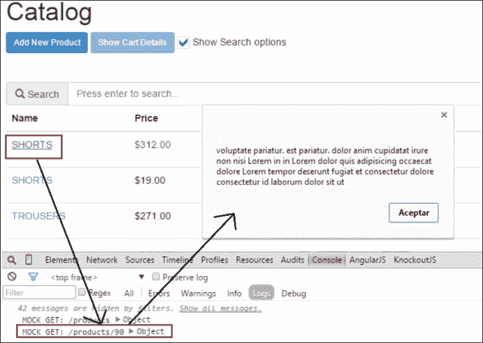
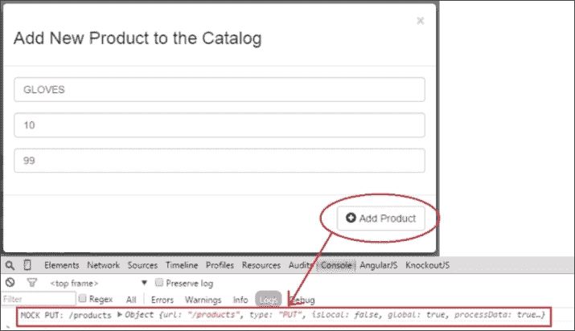
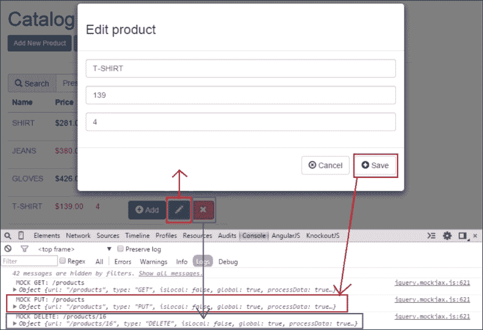
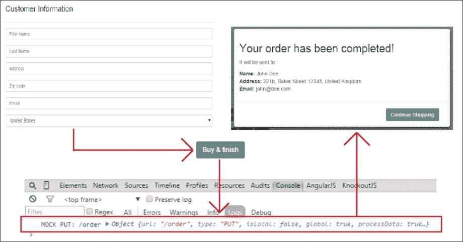
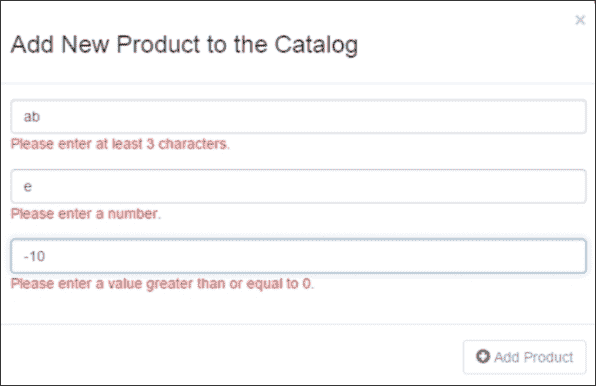

# 第五章 从服务器获取数据

我们现在有了一个购物车应用程序。要使其像真实世界的应用程序一样工作，我们需要从服务器获取数据。然而，本书侧重于如何使用 KnockoutJS 开发项目，而不是如何配置和运行服务器。

幸运的是，这种情况在每个项目中都会发生。前端开发人员开始仅使用数据规范，而没有任何后端服务器。

本章中，我们将构建一个完全功能的前端通信层，而无需后端服务器。要成功完成这项任务，我们将使用虚假对象模拟我们的数据层。当我们移除模拟层时，我们的应用将能够使用真实数据。这将帮助我们更快、更安全地开发我们的应用程序：更快，因为我们不需要等待真实服务器的响应，更安全，因为我们的数据操作不会影响真实服务器。

# REST 服务

在本章中，你将学习如何使前端层与后端层通信。

你不是在构建一个简单的网页，你正在构建一个 web 应用程序。这意味着你的项目不仅包含要显示给用户的数据，还有一些可点击的锚点和导航。这个网页还有一个逻辑和模型层，这使得它比一个简单的网页更复杂。

前端与服务器通信使用 Web 服务。W3C（代表 World Wide Web Consortium）定义 Web 服务为一种设计用于在网络上支持可互操作的机器对机器交互的软件系统。你可以使用许多协议来执行此交互：SOAP、POX、REST、RPC 等。

现在在 web 开发中，RESTful 服务被最多使用。这是因为 REST（代表 Representational State Transfer）协议具有一些特性，使其在这种应用程序中易于使用：

+   它们是基于 URI 的

+   通信使用互联网媒体类型（通常为 JSON，但也可以是 XML 或其他格式）

+   HTTP 方法是标准的：`GET`、`POST`、`PUT`、`DELETE`

+   可以使用超链接来引用资源的状态

要理解这些概念，我们将看一些示例。考虑到购物车场景，假设你想检索所有你的产品，那么请执行以下操作：

1.  定义 API 的入口点。RESTful 协议是基于 URI 的，如下所示：

    ```js
    http://mydomain.com/api/
    ```

1.  现在你想检索所有你的产品，因此定义一个指向此资源的 URI 如下所示：

    ```js
    http://mydomain.com/api/products
    ```

1.  由于这是一个检索操作，因此 HTTP 头应包含如下所示的 `GET` 方法：

    ```js
    GET /api/products HTTP/1.1
    ```

1.  为了利用 HTTP 协议，你可以在头部发送元数据；例如，你要发送的数据类型以及你要接收的数据，如下所示：

    ```js
    'Content-Type': 'application/json' //what we send
    Accept: 'application/json; charset=utf-8'//what we expect
    ```

1.  服务器将以预期格式回应一些数据和通常包含在 HTTP 头中的一些信息，例如操作的状态：`HTTP/1.1 200 OK`。以下是格式：

    +   如果一切顺利，则 2xx

    +   4xx，如果前端出现错误

    +   5xx，如果服务器端出现错误

如果您想要更新或删除一个对象，请将该对象的 ID 附加到 URI 并使用相应的标头。例如，要编辑或删除一个产品，使用适当的方法调用此 URI：`PUT`进行编辑和`DELETE`进行删除。服务器将适当处理这些请求，查找 URI 和标头中的信息，例如：

```js
http://mydomain.com/api/products/1
```

要了解有关 REST 和 RESTful 服务的更多信息，请参阅[`en.wikipedia.org/wiki/Representational_state_transfer`](http://en.wikipedia.org/wiki/Representational_state_transfer)。

# 定义 CRUD

当您定义一个用于发送和接收数据的服务时，此对象通常应执行最低程度的行为。您可以通过缩写**CRUD**来识别此行为：

+   **创建（C）**：您需要向服务器发送一条消息，其中包含要将其持久化在数据库中的新对象。HTTP 的`POST`动词用于此类请求。

+   **检索（R）**：该服务应能够发送请求以获取对象集合或仅特定对象。用于此类请求的是`GET`动词。

+   **更新（U）**：这是一个更新对象的请求。按照惯例，用于此类请求的是`PUT`动词。

+   **删除（D）**：这是一个删除对象的请求。用于此类请求的是`DELETE`动词。

可以实现更多操作，有时您不需要编写所有 CRUD 方法。您应根据应用程序的要求调整代码，并仅定义应用程序需要的操作。请记住，编写比应用程序需要的更多代码意味着在代码中创造更多错误的可能性。

# 单例资源

在此应用程序中，我们将资源称为与 API 服务器中包含的 URI 相关的对象。这意味着要管理`/products`URI，我们将拥有一个名为`ProductResource`的对象，该对象将管理此 URI 的 CRUD 操作。

我们将创建此对象作为单例，以确保我们在应用程序中只有一个对象管理每个 URI。有关单例的更多信息，请参阅[`en.wikipedia.org/wiki/Singleton_pattern`](http://en.wikipedia.org/wiki/Singleton_pattern)。

# 在资源中设置 CRUD 操作

我们将定义一些服务来为我们的产品和订单定义 CRUD 操作。一些开发人员常犯的一个常见错误是在模型类中设置 CRUD 操作。最佳实践表明，最好将模型和通信层分开。

为准备您的项目，请创建一个名为`services`的文件夹。在此文件夹中，存储包含 CRUD 操作的文件。执行以下步骤：

1.  在新文件夹中创建两个文件。它们代表两个通信服务：`OrderResource.js`和`ProductResource.js`。

1.  打开`ProductResource.js`文件，并定义基本的 CRUD 操作如下：

    ```js
    var ProductResource = (function () {
      function all() {}
      function get(id) {}
      function create(product) {}
      function update(product) {}
      function remove(id) {}
      return {
        all: all,
        get: get,
        create: create,
        update: update,
        remove: remove
      };
    })();
    ```

    这是 CRUD 服务的骨架。你可以使用 `all` 和 `get` 方法来定义检索操作。`all` 方法将返回所有产品，而 `get` 方法只返回传递的 ID 的产品。`create` 方法将创建一个产品，而 `update` 方法将更新一个产品。`remove` 方法将执行删除操作。我们称其为 `remove`，因为 `delete` 是 JavaScript 语言中的保留字。

1.  要实现这些方法的主体，请使用 jQuery AJAX 调用 ([`api.jquery.com/jquery.ajax/`](http://api.jquery.com/jquery.ajax/))。这样向服务器发出的请求是异步的，并使用一个称为 promise 的概念 ([`api.jquery.com/promise/`](http://api.jquery.com/promise/))。**Promise** 只是一个将来会包含一个值的对象。这个值通过使用回调函数来处理。

    Promise 图表：一个 promise 执行异步代码

1.  要定义 `retrieve` 方法，你需要定义 AJAX 请求的配置。调用此方法将返回一个 promise。你可以按照以下方式在视图模型中处理此 promise 中包含的数据：

    ```js
    function all() {
      return $.ajax({
        dataType:'json',
        type: 'GET',
        url: '/products'
      });
    }
    function get(id) {
      return $.ajax({
        dataType:'json',
        type: 'GET',
        url: '/products/'+id
      });
    }
    ```

1.  注意，你只需要定义服务器可用于获取数据的响应类型和端点。此外，完成 `CREATE`、`UPDATE` 和 `DELETE` 方法。记住要尊重动词 (`POST`、`PUT` 和 `DELETE`)。

    ```js
    function create(product) {
      return $.ajax({
        datatype:'json',
        type: 'POST',
        url: '/products',
        data: product
      });
    }
    function update(product) {
      return $.ajax({
        datatype:'json',
        type: 'PUT',
        url: '/products/'+product.id,
        data: product
      });
    }
    function remove(id) {
      return $.ajax({
        datatype:'json',
        type: 'DELETE',
        url: '/products/'+id
      });
    }
    ```

记住你正在构建一个 REST API，所以要遵循架构的约定。这意味着实体的 URL 应该以复数形式命名。

要获取所有产品，使用 `/products` URL。要获取一个产品，仍然使用 `/products` URL，但也将产品的 ID 添加到 URI 中。例如，`/products/7` 将返回 ID 为 `7` 的产品。如果关系更深入，例如，“客户 5 有消息”，则将路由定义为 `/customers/5/messages`。如果要从用户 `5` 中读取消息 ID 为 `1` 的消息，则使用 `/customers/5/message/1`。

有些情况下，你可以使用单数名称，比如 `/customers/5/configuration/`，因为一个用户通常只有一个配置。何时使用复数形式取决于你。唯一的要求是保持一致性。如果你更喜欢使用所有名称的单数形式，也可以，没有问题。将名称变为复数只是一种约定，而不是规则。

# 在视图模型中使用资源

现在我们已经创建了我们的产品资源，我们将在我们的视图模型中使用它来通过以下步骤获取我们的数据：

1.  首先，在 `index.html` 文件中链接 `ProductResource.js` 文件，如下所示：

    ```js
    <script type='text/javascript' src='js/resources/ProductResource.js'></script>
    ```

    由于资源是异步工作的，所以不能在文件末尾应用绑定，因为数据可能还没有准备好。因此，应在数据到达时应用绑定。

    要做到这一点，请创建一个名为`activate`的方法。此方法将在文件末尾触发，在我们之前调用`ko.applyBindings`的同一行上，方式如下：

    1.  获取此行代码：

        ```js
        ko.applyBindings(vm);
        ```

    1.  用这个替换它：

        ```js
        vm.activate();
        ```

1.  现在在视图模型中定义`activate`方法：

    ```js
    var activate = function () {
      ProductResource.all().done(allCallbackSuccess);
    };
    ```

    当您调用`all`方法时，将返回一个 jQuery 承诺。为了管理承诺的结果，jQuery 提供了一个承诺 API：

    +   `.done(callback)`：当承诺以成功解决时触发此方法。这意味着收到了与 5xx 或 4xx 不同的状态。

    +   `.fail(callback)`：您可以使用此方法来处理被拒绝的承诺。它由 5xx 和 4xx 头触发。

    +   `.then(successCb, errorCb)`：此方法以两个回调作为参数。第一个在承诺解决时调用，第二个在承诺被拒绝时调用。

    +   `.always(callback)`：传递给此方法的回调在两种情况下运行。

    通过使用 HTTP 头，您可以避免在响应主体中发送额外的信息以了解您是否收到了错误。了解您正在使用的协议（在本例中为 HTTP）并尝试使用它的所有优势是很重要的，比如在本例中，可以在其标头中发送信息的可能性。

1.  现在是定义`allCallbackSuccess`方法的时候了：

    ```js
    var allCallbackSuccess = function(response){
      catalog([]);
      response.data.forEach(function(item){
        catalog.push( 
          Product (item.id, item.name, item.price, item.stock)
        );
      });
      filteredCatalog(catalog());
      ko.applyBindings(vm);
    };
    ```

    一个 jQuery AJAX 回调总是将响应作为第一个参数。在这种情况下，您会收到一个 JSON 响应，其中包含目录中的所有项目。

    第一步是将目录初始化为空数组。一旦目录初始化完成，就可以对项目集合进行迭代。该集合存储在一个数据对象中。将数据隔离在其他变量中是一个好习惯。这只是为了以防您想向响应添加元数据。一旦目录准备就绪，请将其链接到`filteredCatalog`方法。

    当我们准备好初始数据时，这就是您可以调用`ko.applyBindings`方法的时刻。如果您在回调范围之外调用它，您不能确定目录是否已经包含了所有项目。这是因为资源执行操作是异步的，这意味着代码不是按顺序执行的。当资源返回的承诺有数据可用时，它才被执行。

1.  最后一步是在文件末尾运行`activate`方法，如下所示：

    ```js
    //ko External Template Settings
    infuser.defaults.templateSuffix = '.html';
    infuser.defaults.templateUrl = 'views';
    vm.activate();

    ```

运行我们的应用程序，它将无法工作，因为没有服务器来处理我们的请求。我们会得到一个 404 错误。为了解决这个问题，我们将模拟我们的 AJAX 调用和数据。


在没有服务器支持的情况下进行 AJAX 调用会引发 404 错误

# 使用 Mockjax 模拟 HTTP 请求

**Mocking** **data**意味着用另一个模拟其行为的函数替换`$.ajax`调用。在遵循测试驱动开发范 paradigm 时，模拟是一种常用的技术。

要模拟 jQuery AJAX 调用，我们将使用一个名为 Mockjax 的库。要在应用程序中安装 Mockjax，请按照以下步骤操作：

1.  从[`github.com/jakerella/jquery-mockjax`](https://github.com/jakerella/jquery-mockjax)下载该库。

1.  将其保存到`vendors`文件夹中。

1.  在`index.html`页面中添加一个引用，就在 jQuery 库后面。为此，使用`<script>`标签，如下所示：

    ```js
    <script type='text/javascript' src='vendors/jquery.mockjax.js'></script>
    ```

1.  创建一个名为`mocks`的文件夹，并在其中创建一个名为`product.js`的文件。

1.  在`product.js`文件中，定义一个调用`$.mockjax`函数的模拟，如下所示：

    ```js
    $.mockjax({
      url: '/products',
      type: 'GET',
      dataType: 'json',
      responseTime: 750,
      responseText: []
    });
    ```

    在这个定义中，你正在模拟`ProducResource.all()`方法内部调用的请求。要定义模拟，你只需要定义这些参数：

    +   **url**：你想要模拟的 URL

    +   **type**：请求的类型

    +   **dataType**：你期望的数据类型

    +   **responseTime**：响应所需的持续时间

    +   **responseText**：响应体

# 使用 MockJSON 生成模拟数据

一旦你模拟了 HTTP 调用，你需要在响应中发送一些数据。你有不同的可能性：

+   你可以手写数据到`$.mockjax`调用的`responseText`属性中：

    ```js
    $.mockjax({
      url: '/products',
      type: 'GET',
      dataType: 'json',
      responseTime: 750,
      responseText: ['Here I can fake the response']
    });
    ```

+   你可以使用一个函数来生成模拟数据：

    ```js
    $.mockjax({
      url: '/products',
      type: 'GET',
      dataType: 'json',
      responseTime: 750,
      response: function(settings) {
        var fake = 'We fake the url:'+settings.url;
        this.responseText = fake;
      }
    });
    ```

+   你可以使用一个在响应中生成复杂和随机数据的库。

    这第三个选项可以通过一个叫做`mockJSON`的库来执行。你可以从 GitHub 仓库[`github.com/mennovanslooten/mockJSON`](https://github.com/mennovanslooten/mockJSON)下载它。

    这个库允许你生成数据模板来创建随机数据。这有助于使你的虚假数据更加真实。你可以在屏幕上看到许多不同类型的数据。这将帮助你检查更多的数据显示可能性，比如文字是否溢出容器或者文字过长或过短在屏幕上看起来很难看。

    +   要生成一个随机元素，定义一个模拟模板如下：

        ```js
        $.mockJSON.generateFromTemplate({
          'data|5-10': [{
            'id|1-100': 0,
            'name': '@PRODUCTNAME',
            'price|10-500': 0,
            'stock|1-9': 0
          }]
        });
        ```

        这个模板表示你想要生成 5 到 10 个具有以下结构的元素：

        +   ID 将是介于 1 到 100 之间的数字。

        +   产品名称将是存储在`PRODUCTNAME`数组中的值。

        +   价格将是介于 10 到 500 之间的数字。

        +   股票价格将是介于 1 到 9 之间的数字。

        +   要生成产品名称数组，你只需要将一个数组或一个函数添加到`$.mockJSON.data`对象中，如下所示：

            ```js
            $.mockJSON.data.PRODUCTNAME = [
              'T-SHIRT', 'SHIRT', 'TROUSERS', 'JEANS', 'SHORTS', 'GLOVES', 'TIE'
            ];
            ```

    你可以生成任何你能想象到的数据。只需创建一个函数，返回一个你想要生成的值的数组，或者定义一个生成随机结果、数字、唯一 ID 等的函数。

    +   要将其作为响应返回，请将此模板附加到响应文本。你的代码应该如下所示：

        ```js
        $.mockJSON.data.PRODUCTNAME = [
          'T-SHIRT', 'SHIRT', 'TROUSERS', 'JEANS', 'SHORTS', 'GLOVES', 'TIE'
        ];
        $.mockjax({
          url: '/products',
          type: 'GET',
          dataType: 'json',
          responseTime: 750,
          status:200,
          responseText: $.mockJSON.generateFromTemplate({
            'data|5-5': [{
              'id|1-100': 0,
              'name': '@PRODUCTNAME',
              'price|10-500': 0,
              'stock|1-9': 0
            }]
          })
        });
        ```

在`index.html`文件的末尾使用`<script>`标签添加`mocks/product.js`文件，然后查看每次刷新网页时如何获得新的随机数据。


当进行模拟调用时，我们会在控制台中看到这条消息

# 通过 ID 检索产品

要从我们的 API 获取一个产品，我们将伪造 `ProductResource` 的 `get` 方法。 即当我们在目录列表中点击产品名称时，`ProductResource.get` 方法将被激活。

此 URI 在 URI 的最后一段包含产品的 ID。 这意味着 ID=1 的产品将生成类似 `/products/1` 的 URI。 ID=2 的产品将生成类似 `/products/2` 的 URI。

因此，这意味着我们无法将 URL 设置为固定字符串。 我们需要使用正则表达式。

如果您需要更多关于正则表达式的信息，请查看此链接：

[`developer.mozilla.org/en/docs/Web/JavaScript/Guide/Regular_Expressions`](https://developer.mozilla.org/en/docs/Web/JavaScript/Guide/Regular_Expressions)

为了完成代码以检索产品，请按照以下步骤进行：

1.  添加一个 `mockjax` 调用来模拟 URI。它应该使用 `GET` HTTP 方法。将正则表达式附加到 `url` 属性，如下所示：

    ```js
    $.mockjax({
      url: /^\/products\/([\d]+)$/,
      type: 'GET',
      dataType: 'json',
      responseTime: 750,
      responseText: ''
    });
    ```

1.  创建一个返回单个产品对象的模板。要生成随机描述，您可以使用 `@LOREM_IPSUM` 魔术变量，它会返回随机文本。它的使用方式与构建 `@PRODUCTNAME` 变量的方式相同。让我们使用以下代码创建一个模板：

    ```js
    $.mockJSON.generateFromTemplate({
      'data': {
        'id|1-100': 0,
        'name': '@PRODUCTNAME',
        'price|10-500': 0,
        'stock|1-9': 0,
        'description': '@LOREM_IPSUM'
      }
    })
    ```

1.  将以下模板附加到 `responseText` 变量：

    ```js
    //URI: /products/:id
    $.mockjax({
      url: /^\/products\/([\d]+)$/,
      type: 'GET',
      dataType: 'json',
      responseTime: 750,
      responseText: $.mockJSON.generateFromTemplate({
        'data': {
          'id|1-100': 0,
          'name': '@PRODUCTNAME',
          'price|10-500': 0,
          'stock|1-9': 0,
          'description': '@LOREM_IPSUM'
        }
      })
    });
    ```

1.  在 `viewmodel.js` 文件中，创建一个方法，该方法使用 `ProductResource` 对象检索产品。 该方法在数据可用时将显示一个警告框。

    ```js
    var showDescription = function (data) {
      ProductResource.get(data.id())
      .done(function(response){
        alert(response.data.description);
      });
    };
    ```

1.  将 `showDescription` 方法绑定到 `catalog.html` 模板上：

    ```js
    <td><a href data-bind='click:$parent.showDescription, text: name'></a></td>
    ```

1.  在视图模型接口中公开 `showDescription` 方法：

    ```js
    return {
      …
      showDescription: showDescription,
      …
    };
    ```

1.  测试如何在警告框中获取描述。

    点击产品名称将显示产品描述

# 创建一个新产品

要创建一个产品，请按照前一节中的相同步骤进行：

1.  在`mocks/product.js` 文件中添加一个 AJAX 模拟调用：

    ```js
    $.mockjax({
      url: '/products',
      type:'POST',
      dataType: 'json',
      responseTime: 750,
      status:200,
      responseText: {
        'data': {
          text: 'Product created'
        }
      }
    });
    ```

    您应该记住一些注意事项：

    +   您应该使用 `POST` 动词来创建对象。实际上，您可以使用任何您想要的动词，但根据 RESTful API 的约定，`POST` 动词是您应该用来创建新对象的一个。

    +   响应文本是提供有关结果的一些信息的消息。

    +   结果本身由标头管理：

    +   如果在状态中获得 `2xx` 值，则会触发 `done` 方法。

    +   如果收到 `4xx` 或 `5xx` 错误，则调用 `fail` 方法。

1.  转到 `modelview.js` 文件并更新 `addProduct` 函数：

    ```js
    var addProduct = function (data) {
      var id = new Date().valueOf();
      var product = new Product(
        id,
        data.name(),
        data.price(),
        data.stock()
      );

      ProductResource.create(ko.toJS(data))
      .done(function (response){
        catalog.push(product);
        filteredCatalog(catalog());
        newProduct = Product(new Date().valueOf(),'',0,0);
        $('#addToCatalogModal').modal('hide');
      });
    };
    ```

显而易见，您不能将 Knockout observables 发送到服务器。 要将包含 observables 的对象转换为普通 JSON 对象，请使用 `ko.to` `JS` 函数。 此函数会遍历对象并提取每个 observable 的值。

您可以在 [`knockoutjs.com/documentation/json-data.html`](http://knockoutjs.com/documentation/json-data.html) 上找到关于 `ko.to` `JS` 和其他方法的信息。

也许你已经注意到了，当你添加一个新产品时，库存会减少一个。这是因为当你在产品中使用`ko.toJS`函数时，它会执行所有的函数。因此，为了使用它，你应该避免那些会操作对象并可能在内部改变其值的方法。我们将在下一节中解决这个问题。

测试应用程序在调用`addProduct`方法时是否发送数据。



添加新产品时使用 AJAX 调用；注意 URL 和类型字段

# 关注关注点分离 - 行为和数据

我们在应用程序中发现了一个问题。当我们使用`ko.toJS`函数时，结果与预期不符。这是软件开发中常见的情况。

我们在模型中设置了一些逻辑，这是一个错误的选择，我们需要修复它。为了解决这个问题，我们将数据和这些行为分开。我们将使用一些我们称之为服务的类。

服务将管理我们模型的逻辑。这意味着每个模型都会有一个相关的服务来管理其状态。

# 创建产品服务

如果你查看`models/product.js`文件，你会发现该模型包含一些逻辑：

```js
var hasStock = function () {
  return _product.stock() > 0;
};
var decreaseStock = function () {
  var s = _product.stock();
  if (s > 0) {
    s--;
  }
  _product.stock(s);
};
```

我们将使用以下步骤将此逻辑和更多内容移动到一个服务中：

1.  创建一个名为`services`的文件夹。

1.  在其中，创建一个名为`ProductService`的文件。

1.  创建一个单例对象，并添加`hasStock`和`decreaseStock`函数，如下所示：

    ```js
    var ProductService = (function() {
      var hasStock = function (product) {
        return product.stock() > 0;
      };

      var decreaseStock = function (product) {
        var s = product.stock();
        if (s > 0) {
          s--;
        }
        product.stock(s);
      };

      return {
        hasStock:hasStock,
        decreaseStock:decreaseStock
      };
    })();
    ```

1.  更新`add-to-cart-button`组件：

    ```js
    this.addToCart = function() {
      ...
      if (item) {
        CartProductService.addUnit(item);
      } else {
        item = CartItem(data,1);
        tmpCart.push(item);
        ProductService.decreaseStock(item.product);
      }
      this.cart(tmpCart);
    };
    ```

注意，你还需要创建一个服务来管理购物车商品的逻辑。

# 创建`CartProduct`服务

购物车商品服务还提取了`CartProduct`模型的逻辑。要创建此服务，请按照以下步骤操作：

1.  在`service`文件夹中创建一个名为`CartProductService.js`的文件。

1.  从`CartProduct`模型中删除`addUnit`和`removeUnit`方法。

1.  使用以下方法更新服务：

    ```js
    var CartProductService = (function() {

      var addUnit = function (cartItem) {
        var u = cartItem.units();
        var _stock =  cartItem.product.stock();
        if (_stock === 0) {
          return;
        }
        cartItem.units(u+1);
        cartItem.product.stock(--_stock);
      };

      var removeUnit = function (cartItem) {
        var u =  cartItem.units();
        var _stock =  cartItem.product.stock();
        if (u === 0) {
          return;
        }
        cartItem.units(u-1);
        cartItem.product.stock(++_stock);
      };

      return {
        addUnit:addUnit,
        removeUnit:removeUnit
      };
    })();
    ```

# 更新产品

在我们的目录中，我们将希望更新我们产品的价值。要完成此操作，请按照以下步骤操作：

1.  首先，要更新一个产品，你需要模拟处理该操作的 URI：

    ```js
    $.mockjax({
        url: /^\/products\/([\d]+)$/,
        type:'PUT',
        dataType: 'json',
        responseTime: 750,
        status:200,
        responseText: {
            'data': {
                text: 'Product saved'
            }
        }
    });
    ```

1.  在`catalog.html`视图的每一行中添加一个按钮，在您有`add-to-cart-button`组件的相同单元格中：

    ```js
    <button class='btn btn-info' data-bind='click: $parent.openEditModal'>
      <i class='glyphicon glyphicon-pencil'></i>
    </button>
    ```

1.  现在，使用这个产品的数据打开一个模态框：

    ```js
    var openEditModal = function (product) {
      tmpProduct = ProductService.clone(product);
      selectedProduct(product);
      $('#editProductModal').modal('show');
    };
    ```

1.  `tmpProduct`将包含您要编辑的对象的副本：

    ```js
    Var tmpProduct = null;
    ```

1.  `selectedProduct`将包含您要编辑的原始产品：

    ```js
    Var selectedProduct = ko.observable();
    ```

1.  在`ProductService`资源中创建`clone`函数：

    ```js
    var clone = function (product) {
      return Product(product.id(), product.name(), product.price(), product.stock());
    };
    ```

1.  在`ProductService`资源中创建`refresh`函数。此方法允许服务在不丢失对购物车中产品的引用的情况下刷新产品。

    ```js
    var refresh = function (product,newProduct) {
      product.name(newProduct.name());
      product.stock(newProduct.stock());
      product.price(newProduct.price());
    };
    ```

1.  将这两个方法添加到服务接口中：

    ```js
    return {
      hasStock:hasStock,
      decreaseStock:decreaseStock,
      clone:clone,
      refresh: refresh
    };
    ```

1.  创建`edit-product-modal.html`模板以显示编辑模态框。此模板是`create-product-modal.html`模板的副本。你只需要更新 form 标签行，如下所示：

    ```js
    <form class='form-horizontal' role='form' data-bind='with:selectedProduct'>
    ```

1.  你还需要更新`button`绑定：

    ```js
    <button type='submit' class='btn btn-default' data-bind='click: $parent.cancelEdition'>
      <i class='glyphicon glyphicon-remove-circle'></i> Cancel
    </button>
    <button type='submit' class='btn btn-default' data-bind='click: $parent.updateProduct'>
      <i class='glyphicon glyphicon-plus-sign'></i> Save
    </button>
    ```

1.  现在，定义`cancelEditon`和`saveProduct`方法：

    ```js
    var cancelEdition = function (product) {
      $('#editProductModal').modal('hide');
    };
    var saveProduct = function (product) {
      ProductResource.save(ko.toJS(product)).done( function(response){
        var tmpCatalog = catalog();
        var i = tmpCatalog.length;
        while(i--){
          if(tmpCatalog[i].id() === product.id()){
            ProductService.refresh(tmpCatalog[i],product);
          }
        }
        catalog(tmpCatalog);
        filterCatalog();
        $('#editProductModal').modal('hide');
      });
    };
    ```

1.  最后，将这些方法添加到视图模型 API 中。

现在，您可以测试如何更新产品的不同值。

# 删除产品

要删除产品，按照与`CREATE`和`UPDATE`方法相同的简单步骤进行操作。

1.  第一步是在`mocks/products.js`文件中创建模拟内容，如下所示：

    ```js
    $.mockjax({
      url: /^\/products\/([\d]+)$/,
      type:'DELETE',
      dataType: 'json',
      responseTime: 750,
      status:200,
      responseText: {
        'data': {
          text: 'Product deleted'
        }
      }
    });
    ```

1.  这种方法非常简单。只需添加一个类似编辑按钮的按钮，然后删除它。

    ```js
    var deleteProduct = function (product){
      ProductResource.remove(product.id())
      .done(function(response){
        catalog.remove(product);
        filteredCatalog(catalog());
        removeFromCartByProduct(product);
      });
    };
    ```

1.  创建一个函数来从购物车中移除产品。此函数遍历购物车项目并找到与移除产品相关的购物车项目。一旦找到该项目，就可以使用`removeFromCart`函数将其删除为普通项目：

    ```js
    var removeFromCartByProduct = function (product) {
      var tmpCart = cart();
      var i = tmpCart.length;
      var item;
      while(i--){
        if (tmpCart[i].product.id() === product.id()){
          item = tmpCart[i];
        }
      }
      removeFromCart(item);
    }
    ```

1.  在目录模板中添加一个按钮，位于编辑按钮旁边：

    ```js
    <button class='btn btn-danger' data-bind='click: $parent.deleteProduct'>
      <i class='glyphicon glyphicon-remove'></i>
    </button>
    ```

    

    编辑和删除按钮

# 将订单发送到服务器

一旦您可以与服务器通信来管理我们的产品，就是时候发送订单了。为此，请按照以下说明进行：

1.  创建一个名为`resources/OrderResource.js`的文件，并添加以下内容：

    ```js
    'use strict';
    var OrderResource = (function () {
      function create(order) {
        return $.ajax({
          type: 'PUT',
          url: '/order',
          data: order
        });
      }
      return {
        create: create
      };
    })();
    ```

1.  通过创建名为`mocks/order.js`的文件并添加以下代码来模拟调用：

    ```js
    $.mockjax({
      type: 'POST',
      url: '/order',
      status: 200,
      responseTime: 750,
      responseText: {
        'data': {
          text: 'Order created'
        }
      }
    });
    ```

1.  更新`viewmodel.js`文件中的`finishOrder`方法：

    ```js
    var finishOrder = function() {
      OrderResource.create().done(function(response){
        cart([]);
        visibleCart(false);
        showCatalog();
        $('#finishOrderModal').modal('show');
      });
    };
    ```

我们应用程序的要求之一是，用户可以更新个人数据的选项。我们将允许用户将个人数据附加到订单中。这很重要，因为当我们发送订单时，我们需要知道谁将收到订单。

1.  在`models`文件夹中创建一个名为`Customer.js`的新文件。它将包含以下函数，用于生成客户：

    ```js
    var Customer = function () {
      var firstName = ko.observable('');
      var lastName = ko.observable('');
      var fullName = ko.computed(function(){
        return firstName() + ' ' + lastName();
      });
      var address = ko.observable('');
      var email = ko.observable('');
      var zipCode = ko.observable('');
      var country = ko.observable('');
      var fullAddress = ko.computed(function(){
        return address() + ' ' + zipCode() + ', ' + country();
      });
      return {
        firstName:firstName,
        lastName: lastName,
        fullName: fullName,
        address: address,
        email: email,
        zipCode: zipCode,
        country: country,
        fullAddress: fullAddress,
      };
    };
    ```

1.  链接到视图模型：

    ```js
    var customer = Customer();
    ```

1.  还要创建一个用于存储可销售国家的可观察数组：

    ```js
    var countries = ko.observableArray(['United States', 'United Kingdom']);
    ```

1.  在订单模板中创建一个表单，以显示一个完成客户数据的表单：

    ```js
    <div class='col-xs-12 col-sm-6'>
      <form class='form-horizontal' role='form' data-bind='with:customer'>
        <div class='modal-header'>
          <h3>Customer Information</h3>
        </div>
        <div class='modal-body'>
          <div class='form-group'>
            <div class='col-sm-12'>
              <input type='text' class='form-control' placeholder='First Name' data-bind='textInput:firstName'>
            </div>
          </div>
          <div class='form-group'>
            <div class='col-sm-12'>
              <input type='text' class='form-control' placeholder='Last Name' data-bind='textInput:lastName'>
            </div>
          </div>
          <div class='form-group'>
            <div class='col-sm-12'>
              <input type='text' class='form-control' placeholder='Address' data-bind='textInput:address'>
            </div>
          </div>
          <div class='form-group'>
            <div class='col-sm-12'>
              <input type='text' class='form-control' placeholder='Zip code' data-bind='textInput:zipCode'>
            </div>
          </div>
          <div class='form-group'>
            <div class='col-sm-12'>
              <input type='text' class='form-control' placeholder='Email' data-bind='textInput:email'>
            </div>
          </div>
          <div class='form-group'>
            <div class='col-sm-12'>
              <select class='form-control' data-bind='options: $parent.countries,value:country'></select>
            </div>
          </div>
        </div>
      </form>
    </div>
    ```

1.  使用`finishOrder`方法将此信息与订单请求一起发送：

    ```js
    var finishOrder = function() {
      var order = {
        cart: ko.toJS(cart),
        customer: ko.toJS(customer)
      };
      OrderResource.create(order).done(function(response){
        cart([]);
        hideCartDetails();
        showCatalog();
        $('#finishOrderModal').modal('show');
      });
    };
    ```

我们的 AJAX 通讯已经完成。现在，您可以在项目中添加和移除`mocks/*.js`文件，以获取虚假数据或真实数据。在使用此方法时，当您开发前端问题时，无需在应用程序后面运行服务器。



一旦提供了个人数据，您就可以关闭订单

# 处理 AJAX 错误

我们构建了应用程序的正常路径。但在现实世界中，在与服务器的通讯过程中可能会发生错误。要处理这种情况有两种方法：

+   AJAX 承诺的`fail`方法：

    ```js
    ProductResource.remove()
    .done(function(){...})
    .fail(function(response){
      console.error(response);
      alert("Error in the communication. Check the console!");
    });
    ```

+   一个全局的 AJAX 错误处理程序：

    ```js
    $(document).ajaxError(function(event,response) {
      console.error(response);
      alert("Error in the communication. Check the console!");
    });
    ```

如果您有一致的错误格式，全局处理程序是处理错误的非常好的选择。

要测试错误，请将一个模拟的状态属性从 200 更新为 404 或 501：

```js
$.mockjax({
  url: /^\/products\/([\d]+)$/,
  type:"DELETE",
  dataType: "json",
  responseTime: 750,
  status:404,
  responseText: {
    "data": {
      text: "Product deleted"
    }
  }
});
```

# 验证数据

现在您可以发送和接收数据了，但是如果用户设置了服务器不允许的一些数据会发生什么？您无法控制用户输入。如果某些值不允许，重要的是要提醒用户。要验证 Knockout 数据，有一个名为 Knockout Validation 的库（可在[`github.com/Knockout-Contrib/Knockout-Validation`](https://github.com/Knockout-Contrib/Knockout-Validation)找到），可以使这变得非常容易。

此库通过为可观察对象添加一些值来扩展可观察对象，以使您在数据更改时能够验证数据。我们现在将更新我们的模型以添加某种验证。

# 扩展产品模型

为了使用 Knockout Validation 库验证我们的模型，我们将扩展我们模型的属性。**扩展器**是 Knockout 的基本功能。使用扩展器，我们可以向我们的可观察对象添加一些属性以增强其行为。有关扩展器的更多信息，请参阅以下链接：

[`knockoutjs.com/documentation/extenders.html`](http://knockoutjs.com/documentation/extenders.html)

我们将通过以下步骤扩展我们的产品模型以添加一些属性，以允许我们验证数据：

1.  转到`models/Product.js`文件。

1.  更新`name`字段。它应至少包含三个字母，并且应仅包含字母、数字和破折号：

    ```js
    _name = ko.observable(name).extend({
      required: true,
      minLength: 3,
      pattern: {
        message: 'Hey this doesn\'t match my pattern',
        params: '^[A-Za-z0-9 \-]+$'
      }
    })
    ```

1.  更新`price`以仅允许数字，并为其设置范围（最大和最小值）：

    ```js
    _price = ko.observable(price).extend({
      required: true,
      number:true,
      min: 1
    }),
    ```

1.  对`stock`也执行同样的操作：

    ```js
    _stock = ko.observable(stock).extend({
      required: true,
      min: 0,
      max: 99,
      number: true
    })
    ```

1.  创建一个验证组以确定何时整个对象是有效的：

    ```js
    var errors = ko.validation.group([_name, _price, _stock]);
    ```

    此错误变量将包含一个可观察数组。当此数组没有元素时，所有可观察对象均具有正确的值。

1.  在`add-to-catalog-modal.html`模板中，仅在产品中的所有值都有效时才启用创建按钮：

    ```js
    <button type='submit' class='btn btn-default' data-bind='click:$parent.addProduct, enable:!errors().length'>
      <i class='glyphicon glyphicon-plus-sign'></i> Add Product
    </button>
    ```

1.  在`edit-product-modal.html`模板中添加相同的按钮：

    ```js
    <button type='submit' class='btn btn-default' data-bind='enable:!errors().length, click: $parent.saveProduct'>
      <i class='glyphicon glyphicon-plus-sign'></i> Save
    </button>
    ```

1.  如果要为错误消息设置样式，只需为`validationMessage`类定义 CSS 规则，如下所示。将显示一个`span`元素，显示在与验证的可观察对象绑定的元素旁边：

    ```js
    .validationMessage { color: Red; }
    ```

# 扩展客户模型

您还需要验证客户数据。以下是验证规则：

+   名字是必需的

+   姓是必需的，且至少需要三个字符

+   地址是必需的，且至少需要五个字符

+   电子邮件地址是必需的，并且必须与内置的电子邮件模式匹配

+   邮政编码是必需的，且必须包含五个数字

要完成此任务，请按照以下方式更新代码：

1.  在`models/Customer.js`文件中扩展客户对象：

    ```js
    var firstName = ko.observable('').extend({
      required: true
    });
    var lastName = ko.observable('').extend({
      required: true,
      minLength: 3
    });
    var fullName = ko.computed(function(){
      return firstName() + ' ' + lastName();
    });
    var address = ko.observable('').extend({
      required: true,
      minLength: 5
    });
    var email = ko.observable('').extend({
      required: true,
      email: true
    });
    var zipCode = ko.observable('').extend({
      required: true,
      pattern: {
        message: 'Zip code should have 5 numbers',
        params: '^[0-9]{5}$'
      }
    });
    var country = ko.observable('');
    var fullAddress = ko.computed(function(){
        return address() + ' ' + zipCode() + ', ' + country();
    });
    var errors = ko.validation.group([firstName, lastName, address, email, zipCode]);
    ```

1.  如果客户数据已完成并且有效，请在`order.html`模板中启用购买按钮。

    ```js
    <button class='btn btn-sm btn-primary' data-bind='click:finishOrder, enable:!customer.errors().length'>
      Buy & finish
    </button>
    ```

1.  在`finish-order-modal.html`模板中显示用户信息。

    ```js
    <div class='modal-body'>
      <h2>Your order has been completed!</h2>
      <p>It will be sent to:</p>
      <p>
        <b>Name: </b><span data-bind='text: customer.fullName'></span><br/>
        <b>Address: </b><span data-bind='text: customer.fullAddress'></span><br/>
        <b>Email: </b><span data-bind='text: customer.email'></span><br/>
      </p>
    </div>
    ```

    

    如果字段中的信息无效，则显示验证消息。

现在我们的模型已经验证，并且我们知道我们发送的数据具有有效的格式。

要查看应用程序的完整代码，你可以从[`github.com/jorgeferrando/knockout-cart/tree/chapter5`](https://github.com/jorgeferrando/knockout-cart/tree/chapter5)下载本章的代码。

# 摘要

在本章中，你学会了如何使用 jQuery 与我们的应用程序进行通信以执行 AJAX 调用。 你还学会了使用 Knockout Validation 库对我们的模型应用验证有多么容易，该库使用了 Knockout 本身的`extend`方法来增强可观察对象的行为。

你经历了 KnockoutJS 的一个问题：你需要将对象序列化后发送到服务器，并且需要在从服务器返回时将它们包装在可观察对象中。 要解决这个问题，你可以使用`ko.toJS`方法，但这意味着对象没有允许它们更新值的代码。

在接下来的章节中，你将学会如何使用 RequireJS 和模块模式来管理文件之间的依赖关系。
