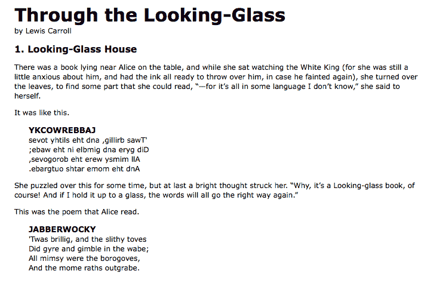
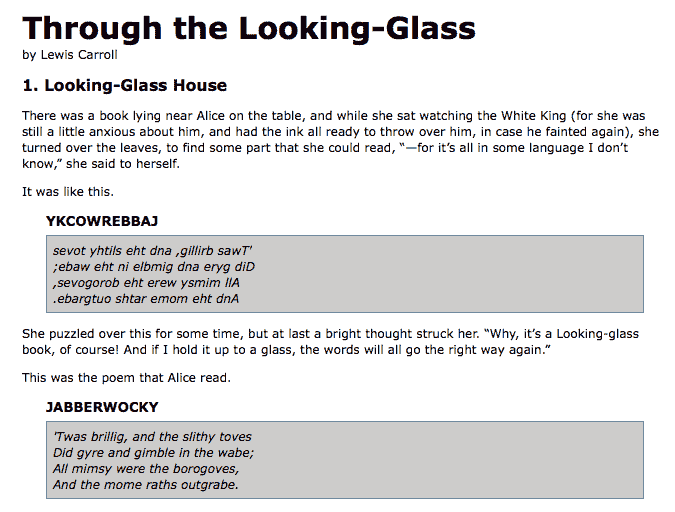
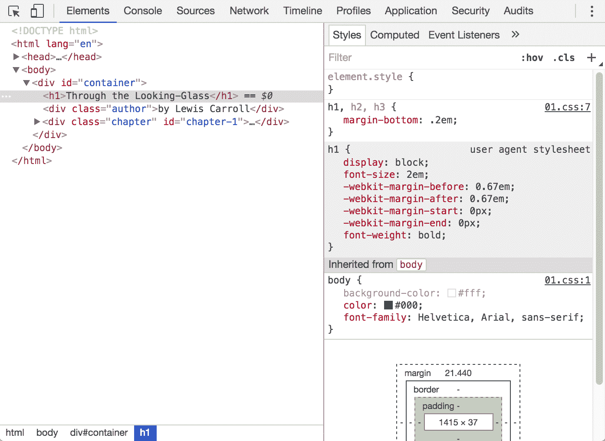
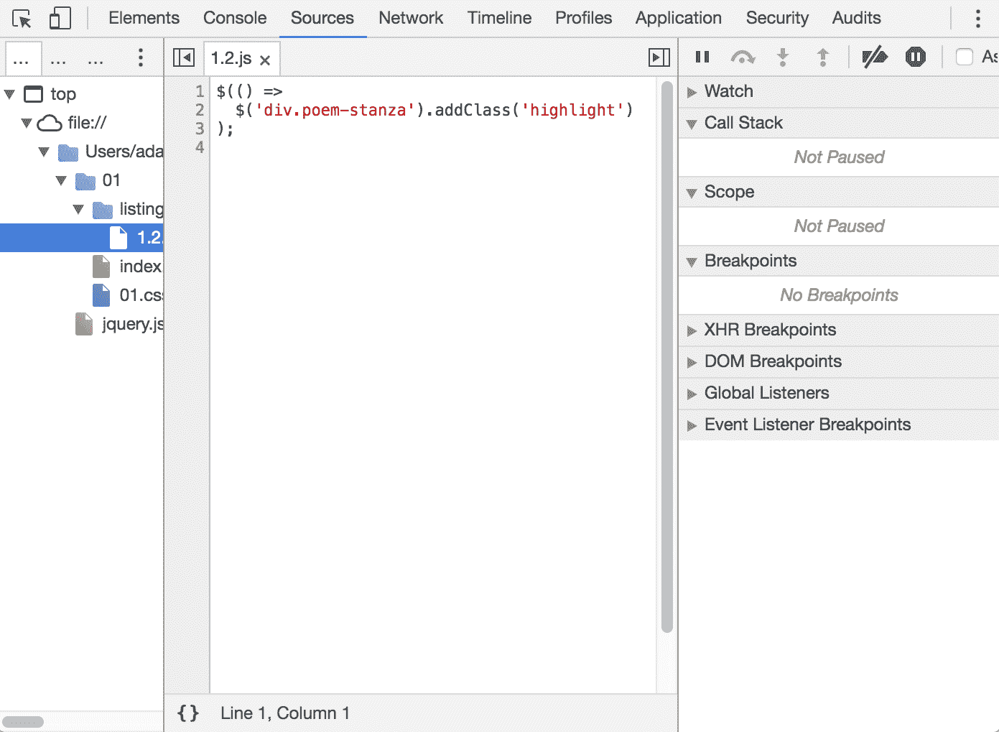
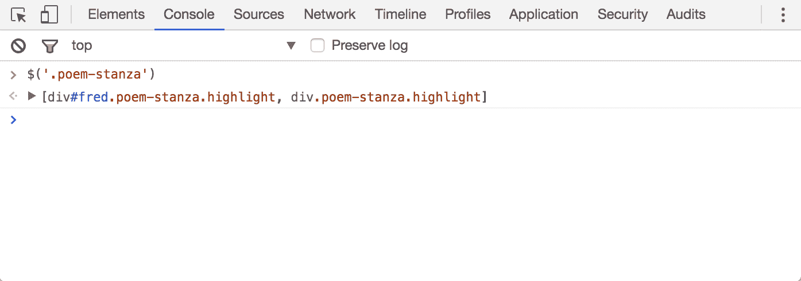

# 入门

今天的**万维网**（**WWW**）是一个动态的环境，其用户对站点的样式和功能设置了很高的标准。为了构建有趣和交互式的站点，开发人员正在转向 JavaScript 库，如 jQuery，来自动执行常见任务并简化复杂任务。jQuery 库之所以成为热门选择的原因之一是其能够帮助完成各种任务。

由于 jQuery 执行了许多不同的功能，因此很难知道从哪里开始。然而，该库的设计具有一致性和对称性；许多概念都借鉴自**HTML**和**层叠样式表**（**CSS**）的结构。这种设计适合对编程经验较少的设计师快速入门，因为许多人对这些技术的了解比对 JavaScript 更多。事实上，在本章中，我们将只用三行代码编写一个功能齐全的 jQuery 程序。另一方面，有经验的程序员也会欣赏到这种概念上的一致性。

在本章中，我们将涵盖：

+   jQuery 的主要特性

+   设置 jQuery 代码环境

+   一个简单的工作中的 jQuery 脚本示例

+   选择 jQuery 而不是普通 JavaScript 的原因

+   常见的 JavaScript 开发工具

# jQuery 做了什么？

jQuery 库为常见的网页脚本提供了一个通用的抽象层，因此在几乎每种脚本情况下都很有用。它的可扩展性意味着我们永远无法在一本书中涵盖所有可能的用途和功能，因为插件不断被开发用来添加新的功能。然而，核心特性却能帮助我们完成以下任务：

+   **访问文档中的元素**：没有 JavaScript 库，Web 开发人员通常需要编写许多代码行来遍历**文档对象模型**（**DOM**）树并定位 HTML 文档结构的特定部分。有了 jQuery，开发人员可以使用强大而高效的选择器机制，轻松地检索需要检查或操作的文档的确切部分。

```js
$('div.content').find('p'); 

```

+   **修改网页的外观**：CSS 提供了一种影响文档呈现方式的强大方法，但当不是所有的 web 浏览器都支持相同的标准时，它会显得不足。使用 jQuery，开发人员可以弥补这一差距，依赖于所有浏览器的相同标准支持。此外，jQuery 可以在页面呈现后改变应用于文档部分的类别或个别样式属性。

```js
$('ul > li:first').addClass('active'); 

```

+   **修改文档的内容**：jQuery 不仅仅局限于表面上的改变，它可以用几个按键来修改文档本身的内容。文本可以被更改，图像可以被插入或交换，列表可以被重新排序，甚至可以用单个易于使用的**应用程序编程接口**（**API**）重写和扩展 HTML 的整个结构。

```js
$('#container').append('<a href="more.html">more</a>'); 

```

+   **响应用户的交互**: 即使是最复杂和强大的行为，如果我们无法控制它们发生的时间，也是没有用的。jQuery 库提供了一种优雅的方式来拦截各种事件，比如用户点击链接，而不需要用事件处理程序来混杂 HTML 代码本身。

```js
$('button.show-details').click(() => { 
  $('div.details').show(); 
});

```

+   **动画文档中正在进行的更改**: 要有效地实现这样的交互行为，设计者还必须为用户提供视觉反馈。jQuery 库通过提供一系列效果，如淡入淡出和擦除，以及用于制作新效果的工具包，来促进这一点。

```js
$('div.details').slideDown(); 

```

+   **在不刷新页面的情况下从服务器检索信息**: 这种模式被称为 **Ajax**，最初代表 **异步 JavaScript 和 XML**，但后来已经成为了一套更大的用于客户端和服务器之间通信的技术集合。jQuery 库从这个过程中移除了特定于浏览器的复杂性，使开发者可以专注于服务器端功能。

```js
$('div.details').load('more.html #content');

```

# 为什么 jQuery 的效果好？

随着对动态 HTML 的兴趣重新涌现，JavaScript 框架也在不断涌现。有些是专门的，只关注先前提到的一两个任务。其他尝试列出每一个可能的行为和动画，并提供预打包的。为了保持先前列出的广泛功能范围，同时保持相对紧凑，jQuery 采用了几种策略：

+   **利用 CSS 知识**: 通过基于 CSS 选择器定位页面元素的机制，jQuery 继承了一种简洁而易读的表达文档结构的方式。由于专业网页开发的先决条件是对 CSS 语法的了解，因此 jQuery 库成为了设计师想要为其页面添加行为的入口点。

+   **支持扩展**: 为了避免“功能蔓延”，jQuery 将特殊用例委托给插件。创建新插件的方法简单而且有文档说明，这推动了各种富有创意和有用的模块的开发。即使基本 jQuery 下载包中的大多数功能都是通过插件架构内部实现的，如果需要，也可以删除，从而获得更小的库。

+   **抽象出浏览器的怪癖**: 网页开发的一个不幸现实是，每个浏览器都有自己的一套与发布标准不一致的特性。任何一个网页应用的一个重要部分都可能被归类为在每个平台上以不同方式处理功能。虽然不断发展的浏览器环境使得对于某些高级功能来说，无法实现完全与浏览器无关的代码库成为可能，但 jQuery 添加了一个抽象层，规范了常见任务，减少了代码量的同时极大地简化了它。

+   **始终与集合一起工作**：当我们指示 jQuery 查找所有具有 `collapsible` 类的元素并隐藏它们时，没有必要遍历每个返回的元素。相反，像 `.hide()` 这样的方法被设计为自动在对象集合上工作，而不是在单个对象上工作。这种技术称为*隐式迭代*，意味着许多循环结构变得不再必要，大大减少了代码量。

+   **允许一行中进行多个操作**：为了避免过多使用临时变量或者重复浪费，jQuery 使用一种被称为*链式调用*的编程模式来执行其大多数方法。这意味着对对象的大多数操作的结果都是对象本身，准备好接受下一个操作。

这些策略使 jQuery 包的文件大小保持较小，同时为我们的自定义代码提供了保持紧凑的技巧，以及使用该库。

这个库的优雅部分是由设计部分和由项目周围蓬勃发展的活跃社区所推动的进化过程造成的。jQuery 的用户聚集在一起讨论的不仅是插件的开发，还包括对核心库的增强。用户和开发人员还协助不断改进官方项目文档，这些文档可以在 [`api.jquery.com`](http://api.jquery.com) 找到。

尽管构建这样一个灵活而强大的系统需要付出巨大的努力，但最终产品却是供所有人免费使用的。这个开源项目在 MIT 许可证下授权，允许在任何网站上免费使用 jQuery，并促进其在专有软件中的使用。如果一个项目需要，开发者可以重新将 jQuery 授权为 GNU 公共许可证，以便包含在其他 GNU 许可的开源项目中。

# jQuery 3 有什么新特性？

与 jQuery 2 引入的变化相比，jQuery 3 引入的变化相当微妙。大多数变化都在幕后进行。让我们简要地看一下一些变化以及它们对现有 jQuery 项目的影响。您可以在阅读本书的同时查看细粒度的详细信息（[`jquery.com/upgrade-guide/3.0`](https://jquery.com/upgrade-guide/3.0)）。

# 浏览器支持

jQuery 3 中浏览器支持的最大变化是 Internet Explorer。不得不支持此浏览器的旧版本是任何网页开发人员的噩梦。jQuery 3 通过仅支持 IE9+ 迈出了重要的一步。其他浏览器的支持政策是当前版本和上一个版本。

Internet Explorer 的时代已经屈指可数。微软发布了 IE 的继任者 Edge。这个浏览器是完全独立于 IE 的项目，不会受到一直困扰 IE 的问题的影响。此外，最近版本的 Microsoft Windows 实际上推动 Edge 成为默认浏览器，并且更新是定期且可预测的。再见了，IE，真是一去不复返。

# 延迟对象

`Deferred` 对象在 jQuery 1.5 中引入，作为更好地管理异步行为的手段。它们有点像 ES2015 的 promises，但不同之处足以使它们不能互换。现在，随着 ES2015 版本的 JavaScript 在现代浏览器中变得普遍，`Deferred` 对象与原生 `Promise` 对象完全兼容。这意味着旧的 `Deferred` 实现发生了相当大的变化。

# 异步文档准备

起初，文档准备好的回调函数被异步执行的想法可能看起来有些违反直觉。在 jQuery 3 中之所以会这样，有几个原因。首先，`$(() => {})` 表达式返回一个 `Deferred` 实例，这些现在的行为类似于原生 Promise。第二个原因是存在一个 `jQuery.ready` promise，在文档准备好时解析。正如你在本书后面将看到的，你可以在 DOM 准备好渲染之前使用此 promise 以及其他 promise 来执行其他异步任务。

# 其他所有内容

在 jQuery 3 中引入了许多其他 API 的破坏性更改，我们在这里不会详细讨论。我之前提到的升级指南详细介绍了每个更改以及如何处理它们。然而，当我们在本书中逐步进行时，我会指出 jQuery 3 中的新功能或不同之处。

# 制作我们的第一个由 jQuery 驱动的网页

现在我们已经介绍了使用 jQuery 提供的一系列功能，我们可以看看如何将库投入实际运用。要开始，我们需要下载 jQuery 的副本。

# 下载 jQuery

无需安装。要使用 jQuery，我们只需要一个公开可用的文件副本，无论该副本是在外部站点还是我们自己的站点上。由于 JavaScript 是一种解释性语言，因此无需担心编译或构建阶段。每当我们需要一个页面具有可用的 jQuery，我们只需在 HTML 文档中的 `<script>` 元素中引用文件的位置即可。

官方 jQuery 网站 ([`jquery.com/`](http://jquery.com/)) 总是具有最新的稳定版本的库，可以直接从网站的首页下载。任何时候可能有几个版本的 jQuery 可用；对于我们作为站点开发人员而言，最合适的版本将是库的最新未压缩版本。在生产环境中，可以用压缩版本替换此版本。

随着 jQuery 的普及，公司已经通过其 **内容交付** **网络**（**CDN**）免费提供文件。尤其是 Google ([`developers.google.com/speed/libraries/devguide`](https://developers.google.com/speed/libraries/devguide))、Microsoft ([`www.asp.net/ajaxlibrary/cdn.ashx`](http://www.asp.net/ajaxlibrary/cdn.ashx)) 和 jQuery 项目本身 ([`code.jquery.com`](http://code.jquery.com)) 在全球范围内分布了强大、低延迟的服务器上提供该文件，以便用户快速下载，而不管用户位于何处。尽管由 CDN 托管的 jQuery 副本具有由于服务器分发和缓存而带来的速度优势，但在开发过程中使用本地副本可能更加方便。在本书中，我们将使用存储在我们自己系统上的文件副本，这样无论我们是否连接到互联网，都可以运行我们的代码。

为了避免意外错误，始终使用特定版本的 jQuery。例如，3.1.1。一些 CDN 允许您链接到库的最新版本。同样，如果您使用 `npm` 安装 jQuery，请始终确保您的 `package.json` 需要特定版本。

# 在 HTML 文档中设置 jQuery

大多数 jQuery 使用示例都由三部分组成：HTML 文档、用于样式的 CSS 文件，以及用于操作的 JavaScript 文件。对于我们的第一个示例，我们将使用一个包含书摘的页面，其中有许多类应用于其部分。此页面包括对 jQuery 库的最新版本的引用，我们已经下载并将其重命名为 `jquery.js`，并放置在我们的本地项目目录中：

```js
<!DOCTYPE html> 

<html lang="en"> 
  <head> 
    <meta charset="utf-8"> 
    <title>Through the Looking-Glass</title> 

    <link rel="stylesheet" href="01.css"> 

    <script src="img/jquery.js"></script> 
    <script src="img/01.js"></script> 
  </head> 

  <body>   
    <h1>Through the Looking-Glass</h1> 
    <div class="author">by Lewis Carroll</div> 

    <div class="chapter" id="chapter-1"> 
      <h2 class="chapter-title">1\. Looking-Glass House</h2> 
      <p>There was a book lying near Alice on the table, 
        and while she sat watching the White King (for she 
        was still a little anxious about him, and had the 
        ink all ready to throw over him, in case he fainted 
        again), she turned over the leaves, to find some 
        part that she could read, <span class="spoken"> 
        "&mdash;for it's all in some language I don't know," 
        </span> she said to herself.</p> 
      <p>It was like this.</p> 
      <div class="poem"> 
        <h3 class="poem-title">YKCOWREBBAJ</h3> 
        <div class="poem-stanza"> 
          <div>sevot yhtils eht dna ,gillirb sawT'</div> 
          <div>;ebaw eht ni elbmig dna eryg diD</div> 
          <div>,sevogorob eht erew ysmim llA</div> 
          <div>.ebargtuo shtar emom eht dnA</div> 
        </div> 
      </div> 
      <p>She puzzled over this for some time, but at last 
        a bright thought struck her. <span class="spoken"> 
        "Why, it's a Looking-glass book, of course! And if 
        I hold it up to a glass, the words will all go the 
        right way again."</span></p> 
      <p>This was the poem that Alice read.</p> 
      <div class="poem"> 
        <h3 class="poem-title">JABBERWOCKY</h3> 
        <div class="poem-stanza"> 
          <div>'Twas brillig, and the slithy toves</div> 
          <div>Did gyre and gimble in the wabe;</div> 
          <div>All mimsy were the borogoves,</div> 
          <div>And the mome raths outgrabe.</div> 
        </div> 
      </div> 
    </div> 
  </body> 
</html> 

```

在普通的 HTML 前导部分之后，加载样式表。对于本示例，我们将使用一个简单的样式表：

```js
body { 
  background-color: #fff; 
  color: #000; 
  font-family: Helvetica, Arial, sans-serif; 
}
h1, h2, h3 { 
  margin-bottom: .2em; 
}
.poem { 
  margin: 0 2em; 
} 
.highlight { 
  background-color: #ccc; 
  border: 1px solid #888; 
  font-style: italic; 
  margin: 0.5em 0; 
  padding: 0.5em; 
} 

```

获取示例代码

您可以从以下 GitHub 存储库访问示例代码：

[`github.com/PacktPublishing/Learning-jQuery-3`](https://github.com/PacktPublishing/Learning-jQuery-3)。

在引用样式表之后，包含 JavaScript 文件。重要的是，jQuery 库的 `script` 标签应放在我们自定义脚本的标签之前；否则，当我们的代码尝试引用它时，jQuery 框架将不可用。

在本书的其余部分，将仅打印 HTML 和 CSS 文件的相关部分。完整的文件可从该书的伴随代码示例中获取：[`github.com/PacktPublishing/Learning-jQuery-3`](https://github.com/PacktPublishing/Learning-jQuery-3)。

现在，我们的页面看起来像这样：



我们将使用 jQuery 为诗文文字应用新样式。

此示例旨在演示 jQuery 的简单用法。在现实世界的情况下，此类样式可以纯粹通过 CSS 执行。

# 添加我们的 jQuery 代码

我们的自定义代码将放在第二个目前为空的 JavaScript 文件中，我们通过`<script src="img/01.js"></script>`从 HTML 中包含。对于这个示例，我们只需要三行代码：

```js
$(() => {
  $('div.poem-stanza').addClass('highlight')
});

```

在本书中，我将使用更新的 ES2015 **箭头函数**语法来编写大多数回调函数。唯一的原因是它比在各处使用`function`关键字更简洁。然而，如果你更喜欢`function() {}`语法，那么请尽管使用它。

现在让我们逐步分析这个脚本，看看它是如何工作的。

# 查找诗歌文本

jQuery 中的基本操作是选择文档的一部分。这通过`$()`函数完成。通常，它以字符串作为参数，该参数可以包含任何 CSS 选择器表达式。在本例中，我们希望找到文档中所有应用了`poem-stanza`类的`<div>`元素，因此选择器非常简单。但是，我们将在本书的过程中涵盖更多复杂的选项。我们将在第二章中介绍许多定位文档部分的方法，*选择元素*。

当调用`$()`函数时，它会返回一个新的 jQuery 对象实例，这是我们将要使用的基本构建块。该对象封装了零个或多个 DOM 元素，并允许我们以多种不同的方式与它们交互。在这种情况下，我们希望修改页面的这些部分的外观，并通过更改应用于诗歌文本的类来实现这一目标。

# 注入新类

`.addClass()`方法，像大多数 jQuery 方法一样，其名称具有自解释性；它将一个 CSS 类应用于我们选择的页面部分。它的唯一参数是要添加的类的名称。这个方法及其相对应的`.removeClass()`方法将允许我们轻松地观察到 jQuery 在我们探索可用的不同选择器表达式时的作用。目前，我们的示例仅添加了`highlight`类，我们的样式表将其定义为具有灰色背景和边框的斜体文本。

注意，不需要迭代即可将类添加到所有诗歌的段落中。正如我们讨论的那样，jQuery 在诸如`.addClass()`之类的方法内部使用隐式迭代，因此只需一个函数调用即可更改文档中的所有选定部分。

# 执行代码

综合起来，`$()`和`.addClass()`足以实现我们改变诗歌文本外观的目标。但是，如果单独将这行代码插入文档头部，它将不会产生任何效果。JavaScript 代码一旦在浏览器中遇到就会运行，在处理标题时，尚未存在要样式化的 HTML。我们需要延迟执行代码，直到 DOM 可供我们使用。

使用 `$(() => {})` 构造（传递函数而不是选择器表达式），jQuery 允许我们安排函数调用，以便一旦 DOM 加载完成，即可触发，而不必等待图像完全渲染。虽然这种事件调度在没有 jQuery 的情况下也是可能的，但 `$(() => {})` 提供了一种特别优雅的跨浏览器解决方案，其中包括以下特性：

+   当可用时，它使用浏览器的本机 DOM 就绪实现，并添加 `window.onload` 事件处理程序作为一个安全网

+   即使在浏览器事件已经发生后调用，它也会执行传递给 `$()` 的函数

+   它异步处理事件调度，以允许脚本延迟执行，如果有必要的话

`$()` 函数的参数可以接受对已定义函数的引用，如以下代码片段所示：

```js
function addHighlightClass()  { 
  $('div.poem-stanza').addClass('highlight'); 
} 

$(addHighlightClass); 

```

列表 1.1

然而，如在脚本的原始版本中演示的，并在*列表 1.2*中重复的，该方法也可以接受匿名函数：

```js
$(() =>
  $('div.poem-stanza').addClass('highlight')
); 

```

列表 1.2

这种匿名函数惯用法在 jQuery 代码中对于接受函数作为参数的方法很方便，当该函数不可重用时。此外，它创建的闭包可以是一种高级且强大的工具。如果您使用箭头函数，您还可以获得词法绑定的 `this` 作为上下文，这避免了绑定函数的需要。然而，如果不小心处理，它可能会产生意想不到的后果和内存使用方面的影响。

# 成品

现在我们的 JavaScript 就位了，页面看起来是这样的：



诗歌的节现在已经用盒子括起来，如 `01.css` 样式表所指定的，由于 JavaScript 代码插入了 `highlight` 类。

# 纯 JavaScript 对比 jQuery

即使是这样简单的任务，如果没有 jQuery 支持，也可能会变得复杂。在纯 JavaScript 中，我们可以这样添加 `highlight` 类：

```js
window.onload = function() {
  const divs = document.getElementsByTagName('div');
  const hasClass = (elem, cls) =>
    new RegExp(` ${cls} `).test(` ${elem.className} `);

  for (let div of divs) {
    if (hasClass(div, 'poem-stanza') && !hasClass(div, 'highlight')) {
      div.className += ' highlight';
    }
  }
};

```

列表 1.3

尽管其长度较长，但这种解决方案并没有处理 jQuery 在*列表 1.2*中为我们处理的许多情况，例如：

+   正确地尊重其他 `window.onload` 事件处理程序

+   一旦 DOM 准备就绪就开始行动

+   使用现代 DOM 方法优化元素检索和其他任务

我们可以看到，我们使用 jQuery 驱动的代码比其纯 JavaScript 等价物更容易编写、更容易阅读，并且执行速度更快。

# 使用开发工具

正如这个代码对比所显示的，jQuery 代码通常比其基本的 JavaScript 等价物更短更清晰。然而，这并不意味着我们将总是写出没有错误的代码，或者我们会在任何时候直观地理解页面上正在发生的事情。有了标准的开发工具，我们的 jQuery 编码体验将会更加顺畅。

所有现代浏览器都提供了高质量的开发工具。我们可以自由选择最适合我们的环境。选项包括以下内容：

+   Microsoft Edge（[`developer.microsoft.com/zh-CN/microsoft-edge/platform/documentation/f12-devtools-guide/`](https://developer.microsoft.com/zh-CN/microsoft-edge/platform/documentation/f12-devtools-guide/)）

+   Internet Explorer 开发者工具（[`msdn.microsoft.com/zh-CN/library/dd565628.aspx`](http://msdn.microsoft.com/zh-CN/library/dd565628.aspx)）

+   Safari Web 开发工具（[`developer.apple.com/zh-CN/safari/tools/`](https://developer.apple.com/zh-CN/safari/tools/)）

+   Chrome 开发者工具（[`developer.chrome.com/devtools`](https://developer.chrome.com/devtools)）

+   Firefox 开发者工具（[`developer.mozilla.org/zh-CN/docs/Tools`](https://developer.mozilla.org/zh-CN/docs/Tools)）

每个工具包都提供类似的开发功能，包括：

+   探索和修改 DOM 的各个方面

+   调查 CSS 与其对页面呈现的影响之间的关系

+   通过特殊方法方便地追踪脚本执行

+   暂停正在运行的脚本的执行并检查变量值

尽管这些功能的细节因工具而异，但一般概念仍然相同。在本书中，一些示例将需要使用其中一个工具包；我们将使用 Chrome 开发者工具进行这些演示，但其他浏览器的开发工具也是很好的替代方案。

# Chrome 开发者工具

最新的 Chrome 开发者工具的访问和使用说明可以在项目的文档页面上找到：[`developer.chrome.com/devtools`](https://developer.chrome.com/devtools)。这些工具涉及太多，无法在此处详细探讨，但对一些最相关的功能进行概述将对我们有所帮助。

理解这些屏幕截图

Chrome 开发者工具是一个快速发展的项目，因此以下屏幕截图可能与您的环境不完全匹配。

当激活 Chrome 开发者工具时，会出现一个新的面板，提供有关当前页面的信息。在此面板的默认元素标签中，我们可以在左侧看到页面结构的表示，右侧可以看到所选元素的详细信息（例如适用于它的 CSS 规则）。此标签对于调查页面结构和调试 CSS 问题特别有用：



“源”标签允许我们查看页面上加载的所有脚本的内容。通过右键单击行号，我们可以设置断点，设置条件断点，或在达到另一个断点后使脚本继续到该行。断点是暂停脚本执行并逐步检查发生情况的有效方法。在页面右侧，我们可以输入要在任何时间知道其值的变量和表达式列表：



在学习 jQuery 时，控制台选项卡将是我们最频繁使用的。面板底部的字段允许我们输入任何 JavaScript 语句，然后语句的结果将显示在面板中。

在这个例子中，我们执行了与 *列表 1.2* 中相同的 jQuery 选择器，但是我们没有对所选元素执行任何操作。即便如此，该语句也给我们提供了有趣的信息：我们看到选择器的结果是一个指向页面上两个 `.poem-stanza` 元素的 jQuery 对象。我们可以随时使用此控制台功能快速尝试 jQuery 代码，直接从浏览器中进行：



另外，我们可以直接从我们的代码中使用 `console.log()` 方法与控制台进行交互：

```js
$(() => {
  console.log('hello');
  console.log(52);
  console.log($('div.poem-stanza'));
});

```

列表 1.4

这段代码说明了我们可以将任何类型的表达式传递给 `console.log()` 方法。简单值如字符串和数字直接打印出来，而像 jQuery 对象这样的复杂值则以我们的检查方式进行了良好的格式化：


这个 `console.log()` 函数（在我们之前提到的每个浏览器开发工具中都有效）是 JavaScript `alert()` 函数的一个便利替代品，并且在我们测试 jQuery 代码时将非常有用。

# 摘要

在本章中，我们学习了如何使 jQuery 在我们的网页上的 JavaScript 代码中可用，使用 `$()` 函数来定位具有给定类的页面的某个部分，调用 `.addClass()` 来为页面的这部分应用附加样式，并调用 `$(() => {})` 来使该函数在加载页面时执行。我们还探讨了在编写、测试和调试我们的 jQuery 代码时将依赖的开发工具。

现在我们知道为什么开发人员选择使用 JavaScript 框架而不是从头编写所有代码，即使是最基本的任务也是如此。我们还看到了 jQuery 作为框架的一些优点，以及为什么我们可能会选择它而不是其他选项，以及通常情况下，jQuery 使哪些任务更容易。

我们一直使用的简单示例展示了 jQuery 的工作原理，但在实际情况下并不太有用。在下一章中，我们将通过探索 jQuery 的复杂选择器语言来扩展这段代码，找到这种技术的实际用途。
