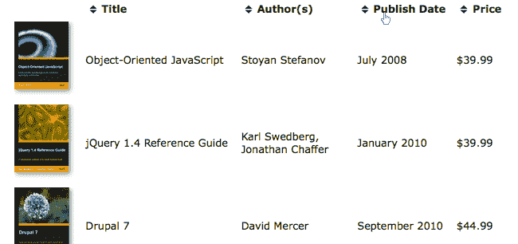

# 高级 DOM 操作

在本书中，我们已经使用了 jQuery 强大的 DOM 操作方法来改变文档的内容。我们已经看到了几种插入新内容、移动现有内容或完全删除内容的方法。我们也知道如何更改元素的属性和属性以满足我们的需求。

在第五章 *操作 DOM* 中，我们介绍了这些重要技术。在这个更高级的章节中，我们将涵盖：

+   使用 `.append()` 排序页面元素

+   附加自定义数据到元素

+   读取 HTML5 数据属性

+   从 JSON 数据创建元素

+   使用 CSS 钩子扩展 DOM 操作系统

# 排序表格行

在本章中，我们正在研究的大多数主题都可以通过对表格行进行排序来演示。这个常见的任务是帮助用户快速找到他们所需信息的有效方法。当然，有许多方法可以做到这一点。

# 在服务器上排序表格

数据排序的常见解决方案是在服务器上执行。表格中的数据通常来自数据库，这意味着从数据库中提取数据的代码可以请求以给定的排序顺序（例如，使用 SQL 语言的 `ORDER BY` 子句）提取数据。如果我们有服务器端代码可供使用，那么从一个合理的默认排序顺序开始是很简单的。

但是，当用户可以确定排序顺序时，排序就变得最有用了。这方面的常见用户界面是将可排序列的表头(`<th>`)转换为链接。这些链接可以指向当前页面，但附加了一个查询字符串来指示按哪一列排序，如下面的代码片段所示：

```js
<table id="my-data"> 
  <thead> 
    <tr> 
      <th class="name"> 
        <a href="index.php?sort=name">Name</a> 
      </th> 
      <th class="date"> 
        <a href="index.php?sort=date">Date</a> 
      </th> 
    </tr> 
  </thead> 
  <tbody> 
    ... 
  </tbody> 
</table> 

```

服务器可以通过返回数据库内容的不同顺序来响应查询字符串参数。

# 使用 Ajax 排序表格

这个设置很简单，但是每次排序操作都需要页面刷新。正如我们所见，jQuery 允许我们通过使用 *Ajax* 方法来消除这种页面刷新。如果我们像以前一样将列标题设置为链接，我们可以添加 jQuery 代码来将那些链接转换为 Ajax 请求：

```js
$(() => { 
  $('#my-data th a')
    .click((e) => { 
      e.preventDefault(); 
      $('#my-data tbody')
        .load($(e.target).attr('href')); 
    }); 
}); 

```

当锚点被点击时，现在 jQuery 会向服务器发送一个 Ajax 请求以获取相同的页面。当 jQuery 用于使用 Ajax 发送页面请求时，它会将 `X-Requested-With` HTTP 头设置为 `XMLHttpRequest`，以便服务器可以确定正在进行 Ajax 请求。当此参数存在时，服务器代码可以编写为仅在回送 `<tbody>` 元素本身的内容，而不是周围的页面。通过这种方式，我们可以使用响应来替换现有 `<tbody>` 元素的内容。

这是**渐进增强**的一个例子。页面即使没有任何 JavaScript 也能正常工作，因为仍然存在用于服务器端排序的链接。但是，当 JavaScript 可用时，我们会劫持页面请求，允许排序而无需完全重新加载页面。

# 在浏览器中排序表

但是有时候，当我们在排序时不想等待服务器响应或者没有服务器端脚本语言可用时。在这种情况下，一个可行的替代方法是完全在浏览器中使用 JavaScript 和 jQuery 的 DOM 操作方法进行排序。

为了演示本章中的各种技术，我们将设置三个单独的 jQuery 排序机制。每个都将以独特的方式完成相同的目标。我们的示例将使用以下方法对表进行排序：

+   从 HTML 内容中提取的数据

+   HTML5 自定义数据属性

+   表数据的 JSON 表示

我们将要排序的表具有不同的 HTML 结构，以适应不同的 JavaScript 技术，但每个表都包含列出书籍、作者姓名、发布日期和价格的列。第一个表具有简单的结构：

```js
<table id="t-1" class="sortable"> 
  <thead> 
    <tr> 
      <th></th> 
      <th class="sort-alpha">Title</th> 
      <th class="sort-alpha">Author(s)</th> 
      <th class="sort-date">Publish Date</th> 
      <th class="sort-numeric">Price</th> 
    </tr> 
  </thead> 
  <tbody> 
    <tr> 
      <td></td> 
      <td>Drupal 7</td> 
      <td>David <span class="sort-key">Mercer</span></td> 
      <td>September 2010</td> 
      <td>$44.99</td> 
    </tr> 
    <!-- code continues --> 
  </tbody> 
</table> 

```

获取示例代码

您可以从以下 GitHub 代码库访问示例代码：[`github.com/PacktPublishing/Learning-jQuery-3`](https://github.com/PacktPublishing/Learning-jQuery-3)。

在我们用 JavaScript 增强表格之前，前几行如下所示：


# 移动和插入元素的再次访问

在接下来的示例中，我们将构建一个灵活的排序机制，可以在每一列上工作。为此，我们将使用 jQuery 的 DOM 操作方法来插入一些新元素并将其他现有元素移动到 DOM 中的新位置。我们将从最简单的部分开始--链接表头。

# 在现有文本周围添加链接

我们想将表头转换为按其各自列排序数据的链接。我们可以使用 jQuery 的 `.wrapInner()` 方法来添加它们；我们回想起 [第五章](https://cdp.packtpub.com/learning_jquery_3_0/wp-admin/post.php?post=37&action=edit#post_30) *DOM 操作* 中，`.wrapInner()` 将一个新元素（在本例中为 `<a>` 元素） *插入* 匹配的元素内，但在*周围*子元素：

```js
$(() => {
  const $headers = $('#t-1')
    .find('thead th')
    .slice(1);

  $headers
    .wrapInner($('<a/>').attr('href', '#'))
    .addClass('sort');
});

```

列表 12.1

我们跳过了每个表的第一个 `<th>` 元素（使用 `.slice()`）因为它除了空格之外没有文本，因此没有必要对封面照片进行标记或排序。然后，我们对剩余的 `<th>` 元素添加了一个 `sort` 类，以便在 CSS 中将其与不可排序的元素区分开。现在，标题行如下所示：


这是渐进增强的对应，**优雅降级**的一个例子。与前面讨论的 Ajax 解决方案不同，这种技术在没有 JavaScript 的情况下无法工作；我们假设服务器在这个例子中没有可用于目的的脚本语言。由于 JavaScript 是必需的，以使排序工作，我们只通过代码添加 `sort` 类和锚点，从而确保界面只在脚本运行时表明可以排序。而且，由于我们实际上是创建链接而不仅仅是添加视觉样式以指示标题可以点击，因此我们为需要使用键盘导航到标题的用户提供了额外的辅助功能（通过按*Tab*键）。页面**退化**为一个仍然可以使用但无法进行排序的页面。

# 对简单的 JavaScript 数组进行排序

为了进行排序，我们将利用 JavaScript 的内置`.sort()`方法。它对数组进行原地排序，并可以接受一个**比较器函数**作为参数。此函数比较数组中的两个项目，并根据应该在排序后的数组中排在前面的项目返回正数或负数。

例如，取一个简单的数字数组：

```js
const arr = [52, 97, 3, 62, 10, 63, 64, 1, 9, 3, 4]; 

```

我们可以通过调用 `arr.sort()` 来对该数组进行排序。之后，项目的顺序如下：

```js
[1, 10, 3, 3, 4, 52, 62, 63, 64, 9, 97] 

```

默认情况下，如我们在这里看到的，项目按**字母顺序**（按字母顺序）排序。在这种情况下，可能更合理地按*数字*排序。为此，我们可以向 `.sort()` 方法提供一个比较函数：

```js
arr.sort((a, b) => a < b ? -1 : (a > b ? 1 : 0)); 

```

此函数如果 `a` 应该在排序后的数组中排在 `b` 之前，则返回负数；如果 `b` 应该在 `a` 之前，则返回正数；如果项目的顺序无关紧要，则返回零。有了这些信息，`.sort()` 方法可以适当地对项目进行排序：

```js
[1, 3, 3, 4, 9, 10, 52, 62, 63, 64, 97] 

```

接下来，我们将这个`.sort()`方法应用到我们的表格行上。

# 对 DOM 元素进行排序

让我们对表格的 `Title` 列执行排序。请注意，虽然我们将 `sort` 类添加到它和其他列，但此列的标题单元格已经有一个由 HTML 提供的 `sort-alpha` 类。其他标题单元格根据每个排序类型接受了类似的处理，但现在我们将专注于 `Title` 标题，它需要一个简单的按字母顺序排序：

```js
$(() => {
  const comparator = (a, b) => a < b ? -1 : (a > b ? 1 : 0);
  const sortKey = (element, column) => $.trim($(element)
    .children('td')
    .eq(column)
    .text()
    .toUpperCase()
  );

  $('#t-1')
    .find('thead th')
    .slice(1)
    .wrapInner($('<a/>').attr('href', '#'))
    .addClass('sort')
    .on('click', (e) => {
      e.preventDefault();

      const column = $(e.currentTarget).index();

      $('#t-1')
        .find('tbody > tr')
        .get()
        .sort((a, b) => comparator(
          sortKey(a, column),
          sortKey(b, column)
        ))
        .forEach((element) => {
          $(element)
            .parent()
            .append(element);
        });
    });
}); 

```

列表 12.2

一旦我们找到了点击的标题单元格的索引，我们就会检索所有数据行的数组。这是一个很好的例子，说明了`.get()`如何将 jQuery 对象转换为 DOM 节点数组；尽管 jQuery 对象在许多方面都像数组一样，但它们并没有所有可用的本机数组方法，比如`.pop()`或`.shift()`。

在内部，jQuery 实际上定义了一些类似原生数组方法的方法。例如，`.sort()`、`.push()` 和 `.splice()` 都是 jQuery 对象的方法。然而，由于这些方法是内部使用的，并且没有公开文档记录，我们不能指望它们在我们自己的代码中以预期的方式运行，因此应避免在 jQuery 对象上调用它们。

现在我们有了一个 DOM 节点数组，我们可以对它们进行排序，但要做到这一点，我们需要编写一个适当的比较器函数。我们想根据相关表格单元格的文本内容对行进行排序，因此这将是比较器函数要检查的信息。我们知道要查看哪个单元格，因为我们使用 `.index()` 调用捕获了列索引。我们使用 jQuery 的 `$.trim()` 函数去除前导和尾随空格，然后将文本转换为大写，因为 JavaScript 中的字符串比较是区分大小写的，而我们的排序应该是不区分大小写的。

现在我们的数组已经排序了，但请注意，对 `.sort()` 的调用并没有改变 DOM 本身。要做到这一点，我们需要调用 DOM 操作方法来移动行。我们一次移动一行，将每行重新插入表格中。由于 `.append()` 不会克隆节点，而是*移动*它们，因此我们的表格现在已经排序了：


# 将数据存储在 DOM 元素旁边

我们的代码可以运行，但速度相当慢。问题在于比较器函数，它执行了大量的工作。在排序过程中，这个比较器将被调用多次，这意味着它需要很快。

数组排序性能

JavaScript 使用的实际排序算法没有在标准中定义。它可能是一个简单的排序，比如**冒泡排序**（在计算复杂度方面的最坏情况是 Θ(*n*²)），或者更复杂的方法，比如**快速排序**（平均情况下是 Θ(*n* log *n*)）。不过可以肯定的是，将数组中的项数翻倍将会使比较器函数被调用的次数增加超过两倍。

解决我们慢比较器的方法是**预先计算**比较所需的键。我们可以在初始循环中完成大部分昂贵的工作，并使用 jQuery 的 `.data()` 方法将结果存储起来，该方法用于设置或检索与页面元素相关联的任意信息。然后我们只需在比较器函数中检查这些键，我们的排序就会明显加快：

```js
$('#t-1')
  .find('thead th')
  .slice(1)
  .wrapInner($('<a/>').attr('href', '#'))
  .addClass('sort')
  .on('click', (e) => {
    e.preventDefault();

    const column = $(e.currentTarget).index();

    $('#t-1')
      .find('tbody > tr')
      .each((i, element) => {
        $(element)
          .data('sortKey', sortKey(element, column));
      })
      .get()
      .sort((a, b) => comparator(
        $(a).data('sortKey'),
        $(b).data('sortKey')
      ))
      .forEach((element) => {
        $(element)
          .parent()
          .append(element);
      });
  }); 

```

列表 12.3

`.data()` 方法和它的补充 `.removeData()` 提供了一个数据存储机制，它是一种方便的替代方案，用于**扩展属性**，或者直接添加到 DOM 元素的非标准属性。

# 执行额外的预计算

现在我们希望将相同类型的排序行为应用于我们表格的作者一栏。因为表头单元格具有`sort-alpha`类，作者一栏可以使用我们现有的代码进行排序。但理想情况下，作者应该按照姓氏而不是名字排序。由于一些书籍有多位作者，有些作者列出了中间名或缩写，我们需要外部指导来确定要用作排序键的文本部分。我们可以通过在单元格中包装相关部分来提供这些指导：

```js
<td>David <span class="sort-key">Mercer</span></td> 

```

现在我们必须修改我们的排序代码，以考虑这个标记，而不影响`Title`列的现有行为，因为它已经运行良好。通过将标记排序键放在之前计算过的键的前面，我们可以先按照姓氏排序，如果指定的话，但是在整个字符串上作为后备进行排序：

```js
const sortKey = (element, column) => {
  const $cell = $(element)
    .children('td')
    .eq(column);
  const sortText = $cell
    .find('span.sort-key')
    .text();
  const cellText = $cell
    .text()
    .toUpperCase();

  return $.trim(`${sortText} ${cellText}`);
}; 

```

列表 12.4

现在按照作者一栏对提供的键进行排序，从而按照姓氏排序：


如果两个姓氏相同，则排序会使用整个字符串作为定位的决定因素。

# 存储非字符串数据

我们的用户应该能够不仅按照标题和作者一栏进行排序，还可以按照发布日期和价格一栏进行排序。由于我们简化了比较函数，它可以处理各种类型的数据，但首先计算出的键需要针对其他数据类型进行调整。例如，在价格的情况下，我们需要去掉前导的`$`字符并解析剩余部分，以便我们可以进行数字比较：

```js
var key = parseFloat($cell.text().replace(/^[^\d.]*/, '')); 
if (isNaN(key)) { 
  key = 0; 
} 

```

此处使用的正则表达式除了数字和小数点以外的任何前导字符，将结果传递给`parseFloat()`。然后需要检查`parseFloat()`的结果，因为如果无法从文本中提取数字，将返回`NaN`（**不是一个数字**）。这可能对`.sort()`造成严重影响，所以将任何非数字设为`0`。

对于日期单元格，我们可以使用 JavaScript 的 `Date` 对象：

```js
var key = Date.parse(`1 ${$cell.text()}`); 

```

此表中的日期仅包含月份和年份； `Date.parse()`需要一个完全规定的日期。为了适应这一点，我们在字符串前面加上`1`，这样`September 2010`就变成了`1 September 2010`。现在我们有了一个完整的日期，`Date.parse()`可以将其转换为**时间戳**，可以使用我们正常的比较器进行排序。

我们可以将这些表达式放入三个单独的函数中，以便稍后可以根据应用于表头的类调用适当的函数：

```js
const sortKeys = {
  date: $cell => Date.parse(`1 ${$cell.text()}`),
  alpha: $cell => $.trim(
    $cell.find('span.sort-key').text() + ' ' +
    $cell.text().toUpperCase()
  ),
  numeric($cell) {
    const key = parseFloat(
      $cell
        .text()
        .replace(/^[^\d.]*/, '')
    );
    return isNaN(key) ? 0 : key;
  }
};

$('#t-1')
  .find('thead th')
  .slice(1)
  .each((i, element) => {
    $(element).data(
      'keyType',
      element.className.replace(/^sort-/,'')
    );
  })
  // ...

```

列表 12.5

我们已修改脚本，为每个列头单元格存储基于其类名的`keyType`数据。我们去掉类名的`sort-`部分，这样就剩下`alpha`、`numeric`或`date`。通过将每个排序函数作为`sortKeys`对象的方法，我们可以使用**数组表示法**，并传递表头单元格的`keyType`数据的值来调用适当的函数。

通常，当我们调用方法时，我们使用**点符号**。事实上，在本书中，我们调用 jQuery 对象的方法就是这样的。例如，要向`<div class="foo">`添加一个`bar`类，我们写`$('div.foo').addClass('bar')`。因为 JavaScript 允许以点符号或数组符号表示属性和方法，所以我们也可以写成`$('div.foo')'addClass'`。大多数情况下这样做没有太多意义，但这可以是一种有条件地调用方法而不使用一堆`if`语句的好方法。对于我们的`sortKeys`对象，我们可以像这样调用`alpha`方法`sortKeys.alpha($cell)`或`sortKeys'alpha'`或者，如果方法名存储在一个`keyType`常量中，`sortKeyskeyType`。我们将在`click`处理程序内使用这种第三种变体：

```js
// ...
.on('click', (e) => {
  e.preventDefault();

  const column = $(e.currentTarget).index();
  const keyType = $(e.currentTarget).data('keyType');

  $('#t-1')
    .find('tbody > tr')
    .each((i, element) => {
      $(element).data(
        'sortKey',
        sortKeyskeyType
            .children('td')
            .eq(column)
        )
      );
    })
    .get()
    .sort((a, b) => comparator(
      $(a).data('sortKey'),
      $(b).data('sortKey')
    ))
    .forEach((element) => {
      $(element)
        .parent()
        .append(element);
    });
}); 

```

列表 12.6

现在我们也可以按发布日期或价格排序：



# 交替排序方向

我们的最终排序增强是允许**升序**和**降序**排序顺序。当用户点击已经排序的列时，我们希望反转当前的排序顺序。

要反转排序，我们只需反转比较器返回的值。我们可以通过简单的`direction`参数来做到这一点：

```js
const comparator = (a, b, direction = 1) =>
  a < b ?
    -direction :
    (a > b ? direction : 0);

```

如果`direction`等于`1`，那么排序将与之前相同。如果它等于`-1`，则排序将被反转。通过将这个概念与一些类结合起来以跟踪列的当前排序顺序，实现交替排序方向就变得简单了：

```js
// ...
.on('click', (e) => {
  e.preventDefault();

  const $target = $(e.currentTarget);
  const column = $target.index();
  const keyType = $target.data('keyType');
  const sortDirection = $target.hasClass('sorted-asc') ?
    -1 : 1;

  $('#t-1')
    .find('tbody > tr')
    .each((i, element) => {
      $(element).data(
        'sortKey',
        sortKeyskeyType
            .children('td')
            .eq(column)
        )
      );
    })
    .get()
    .sort((a, b) => comparator(
      $(a).data('sortKey'),
      $(b).data('sortKey'),
      sortDirection
    ))
    .forEach((element) => {
      $(element)
        .parent()
        .append(element);
    });

    $target
      .siblings()
      .addBack()
      .removeClass('sorted-asc sorted-desc')
      .end()
      .end()
      .addClass(
        sortDirection == 1 ?
          'sorted-asc' : 'sorted-desc'
      );
}); 

```

列表 12.7

作为一个额外的好处，由于我们使用类来存储排序方向，我们可以将列标题样式化以指示当前顺序：


# 使用 HTML5 自定义数据属性

到目前为止，我们一直依赖表格单元格内的内容来确定排序顺序。虽然我们已经通过操作内容来正确排序行，但我们可以通过以**HTML5 数据属性**的形式从服务器输出更多的 HTML 来使我们的代码更高效。我们示例页面中的第二个表格包含了这些属性：

```js
<table id="t-2" class="sortable"> 
  <thead> 
    <tr> 
      <th></th> 
      <th data-sort='{"key":"title"}'>Title</th> 
      <th data-sort='{"key":"authors"}'>Author(s)</th> 
      <th data-sort='{"key":"publishedYM"}'>Publish Date</th> 
      <th data-sort='{"key":"price"}'>Price</th> 
    </tr> 
  </thead> 
  <tbody> 
    <tr data-book='{"img":"2862_OS.jpg", 
      "title":"DRUPAL 7","authors":"MERCER DAVID",       
      "published":"September 2010","price":44.99,       
      "publishedYM":"2010-09"}'> 
      <td></td> 
      <td>Drupal 7</td> 
      <td>David Mercer</td> 
      <td>September 2010</td> 
      <td>$44.99</td> 
    </tr> 
    <!-- code continues --> 
  </tbody> 
</table> 

```

请注意，每个`<th>`元素（除了第一个）都有一个`data-sort`属性，每个`<tr>`元素都有一个`data-book`属性。我们在第七章中首次看到自定义数据属性，*使用插件*，在那里我们提供了插件代码使用的属性信息。在这里，我们将使用 jQuery 自己来访问属性值。要检索值，我们将`data-`后的属性名部分传递给`.data()`方法。例如，我们写`$('th').first().data('sort')`来获取第一个`<th>`元素的`data-sort`属性的值。

当我们使用 `.data()` 方法获取数据属性的值时，如果 jQuery 确定它是其中一种类型，它会将值转换为数字、数组、对象、布尔值或 null。对象必须使用 JSON 语法表示，就像我们在这里做的一样。因为 JSON 格式要求其键和字符串值使用双引号括起来，所以我们需要使用单引号来包围属性值：

```js
<th data-sort='{"key":"title"}'> 

```

由于 jQuery 会将 JSON 字符串转换为对象，因此我们可以简单地获取我们想要的值。例如，要获取`key`属性的值，我们写：

```js
$('th').first().data('sort').key 

```

一旦以这种方式检索了自定义数据属性，数据就被 jQuery 内部存储起来，HTML `data-*` 属性本身不再被访问或修改。

在这里使用数据属性的一个很大的好处是，存储的值可以与表格单元格内容不同。换句话说，我们在第一个表格中必须做的所有工作以调整排序--将字符串转换为大写，更改日期格式，将价格转换为数字--已经处理过了。这使我们能够编写更简单、更高效的排序代码：

```js
$(() => {
  const comparator = (a, b, direction = 1) =>
    a < b ?
      -direction :
      (a > b ? direction : 0);

  $('#t-2')
    .find('thead th')
    .slice(1)
    .wrapInner($('<a/>').attr('href', '#'))
    .addClass('sort')
    .on('click', (e) => {
      e.preventDefault();

      const $target = $(e.currentTarget);
      const column = $target.index();
      const sortKey = $target.data('sort').key;
      const sortDirection = $target.hasClass('sorted-asc') ?
        -1 : 1;

      $('#t-2')
        .find('tbody > tr')
        .get()
        .sort((a, b) => comparator(
          $(a).data('book')[sortKey],
          $(b).data('book')[sortKey],
          sortDirection
        ))
        .forEach((element) => {
          $(element)
            .parent()
            .append(element);
        });

      $target
        .siblings()
        .addBack()
        .removeClass('sorted-asc sorted-desc')
        .end()
        .end()
        .addClass(
          sortDirection == 1 ?
            'sorted-asc' : 'sorted-desc'
        );
    });
}); 

```

第 12.8 节

这种方法的简单性是显而易见的：`sortKey`常量被设置为`.data('sort').key`，然后用它来比较行的排序值和`$(a).data('book')[sortKey]`以及`$(b).data('book')[sortKey]`。其效率表现在无需先循环遍历行，然后每次在调用`sort`函数之前调用`sortKeys`函数之一。通过这种简单和高效的结合，我们还提高了代码的性能并使其更易于维护。

# 使用 JSON 排序和构建行

到目前为止，在本章中，我们一直在朝着将更多信息从服务器输出到 HTML 中的方向前进，以便我们的客户端脚本尽可能保持简洁和高效。现在让我们考虑一个不同的情景，即在 JavaScript 可用时显示一整套新的信息。越来越多的 Web 应用程序依赖于 JavaScript 传递内容以及一旦内容到达后对其进行操作。在我们的第三个表格排序示例中，我们将做同样的事情。

我们将首先编写三个函数：

+   `buildAuthors()`: 这个函数用于构建作者名称的字符串列表。

+   `buildRow()`: 这个函数用于构建单个表格行的 HTML。

+   `buildRows()`: 这个函数通过映射`buildRow()`构建的行来构建整个表格的 HTML。

```js
const buildAuthors = row =>
  row
    .authors
    .map(a => `${a.first_name} ${a.last_name}`)
    .join(', ');

const buildRow = row =>
  `
    <tr>
      <td></td>
      <td>${row.title}</td>
      <td>${buildAuthors(row)}</td>
      <td>${row.published}</td>
      <td>$${row.price}</td>
    </tr>
  `;

const buildRows = rows =>
  rows
    .map(buildRow)
    .join(''); 

```

第 12.9 节

对于我们的目的，我们可以使用一个函数来处理这两个任务，但是通过使用三个独立的函数，我们留下了在其他时间点构建和插入单个行的可能性。这些函数将从对 Ajax 请求的响应中获取它们的数据：

```js
Promise.all([$.getJSON('books.json'), $.ready])
  .then(([json]) => {
    $('#t-3')
      .find('tbody')
      .html(buildRows(json));
  })
  .catch((err) => {
    console.error(err);
  }); 

```

第 12.10 节

在进行 Ajax 调用之前，我们不应该等待 DOM 准备就绪。在我们可以使用 JSON 数据调用`buildRows()`之前，有两个 promise 需要解决。首先，我们需要来自服务器的实际 JSON 数据。其次，我们需要确保 DOM 已准备好进行操作。因此，我们只需创建一个新的 promise，在这两件事发生时解决它，使用`Promise.all()`。`$.getJSON()`函数返回一个 promise，而`$.ready`是一个在 DOM 准备就绪时解决的 promise。

还值得注意的是，我们需要以不同方式处理`authors`数据，因为它作为一个具有`first_name`和`last_name`属性的对象数组从服务器返回，而其他所有数据都作为字符串或数字返回。我们遍历作者数组--尽管对于大多数行，该数组只包含一个作者--并连接名字和姓氏。然后，我们使用逗号和空格将数组值连接起来，得到一个格式化的姓名列表。

`buildRow()`函数假设我们从 JSON 文件中获取的文本是安全可用的。由于我们将``、`<td>`和`<tr>`标签与文本内容连接成一个字符串，我们需要确保文本内容没有未转义的`<`、`>`或`&`字符。确保 HTML 安全字符串的一种方法是在服务器上处理它们，将所有的`<`转换为`&lt;`，`>`转换为`&gt;`，并将`&`转换为`&amp;`。

# 修改 JSON 对象

我们对`authors`数组的处理很好，如果我们只计划调用`buildRows()`函数一次的话。然而，由于我们打算每次对行进行排序时都调用它，提前格式化作者信息是个好主意。趁机我们也可以对标题和作者信息进行排序格式化。与第二个表格不同的是，第三个表格检索到的 JSON 数据只有一种类型。但是，通过编写一个额外的函数，我们可以在到达构建表格函数之前包含修改后的排序和显示值：

```js
const buildAuthors = (row, separator = ', ') =>
  row
    .authors
    .map(a => `${a.first_name} ${a.last_name}`)
    .join(separator);

const prepRows = rows =>
  rows
    .map(row => $.extend({}, row, {
      title: row.title.toUpperCase(),
      titleFormatted: row.title,
      authors: buildAuthors(row, ' ').toUpperCase(),
      authorsFormatted: buildAuthors(row)
    }));

```

列表 12.11

通过将我们的 JSON 数据传递给这个函数，我们为每一行的对象添加了两个属性：`authorsFormatted`和`titleFormatted`。这些属性将用于显示的表格内容，保留原始的`authors`和`title`属性用于排序。用于排序的属性也转换为大写，使排序操作不区分大小写。我们还在`buildAuthors()`函数中添加了一个新的分隔符参数，以便在这里使用它。

当我们立即在 `$.getJSON()` 回调函数内调用这个 `prepRows()` 函数时，我们将修改后的 JSON 对象的返回值存储在 `rows` 变量中，并将其用于排序和构建。这意味着我们还需要改变 `buildRow()` 函数以利用我们提前准备的简便性：

```js
const buildRow = row =>
  `
    <tr>
      <td></td>
      <td>${row.titleFormatted}</td>
      <td>${row.authorsFormatted}</td>
      <td>${row.published}</td>
      <td>$${row.price}</td>
    </tr>
  `;

Promise.all([$.getJSON('books.json'), $.ready])
  .then(([json]) => {
    $('#t-3')
      .find('tbody')
      .html(buildRows(prepRows(json)));
  })
  .catch((err) => {
    console.error(err);
  });

```

清单 12.12

# 根据需要重建内容

现在，我们已经为排序和显示准备好了内容，我们可以再次实现列标题修改和排序例程：

```js
Promise.all([$.getJSON('books.json'), $.ready])
  .then(([json]) => {
    $('#t-3')
      .find('tbody')
      .html(buildRows(prepRows(json)));

    const comparator = (a, b, direction = 1) =>
      a < b ?
        -direction :
        (a > b ? direction : 0);

    $('#t-3')
      .find('thead th')
      .slice(1)
      .wrapInner($('<a/>').attr('href', '#'))
      .addClass('sort')
      .on('click', (e) => {
        e.preventDefault();

        const $target = $(e.currentTarget);
        const column = $target.index();
        const sortKey = $target.data('sort').key;
        const sortDirection = $target.hasClass('sorted-asc') ?
          -1 : 1;
        const content = buildRows(
          prepRows(json).sort((a, b) => comparator(
            a[sortKey],
            b[sortKey],
            sortDirection
          ))
        );

        $('#t-3')
          .find('tbody')
          .html(content);

        $target
          .siblings()
          .addBack()
          .removeClass('sorted-asc sorted-desc')
          .end()
          .end()
          .addClass(
            sortDirection == 1 ?
              'sorted-asc' : 'sorted-desc'
          );
      });
})
.catch((err) => {
  console.error(err);
}); 

```

清单 12.13

`click` 处理程序中的代码与*清单 12.8*中第二个表格的处理程序几乎相同。唯一显著的区别是，这里我们每次排序只向 DOM 中插入一次元素。在表格一和表格二中，即使经过其他优化，我们也是对实际的 DOM 元素进行排序，然后逐个循环遍历它们，将每一个依次附加以达到新的顺序。例如，在*清单 12.8*中，表格行是通过循环重新插入的：

```js
.forEach((element) => {
  $(element)
    .parent()
    .append(element);
}); 

```

这种重复的 DOM 插入在性能上可能是相当昂贵的，特别是当行数很大时。与我们在*清单 12.13*中的最新方法相比：

```js
$('#t-3')
  .find('tbody')
  .html(content);

```

`buildRows()` 函数返回表示行的 HTML 字符串，并一次性插入，而不是移动现有行。

# 重新审视属性操作

到现在，我们已经习惯于获取和设置与 DOM 元素相关的值。我们使用了简单的方法，例如 `.attr()`、`.prop()` 和 `.css()`，方便的快捷方式，例如 `.addClass()`、`.css()` 和 `.val()`，以及复杂的行为捆绑，例如 `.animate()`。即使是简单的方法，它们也在幕后为我们做了很多工作。如果我们更好地理解它们的工作原理，我们可以更有效地利用它们。

# 使用简写元素创建语法

我们经常通过将 HTML 字符串提供给 `$()` 函数或 DOM 插入函数来在我们的 jQuery 代码中创建新元素。例如，我们在*清单 12.9*中创建一个大的 HTML 片段以产生许多 DOM 元素。这种技术快速而简洁。在某些情况下，它并不理想。例如，我们可能希望在使用文本之前对特殊字符进行转义，或者应用浏览器相关的样式规则。在这些情况下，我们可以创建元素，然后链式附加额外的 jQuery 方法来修改它，就像我们已经做过很多次一样。除了这种标准技术之外，`$()` 函数本身提供了一种实现相同结果的替代语法。

假设我们想在文档中的每个表格之前引入标题。我们可以使用 `.each()` 循环来遍历表格并创建一个适当命名的标题：

```js
$(() => {
  $('table')
    .each((i, table) => {
      $('<h3/>', {
        'class': 'table-title',
        id: `table-title-${i}`,
        text: `Table ${i + 1}`,
        data: { index: i },
        click(e) {
          e.preventDefault();
          $(table).fadeToggle();
        },
        css: { glowColor: '#00ff00', cursor: 'pointer' }
      }).insertBefore(table);
    });
}); 

```

清单 12.14

将选项对象作为第二个参数传递给 `$()` 函数与首先创建元素然后将该对象传递给 `.attr()` 方法具有相同的效果。正如我们所知，这个方法让我们设置 DOM 属性，如元素的 `id` 值和其 `class`。

我们示例中的其他选项包括：

+   元素内的文本

+   自定义额外数据

+   点击处理程序

+   包含 CSS 属性的对象

这些不是 DOM 属性，但它们仍然被设置。简写的 `$()` 语法能够处理这些，因为它首先检查给定名称的 jQuery 方法是否存在，如果存在，则调用它而不是设置该名称的属性。

因为 jQuery 会将方法优先于属性名称，所以在可能产生歧义的情况下，我们必须小心；例如，`<input>` 元素的 `size` 属性，因为存在 `.size()` 方法，所以不能以这种方式设置。

这个简写的 `$()` 语法，连同 `.attr()` 函数，通过使用**钩子**可以处理更多功能。

# DOM 操作钩子

许多 jQuery 方法可以通过定义适当的钩子来扩展特殊情况下的获取和设置属性。这些钩子是在 jQuery 命名空间中的数组，名称如 `$.cssHooks` 和 `$.attrHooks`。通常，钩子是包含一个 `get` 方法以检索请求的值和一个 `set` 方法以提供新值的对象。

钩子类型包括：

| **钩子类型** | **修改的方法** | **示例用法** |
| --- | --- | --- |
| `$.attrHooks` | `.attr()` | 阻止更改元素的 `type` 属性。 |
| `$.cssHooks` | `.css()` | 为 Internet Explorer 提供 `opacity` 的特殊处理。 |
| `$.propHooks` | `.prop()` | 修正了 Safari 中 `selected` 属性的行为。 |
| `$.valHooks` | `.val()` | 允许单选按钮和复选框在各个浏览器中报告一致的值。 |

通常这些钩子执行的工作对我们完全隐藏，我们可以从中受益而不用考虑正在发生什么。不过，有时候，我们可能希望通过添加自己的钩子来扩展 jQuery 方法的行为。

# 编写 CSS 钩子

*列表 12.14* 中的代码将一个名为 `glowColor` 的 CSS 属性注入到页面中。目前，这对页面没有任何影响，因为这样的属性并不存在。相反，我们将扩展 `$.cssHooks` 以支持这个新发明的属性。当在元素上设置 `glowColor` 时，我们将使用 CSS3 的 `text-shadow` 属性在文本周围添加柔和的辉光：

```js
(($) => {
  $.cssHooks.glowColor = {
    set(elem, value) {
      elem.style.textShadow = value == 'none' ?
        '' : `0 0 2px ${value}`;
    }
  };
})(jQuery);

```

列表 12.15

钩子由元素的 `get` 方法和 `set` 方法组成。为了尽可能简洁和简单，我们目前只定义了 `set`。

有了这个钩子，现在我们在标题文本周围有一个 2 像素的柔和绿色辉光：


虽然新的钩子按照广告展示的效果工作，但它缺少许多我们可能期望的功能。其中一些缺点包括：

+   辉光的大小不可定制

+   这个效果与 `text-shadow` 或 `filter` 的其他用法是互斥的

+   `get` 回调未实现，所以我们无法测试属性的当前值

+   该属性无法进行动画处理

只要付出足够的工作和额外的代码，我们就能克服所有这些障碍。然而，在实践中，我们很少需要定义自己的钩子；有经验的插件开发人员已经为各种需要创建了钩子，包括大多数 CSS3 属性。

寻找钩子

插件的形势变化很快，所以新的钩子会不断出现，我们无法希望在这里列出所有的钩子。要了解可能的一些内容，请参阅 Brandon Aaron 的 CSS 钩子集合。

[`github.com/brandonaaron/jquery-cssHooks`](https://github.com/brandonaaron/jquery-cssHooks)。

# 总结

在本章中，我们用三种不同的方式解决了一个常见问题--对数据表进行排序--并比较了每种方法的优点。这样做的过程中，我们练习了我们之前学到的 DOM 修改技术，并探索了 `.data()` 方法，用于获取和设置与任何 DOM 元素相关联的数据，或者使用 HTML5 数据属性附加。我们还揭开了几个 DOM 修改例程的面纱，学习了如何为我们自己的目的扩展它们。

# 进一步阅读

本书的 *附录 C* 中提供了完整的 DOM 操作方法列表，或者在官方 jQuery 文档中查看 [`api.jquery.com/`](http://api.jquery.com/)。

# 练习

挑战性练习可能需要使用官方 jQuery 文档 [`api.jquery.com/`](http://api.jquery.com/)。

1.  修改第一个表的关键计算，使标题和作者按长度而不是字母顺序排序。

1.  使用第二个表中的 HTML5 数据计算所有书的价格总和，并将这个总和插入到该列的标题中。

1.  更改用于第三个表的比较器，使包含单词 jQuery 的标题首先按标题排序。

1.  挑战：为 `glowColor` CSS 钩子实现 `get` 回调。
