# 第十章。操纵图像

常常有人说图像胜过千言万语 – 网站也不例外。

我们使用图像来说明一个过程，帮助强化信息，或者为原本可能被视为非常普通的内容应用一些视觉身份。图像在任何网站中都起着关键作用；图像的质量会决定一个站点的成败。

使用 jQuery 操纵图像的一小部分是我们如何应用滤镜，或者操纵图像中的颜色。在本章中，我们将探讨如何使用 jQuery 操纵图像，然后探索几个以捕获图像作为进一步操纵基础的真实世界示例。在本章中，我们将涵盖以下主题：

+   使用 CSS 和 jQuery 应用滤镜

+   使用插件编辑图像

+   使用 jQuery 和 canvas 创建一个简单的签名板

+   捕获和操纵网络摄像头图像

让我们开始吧…！

# 操纵图像中的颜色

一个问题 – 你多久以为操纵图像的唯一方式是使用像 Photoshop 或者 GIMP 这样的软件？我打赌不止一次 – 如果我说这些广为人知的重量级应用程序在某些情况下是多余的，而你只需要一个文本编辑器和一点点 jQuery 呢？

此时，你可能想知道我们可以用 jQuery 如何操纵图像。别担心！我们有几个绝招。在接下来的几页中，我们将逐个看看，发现虽然我们可以使用可能是开发人员最常用的 JavaScript 库之一，但并不总是正确的做法。

为了理解我的意思，让我们快速回顾一下我们可以使用的方法，它们是：

+   使用 CSS3 滤镜，并使用 jQuery 切换它们的使用与否

+   使用 HTML5 `<canvas>` 元素，jQuery 和 `getImageData` 方法处理程序的混合方式来操作每个图像的颜色元素，然后将其重新绘制到画布上。

在本章中，我们将依次看看每一个，并探讨为什么即使我们可以使用 jQuery 创建复杂的滤镜，它也并不总是正确的答案。希望通过我们的一些绝招，能让我们成为更好的开发人员。让我们从简单的 CSS3 滤镜开始，看看我们如何轻松地将它们应用到我们的 jQuery 代码中。

# 使用 CSS3 添加滤镜

至少在主流桌面浏览器中，滤镜支持已经有一段时间了，尽管我们仍然需要使用 `-webkit-` 厂商前缀支持，因为我们还不完全是无前缀的：

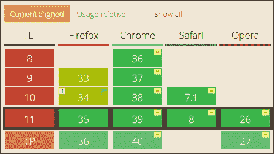

### 注意

关于前面图像的信息来自 CanIUse 网站，网址为 [`caniuse.com/#feat=css-filters`](http://caniuse.com/#feat=css-filters)。

使用这些方法的美妙之处在于它们非常简单易行；如果客户决定改变主意，我们不必花费数小时重新制作图像！我们可以轻松地使用 jQuery 应用和移除样式，这有助于将样式与我们的标记分开。

操纵图像可能变得非常复杂 – 实际上，要涵盖所涉及的数学，我们可能需要写一本专门的书！相反，我们将从简单回顾使用 CSS3 滤镜开始，然后转向创建更复杂的滤镜，并以帮助从两个不太可能的源捕获图像的几个演示结束。

感兴趣吗？在本章末尾一切都会变得清晰起来，但我们首先将从一个简单的练习开始，重新熟悉应用 CSS3 滤镜。

## 准备工作

在开始练习之前，我强烈建议您在这些演示中使用 Firefox 或 IE；如果您使用 Chrome，那么在本地运行时，某些演示将显示跨源错误。

一个很好的例子是跨平台应用程序 XAMPP（可从[`www.apachefriends.org`](http://www.apachefriends.org)获取），或者您可以尝试 WAMPServer（适用于 PC，从[`www.wampserver.com/en`](http://www.wampserver.com/en)获取），或者 MAMP（适用于 Mac，从[`www.mamp.info`](http://www.mamp.info)获取）。我将假设您是从 Web 服务器中运行演示。

## 创建我们的基页

在本章的第一个演示中，我们将从简单回顾使用 `addClass` 方法开始，将特定的滤镜应用到页面上的图像。我们将使用加拿大开发者 Nick La 开发的拍立得效果，并且可以从[`webdesignerwall.com/demo/decorative-gallery-2/`](http://webdesignerwall.com/demo/decorative-gallery-2/)获取。`.addClass()` 方法是您几乎肯定以前使用过无数次的方法；我们在这里使用它是为了引入本章后面更复杂效果的介绍。让我们开始：

1.  让我们从从伴随本书的代码下载中下载并提取以下文件开始：

    +   `cssfilters.html`

    +   `cssfilters.css`

    +   `jquery.min.js`

    +   `cssfilters.js`

1.  将 HTML 标记文件放入项目区域的根目录，将 JavaScript 和 CSS 文件放入项目区域的相关子文件夹中。

1.  在一个新文件中，添加以下简单的代码块 – 这是按钮的事件处理程序，我们将用它来更改滤镜状态：

    ```js
    $(document).ready(function(){
      $("input").on("click", function(){
        $("img").toggleClass("change-filter");
      })
    });
    ```

1.  在这个阶段，尝试在浏览器中预览结果。如果一切正常，我们应该看到一张蓝色花朵的图片，设置在拍立得效果的背景中。参考以下图片：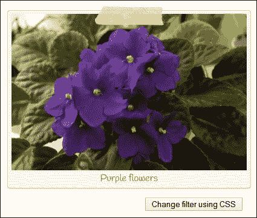

1.  在 `cssfilters.css` – 屏幕底部附近仔细查看。我们应该看到以下内容：

    ```js
    .change-filter {
      filter: blur(5px);
      -webkit-filter: blur(5px); 
    }
    ```

    紧接着这个区块：

    ```js
    img { -webkit-transition: all 0.7s ease-in-out; transition: all 0.7s ease-in-out; }
    ```

1.  现在点击**使用 CSS 更改滤镜**按钮。如果一切正常，我们的图像应该逐渐变模糊，如下图所示：

一个简单的演示 - 在目前阶段没有太多困难，考虑到我们在本书中已经涵盖了一些更复杂的主题！

### 小贴士

小贴士 - 如果你发现在某些版本的 Firefox 中滤镜显示不出来，那么请检查**about:config**中的**layout.css.filters.enabled**属性。在 34 版或更早的版本中，默认情况下未启用；这一点是从 35 版开始改变的：


当然，这个演示的关键是使用`.addClass()`方法处理程序。当点击按钮时，我们只是将一个新的，预设的类应用于图像。但在这里美妙的是，我们可以访问许多快速、简单的滤镜，可以减少（甚至消除）对 PhotoShop 或 GIMP 的使用。为了看到切换有多容易，让我们现在做出这个改变，切换到使用亮度滤镜。

## 更改亮度级别

下一个演示是对我们刚刚工作过的`cssfilters.css`文件进行快速简单的更改。以下是我们将要制作的屏幕截图：

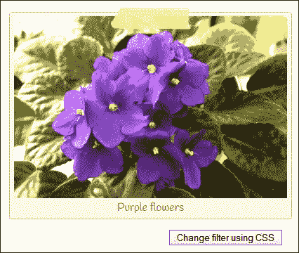

在继续下面列出的步骤之前，请确保你有这个文件可用：

1.  在`cssfilters.css`中，查找并修改`.change-filter`规则如下所示：

    ```js
    .change-filter { filter: brightness(170%); -webkit-filter: brightness(170%); }
    ```

1.  现在点击**使用 CSS 更改滤镜**。如果一切正常，我们应该会发现图像变得更加明亮。

同样 - 在这里没有太多困难；希望在本书中我们所涵盖的一些内容后，这是一个放松的时刻！我们可以使用一些 CSS3 滤镜；由于空间限制，我们不能在这里涵盖它们所有，但至少我们可以再看一种滤镜。在接下来的练习后面，我们将介绍可供使用的其他滤镜。

## 向我们的图像添加深褐色滤镜

与以前一样，我们需要恢复更改`cssfilters.css`，所以确保你已经准备好了这个文件。让我们看看我们需要做什么：

1.  恢复到`cssfilters.css`，然后按如下所示修改这一行：

    ```js
    .change-filter { filter: sepia(100%); -webkit-filter: sepia(100%); }
    ```

1.  现在点击**使用 CSS 更改滤镜**。如果一切正常，我们应该会发现图像现在应用了一种深褐色滤镜，如此屏幕截图所示：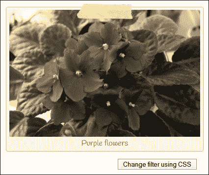

这就是我喜欢使用 CSS3 滤镜的地方 - 尽管有些纯粹主义者可能会说的，但并不总是必要回到使用图形软件包；在 CSS 中简单更改一个值就足够了。

如果需要，我们可以手动更改该值，但是现在我们也可以以编程方式灵活地进行更改，对性能几乎没有影响。这一点非常重要，因为我们将在本章后面看到。使用 jQuery 创建复杂滤镜来操纵图像是一个资源消耗大的过程，因此不宜频繁进行。

## 探索其他滤镜

在我们继续探讨不同的图像处理方法之前，下表展示了不同滤镜的风格；所有这些滤镜都可以使用 jQuery 进行设置，就像我们在之前的练习中所概述的那样：

| 滤镜名称 | 使用示例 |
| --- | --- |
| `contrast()` |

```js
.change-filter { filter: contrast(170%); -webkit-filter: contrast(170%); }
```

|

| `hue-rotate()` |
| --- |

```js
.change-filter { filter: hue-rotate(50deg); -webkit-filter: hue-rotate(50deg); }
```

|

| `grayscale()` |
| --- |

```js
.change-filter { filter: grayscale(100%); -webkit-filter: grayscale(100%); }
```

|

| `invert()` |
| --- |

```js
.change-filter { filter: invert(100%); -webkit-filter: invert(100%); }
```

|

| `Saturate()` |
| --- |

```js
.change-filter { filter: saturate(50%); -webkit-filter: saturate(50%);}
```

|

要查看这些滤镜的实际示例，值得上网查看一下——有很多示例可供参考。作为一个起点，可以查看约翰尼·辛普森在[`www.inserthtml.com/2012/06/css-filters/`](http://www.inserthtml.com/2012/06/css-filters/)上的文章；虽然这篇文章已经有几年了，而且有些设置已经进行了调整，但仍然可以对 CSS3 滤镜的可能性提供有用的了解。

让我们换个方式来思考——虽然我们可以使用简单的 CSS3 滤镜来调整对比度和亮度等方面，但我们也可以使用另一种方法：背景混合。

# 使用 CSS3 合并图像

在某些情况下，我们可能更喜欢不直接处理图像，而是改变背景图像。在 PhotoShop 中可以很容易地在静态图像中实现类似的效果，但在互联网上较少见。

幸运的是，我们可以在 CSS 中使用`background-blend`模式来实现相同的效果——这样可以让我们将两张图像合并在一起。使用`background-blend`模式（在桌面浏览器中的浏览器支持良好）可以避免手动编辑每张照片的需求，因此如果任何照片更改了，同样的效果可以轻松应用到它们的替代品上。

与我们已经检查过的那些滤镜一样，我们会在 CSS 中应用这些滤镜。然后我们可以随心所欲地使用 jQuery 打开或关闭它们。我不会重新介绍所需的 jQuery 代码，因为我们已经在本章的早些时候见过了；简单地说，我们会应用`background-blend`模式，使用以下示例：

```js
  <style>
    .blend { width: 389px; height: 259px; background:#de6e3d url("img/flowers.jpg") no-repeat center center; }
    .blend.overlay { background-blend-mode: overlay; }
  </style>
</head>
```

在这个例子中，我们使用了`overlay`滤镜。这个复杂的滤镜会根据背景色值来乘以颜色。它的净效果是让浅色变得更浅，让深色变得更深，如下一个截图所示：

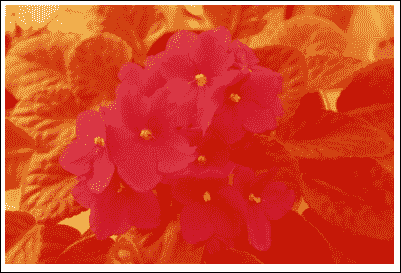

### 提示

代码下载包中有两个示例，其中包括`overlay.html`和`multiply.html`文件中的这种混合模式的示例。 

有很多滤镜选项可供选择，比如乘法、变亮、避免和颜色燃烧——这些都旨在产生类似于 PhotoShop 中使用的效果，但不需要昂贵的应用程序。所有滤镜都遵循类似的格式。在谷歌上搜索滤镜的示例很值得，比如在[`www.webdesignerdepot.com/2014/07/15-css-blend-modes-that-will-supercharge-your-images/`](http://www.webdesignerdepot.com/2014/07/15-css-blend-modes-that-will-supercharge-your-images/)上展示的那些。

### 注意

如果您想了解更多信息，请访问 Mozilla 的开发者网站[`developer.mozilla.org/en-US/docs/Web/CSS/background-blend-mode`](https://developer.mozilla.org/en-US/docs/Web/CSS/background-blend-mode)。要获取此滤镜的真正有用的示例（以及与 jQuery 结合的灵感来源），请查看 2016 年美国总统候选人演示[`codepen.io/bennettfeely/pen/rxoAc`](http://codepen.io/bennettfeely/pen/rxoAc)。

好了，是时候真正投入一些 jQuery 的时间了！让我们转向使用插件，并看看我们可以使用什么可用的东西来实现一些效果。我们将从使用 CamanJS 作为示例开始，然后深入探讨手动创建滤镜，并看看为什么这并不总是实现所需效果的最佳方式！

# 使用 CamanJS 应用滤镜

到目前为止，我们已经使用 CSS3 应用了滤镜。这对于轻量级解决方案来说是完美的，但在某些情况下，我们可能需要做更多，而 CSS3 则不够。

进入 jQuery！在接下来的几页中，我们将简要介绍如何使用 CamanJS 作为我们示例 jQuery 插件来应用滤镜。然后，我们将继续看看如何轻松（或复杂）地手动创建相同的效果，而不需要依赖第三方插件。

## 介绍 CamanJS 作为插件

CamanJS 是为 jQuery 提供的几个插件之一，它允许我们应用任意数量的滤镜；我们可以从库中提供的预设滤镜中选择，或者创建我们自己的组合。

该插件可以从[`camanjs.com/`](http://camanjs.com/)获得，并可以从 GitHub 下载[`github.com/meltingice/CamanJS`](https://github.com/meltingice/CamanJS)。另外，我们可以使用 NodeJS 或 Bower 来安装该库。该插件还可以通过 CDN 在[`www.cdnjs.com`](http://www.cdnjs.com)获得 - 搜索 CamanJS 以获取在您的项目中使用的最新 URL。

值得注意的是，可以使用两种方法之一来应用滤镜 - 第一种是作为 HTML 数据属性：

```js

```

第二种方法是使用 jQuery，正如我们将在下一个演示中看到的；我们将在我们的示例中一直使用这种方法。有了这个想法，让我们开始动手，并看看如何使用 CamanJS 来应用滤镜，就像我们下一个演示中展示的那样。

## 构建一个简单的演示

在这个演示中，我们将使用 CamanJS 库来对我们在本章节中一直在使用的花朵图像应用三个滤镜中的任何一个。

### 注意

记住 - 如果您使用 Chrome，请在本地 Web 服务器内运行此演示，如“准备就绪”部分所建议的那样。

让我们开始：

1.  首先，从附带本书的代码下载中提取以下文件。对于这个演示，我们需要以下文件：`caman.html`，`flowers.jpg`，`usecaman.js`，`jquery.min.js`和`usecaman.css`。将 JavaScript 文件存储在`js`子文件夹中，将 CSS 文件存储在`css`子文件夹中，将图像存储在`img`子文件夹中，并将 HTML 标记存储在项目文件夹的根目录中。

1.  运行`caman.html`演示文件。如果一切顺利，我们应该看到以下图片出现：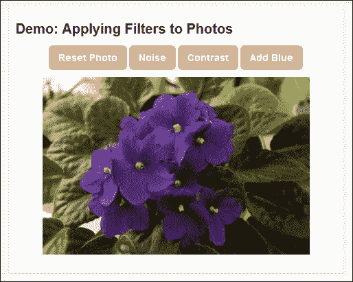

1.  让我们探索操作演示所需的 jQuery。如果我们查看`usecaman.js`，我们会看到以下代码。这用于获取我们标记中`<canvas>`元素的句柄，然后在其上绘制`flowers.jpg`图像。

    ```js
      var canvas = $('#canvas');
      var ctx = canvas[0].getContext("2d");
      var img = new Image();
      img.src = "img/flowers.jpg";
      ctx.drawImage(img, 0, 0);
    ```

1.  深入挖掘一下，我们应该看到以下方法——这个方法处理了`<canvas>`元素恢复到其原始状态的重置；请注意使用的`drawImage()`方法，这是使用不同滤镜操作图像的关键：

    ```js
      $reset.on('click', function(e){
        e.preventDefault();
        var img = new Image();
        img.src = "img/flowers.jpg";
        ctx.save();
        ctx.setTransform(1, 0, 0, 1, 0, 0);
        ctx.clearRect(0, 0, canvas[0].width, canvas[0].height);
        ctx.restore();
        ctx.drawImage(img, 0, 0);
        Caman('#maincanvas', 'img/flowers.jpg', function(){
          this.revert(false).render();
        });
      });
    ```

1.  然后，我们再加上三个不同的事件处理程序——这些应用了相应的 CamanJS 滤镜：

    ```js
    $noise.on('click', function(e) {
      e.preventDefault();
      Caman('#maincanvas', 'img/flowers.jpg', function() {
        this.noise(10).render();
      });
    });
    ```

我们的简单演示只是展示了使用 CamanJS 可能性的冰山一角。详细查看该网站，了解使用该库可以实现的效果是非常值得的。作为灵感的来源，请查看 Carter Rabasa 的文章，他使用该库创建了一个基于著名的 Instagram 网站的 Phonestagram 应用程序；该文章位于[`www.twilio.com/blog/2014/11/phonestagram-fun-with-photo-filters-using-node-hapi-and-camanjs.html`](https://www.twilio.com/blog/2014/11/phonestagram-fun-with-photo-filters-using-node-hapi-and-camanjs.html)。

### 注意

值得注意的是，CamanJS 能够轻松处理 HiDPI 图像——我们只需在代码中设置`data-caman-hidpi`属性。如果检测到设备支持高分辨率图像，Caman 将自动切换到使用高分辨率版本。但要注意，由于使用了额外的像素，渲染时间会更长。

## Getting really creative

回想一下本章开头提到的地方，我提到 CSS3 滤镜提供了一个方便且轻量级的手段来操作图像。它们的使用意味着我们可以减少编辑图像所需的工作量，并且如果图像的大小或内容发生变化，更新它们会更容易。

然而，使用 CSS3 滤镜只能做到这一点——这就是 jQuery 接管的地方。要了解原因，请让我们通过另一个演示来进行工作。这一次，我们将使用 CamanJS 附带的更高级的预设滤镜之一，如果仅使用 CSS3 滤镜就很难实现。

记住——如果您使用的是 Chrome，请从本地 Web 服务器中运行此演示，如“准备就绪”部分所建议的那样。让我们开始：

1.  对于这个演示，我们需要从本书配套的代码下载中获取一些文件。它们是：`caman-advanced.css`，`caman-advanced.html`，`caman.full.js`，`jquery.min.js`和`flowers.jpg`。将每个文件放在相关的子文件夹中，而将 HTML 标记文件放在项目区的根目录。

1.  在一个新文件中，添加以下代码以配置 CamanJS 对象以使用库提供的针孔滤镜；将其保存为`caman-advanced.js`，放在`js`子文件夹中。

    ```js
    $(document).ready(function() {
      $("input").on("click", function() {
        Caman("#caman-image", function () {
          this.pinhole().render();
        });
      })
    });
    ```

1.  如果我们预览演示，可以看到点击**更改滤镜**按钮时，图像现在显示为针孔相机效果。参考下面的图片：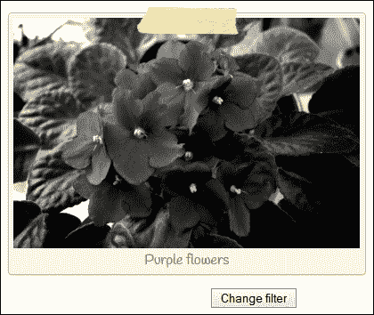

在 CamanJS 网站上有许多更不寻常滤镜的示例。前往[`camanjs.com/examples/`](http://camanjs.com/examples/)查看使用该库可能出现的情况。

尽管我们集中在使用 CamanJS 作为示例（部分是因为这个库的广泛可能性），但是还有其他可用的库，提供类似的滤镜功能，但并非所有库都能达到 CamanJS 的水平。以下是一些可供探索的例子，让你开始：

+   **VintageJS**：[`github.com/rendro/vintageJS`](https://github.com/rendro/vintageJS)

+   **Hoverizr**：[`github.com/iliasiovis/Hoverizr`](https://github.com/iliasiovis/Hoverizr)

+   **PaintbrushJS**：[`mezzoblue.github.com/PaintbrushJS`](http://mezzoblue.github.com/PaintbrushJS)

+   **Colorimazer**：[`colorimazer.tacyniak.fr/`](http://colorimazer.tacyniak.fr/)

对于那些不喜欢使用开源软件的人，一个你可能喜欢探索的例子是 JSManipulation 库，这个库可以在 CodeCanyon 网站上以出售的方式获得，网址为：[`codecanyon.net/item/jsmanipulate-jquery-image-manipulation-plugin/428234`](http://codecanyon.net/item/jsmanipulate-jquery-image-manipulation-plugin/428234)。

好的，让我们继续，并且真正投入到一些事情中去。目前为止，我们已经使用了大多数情况下适用的插件。但是在一些情况下，我们可能会发现需要手动创建自己的滤镜，因为现有的滤镜不适用于我们的需求。让我们看看一些例子，以了解涉及到的内容。

### 小贴士

要了解使用 Caman 时可能出现的情况，请查看 Martin Angelov 在[`tutorialzine.com/2013/02/instagram-filter-app/`](http://tutorialzine.com/2013/02/instagram-filter-app/)的这篇文章。他通过使用 jQuery，CamanJS 和 jQuery Mousewheel 来构建一个 Instagram 滤镜应用程序。

# 手动创建简单的滤镜

创造我们自己的滤镜的关键（也与许多预构建的插件一样）是使用`<canvas>`元素，并熟悉`getImageData`方法。我们可以使用后者来操纵每个图像中的颜色通道，以产生所需的效果。

我们可以花时间详细讨论如何使用此方法，但我认为亲自尝试会更好。所以让我们深入了解并使用它手动创建一些滤镜，首先是将图像转换为灰度。

## 将图像转换为灰度

对于三个演示中的第一个演示，我们将对我们在本章中一直使用的`flowers.jpg`图像的颜色进行去饱和处理。这将使其呈现出灰度外观。

### 注意

如果在本地运行此演示，您可能会遇到跨域错误。我建议按照*准备工作*部分的建议在本地 Web 服务器上运行它。

让我们看看我们需要做什么：

1.  让我们从附带本书代码下载中提取`flowers.jpg`的副本、`jquery.min.js`、`manual-grayscale.html`和`manual-grayscale.css`。将图像存储在`img`子文件夹中，JavaScript 文件存储在`js`子文件夹中，样式表存储在`css`子文件夹中；HTML 标记需要存储在我们项目文件夹的根目录下。

1.  在一个新文件中，继续添加以下代码，并将其保存为`manual-grayscale.js` - 这将查找每个设置了图片类名为 picture 的图像集，然后调用`grayscale`函数执行魔术：

    ```js
    $(window).load(function(){
      $('.picture').each(function(){
        this.src = grayscale(this.src);
      });
    });
    ```

1.  将以下函数添加到`$(window).load`方法的下方 - 这将用等效的灰度重写图像：

    ```js
    function grayscale(src){
      var i, avg;
      var canvas = document.createElement('canvas');
      var ctx = canvas.getContext('2d');
      var imgObj = new Image();
      imgObj.src = src;
      canvas.width = imgObj.width;
      canvas.height = imgObj.height;
      ctx.drawImage(imgObj, 0, 0);
      var imgPixels = ctx.getImageData(0, 0, canvas.width, canvas.height);
      for(var y = 0; y < imgPixels.height; y++){
        for(var x = 0; x < imgPixels.width; x++){
          i = (y * 4) * imgPixels.width + x * 4;
          avg = (imgPixels.data[i] + imgPixels.data[i + 1] + imgPixels.data[i + 2]) / 3;
          imgPixels.data[i] = avg;
          imgPixels.data[i + 1] = avg;
          imgPixels.data[i + 2] = avg;
        }
      }
      ctx.putImageData(imgPixels, 0, 0, 0, 0, imgPixels.width, imgPixels.height);
      return canvas.toDataURL();
    }
    ```

1.  如果我们此时运行演示，我们应该会看到一张带有极化效果边框的图像的副本，但这次，它已经被转换成了灰度等效图像，接着是截图本身：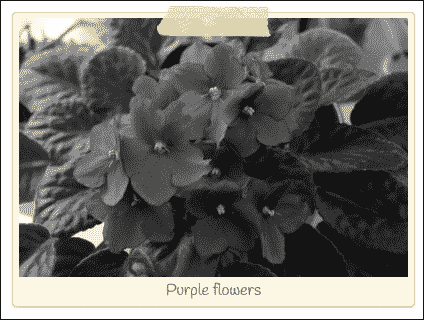

在我们继续进行下一个演示之前，有一些关键点需要注意，与我们刚刚使用的代码相关。所以让我们花点时间详细介绍一下这些：

+   我们所做的大部分工作都使用了`<canvas>`元素 - 这使我们能够以比使用普通的 JPG 或 PNG 格式图像更细致的细节来操作图像。

+   在这种情况下，我们使用纯 JavaScript 使用语句 `document.createElement('canvas')` 创建了 canvas 元素。有些人可能会认为将纯 JavaScript 与 jQuery 混合使用是不好的做法。在这种情况下，我个人认为它提供了更清洁的解决方案，因为使用 jQuery 动态创建的`<canvas>`元素不会自动添加上下文。

+   作为一种方法，`getImageData()`是使用此路由操作任何图像的关键。然后，我们可以处理每个颜色通道，即红色、绿色和蓝色，以产生所需的效果。

我们可以使用这个过程来生成任意数量的不同滤镜 - 比如说一个棕褐色调的滤镜？让我们看看我们如何手动创建这样一个滤镜。在这种情况下，我们将进一步将其转换为一个小插件，以便以后重复使用。

## 添加棕褐色调

我们已经看到了从头开始制作一个彩色滤镜是多么简单 – 那么创建不同类型的滤镜呢？我们可以使用类似的技术来制作其他滤镜，所以让我们继续创建一个基于棕褐色的滤镜，以补充本章早些时候使用的 CSS3 版本。

### 注意

记住 – 如果您使用的是 Chrome，请从本地 Web 服务器中运行此演示，如“准备就绪”部分所建议的那样。

让我们开始吧：

1.  我们将像往常一样从随书代码下载中提取相关文件。对于这一个，我们需要以下文件：`jquery.min.js`、`flowers.jpg`、`manual-sepia.css`和`manual-sepia.html`。将它们存储在我们项目文件夹的相应子文件夹中。

1.  在一个新文件中，我们需要创建我们的棕褐色插件，所以继续添加以下代码，从设置调用开始，以找到所有类名为`.sepia`的图像：

    ```js
    jQuery.fn.sepia = function () {
      $(window).load(function () {
        $('.sepia').each(function () {
          var curImg = $(this).wrap('<span />');
          curImg.attr("src", grayImage(this));
        });
      });
    ```

1.  下一个非常重要的函数是`grayImage`函数，它接收图像，将其绘制到画布上，然后操纵图像中的每个颜色通道，最后将其渲染回屏幕：

    ```js
      function grayImage(image) {
        var canvas = document.createElement("canvas");
        var ctx = canvas.getContext("2d");
        canvas.width = image.width;
        canvas.height = image.height;
        ctx.drawImage(image, 0, 0);
        var imgData = ctx.getImageData(0, 0, canvas.width, canvas.height);

        for (var y = 0; y < imgData.height; y++) {
          for (var x = 0; x < imgData.width; x++) {
            var pos = (y * 4) * imgData.width + (x * 4);
            var mono = imgData.data[pos] * 0.32 + imgData.data[pos + 1] * 0.5 + imgData.data[pos + 2] * 0.18;
            imgData.data[pos] = mono + 50;
            imgData.data[pos + 1] = mono;
            imgData.data[pos + 2] = mono - 50;
          }
        }
        ctx.putImageData(imgData, 0, 0, 0, 0, imgData.width, imgData.height);
        return canvas.toDataURL();
      }
    };
    $.fn.sepia();
    ```

1.  让我们在浏览器中预览结果。如果一切顺利，我们应该会看到我们的图像具有漂亮的棕褐色调，如下图所示：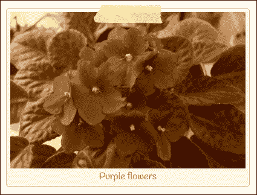

这个滤镜版本在我们使用的代码方面可能看起来略有不同，但其中大部分是由于将其重新配置为插件以及一些变量名称的更改。如果我们仔细观察，就会发现两个示例中都使用了相同的原理，但产生了两个不同版本的同一图像。

### 提示

如果您想要了解更多关于使用`getImageData()`方法的信息，请查看 W3School 的教程，可在[`www.w3schools.com/tags/canvas_getimagedata.asp`](http://www.w3schools.com/tags/canvas_getimagedata.asp)上找到。

## 图像混合

对于我们的第三个和最后一个演示，并且为了证明`getImageData()`的多功能性，我们将在本章中一直使用的同一张花朵图像上添加一种色调。

这个演示相对而言比较简单。我们已经有了一个框架，以插件的形式存在；我们只需要将嵌套的`for…`块替换为我们的新版本即可。让我们开始吧：

1.  在`manual-sepia.js`的副本中，查找大约在第**17**行左右的以下行：

    ```js
    for (var y = 0; y < imgData.height; y++) {
    ```

1.  将高亮显示的内容删除直到第**25**行。用以下代码替换它：

    ```js
        var r_weight = 0.44;
        var g_weight = 0.5;
        var b_weight = 0.16;
        var r_intensity = 255;
        var g_intensity = 1;
        var b_intensity = 1;

        var data = imgData.data;
        for(var i = 0; i < data.length; i += 4) {
          var brightness = r_weight * data[i] + g_weight * data[i + 1] + b_weight * data[i + 2];
          data[i] = r_intensity * brightness; // red
          data[i + 1] = g_intensity * brightness; // green
          data[i + 2] = b_intensity * brightness; // blue
        }
        ctx.putImageData(imgData, 0, 0);
    ```

1.  现在，将文件保存为`manual-sepia.js`，然后在浏览器中预览`manual-sepia.html`。如果一切正常，我们应该会看到图像出现，但这次有了红色色调，如下图所示：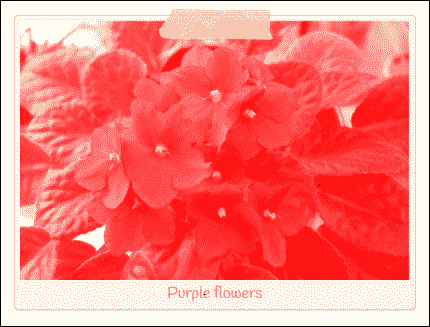

这个演示中使用的数学看起来很简单，但可能需要一点解释。这是一个两阶段过程，我们首先使用`_weight`变量来计算亮度级别，然后使用`_intensity`变量来计算相关的强度级别，然后再将其重新应用于适当的颜色通道。

掌握使用这种方法构建滤镜所需的数学可能需要一些时间（这超出了本书的范围），但一旦你理解了数学，它就会带来一些真正的可能性！

### 注意

为了方便起见，我在这个演示中重新使用了相同的文件，以证明我们可以应用特定的颜色色调。在实践中，我们需要重新命名插件名称，以更好地反映正在使用的颜色（而且在这种情况下，不会是 sepias！）。

当然，我们还可以更进一步。这样做可能需要一些强大的数学，因此不适合胆怯的人！如果你喜欢挑战，那么一个很好的起点是学习使用**卷积掩模**，它看起来类似于以下内容（这个是用于图像模糊的）：

```js
    [.1, .1, .1],
    [.1, .2, .1],
    [.1, .1, .1],
```

这将使我们能够创建一些非常复杂的滤镜，比如 Sobel 滤镜（[`en.wikipedia.org/wiki/Sobel_operator`](http://en.wikipedia.org/wiki/Sobel_operator)），甚至是 Laplace 滤镜（[`en.wikipedia.org/wiki/Discrete_Laplace_operator#Implementation_in_Image_Processing`](http://en.wikipedia.org/wiki/Discrete_Laplace_operator#Implementation_in_Image_Processing)）- 警告：这数学真的很强大！为了将它变得简单一点，请看看 Google。以下是一些有用的起点：

+   [`halfpapstudios.com/blog/2013/01/canvas-convolutions/`](http://halfpapstudios.com/blog/2013/01/canvas-convolutions/)

+   [`thiscouldbebetter.wordpress.com/2013/08/14/filtering-images-with-convolution-masks-in-javascript/`](https://thiscouldbebetter.wordpress.com/2013/08/14/filtering-images-with-convolution-masks-in-javascript/)

+   [`beej.us/blog/data/convolution-image-processing/convolution.js`](http://beej.us/blog/data/convolution-image-processing/convolution.js)

让我们换个方式！我们已经使用不同的方法对我们的图像应用了一些滤镜，但有没有人注意到效果有多突然？一个更令人愉悦的路线是动画过渡过程。让我们看看如何使用**cssAnimate**库实现这一点。

# 使用滤镜来实现图像动画

好的，我们已经讨论了许多不同的方法来应用滤镜来操作图像的外观。在我们继续并查看一些实际示例之前，让我们停顿一下。

有没有人注意到，当使用 jQuery 时，我们失去了逐渐从一个状态过渡到另一个状态的能力？过渡只是提供状态变化的一种方式之一 - 毕竟，逐渐改变状态比看到突然切换更容易接受！

我们可以花时间从头开始使用 jQuery 创造一个解决方案。然而，更明智的解决方案是使用一个专门用于此目的的插件。

## 引入 cssAnimate

进入 cssAnimate！这个小宝石由 Clemens Damke 制作，它生成了必要的 CSS3 样式来动画地更改状态，但如果不支持，则退回到使用 jQuery 的 `animate()` 方法处理程序。该插件可从 [`cortys.de/cssAnimate/`](http://cortys.de/cssAnimate/) 下载。尽管该网站指出了 jQuery 1.4.3 或更高版本的最低要求，但在与 jQuery 2.1 一起使用时，它可以无明显问题地运行。

让我们看一下我们即将产生的截图：

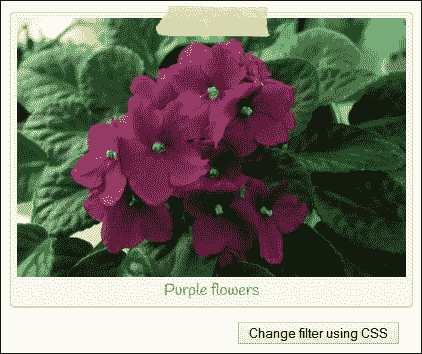

让我们开始吧：

1.  我们将从随本书附带的代码下载中提取以下文件开始：`cssanimate.html`、`cssanimate.css`、`flowers.jpg`、`jquery.min.js` 和 `jquery.cssanimate.min.js`。

1.  将 JavaScript 文件保存到 `js` 子文件夹中，将图像保存到 `img` 文件夹中，将 CSS 文件保存到 `css` 子文件夹中，并将 HTML 标记保存到我们项目区域的根文件夹中。

1.  在一个单独的文件中，添加以下代码，该代码将动画更改为 `hue-rotate` 滤镜：

    ```js
    $(document).ready(function(){
      $("input[name='css']").on("click", function(){
        $("img").cssAnimate({filter: hue-rotate(50deg), -webkit- filter: hue-rotate(50deg)}, 500, "cubic-bezier(1,.55,0,.74)");
      })
    });
    ```

1.  如果一切顺利，当点击**使用 CSS 更改滤镜**按钮时，我们应该看到花朵似乎变成深粉色，就像我们练习开始时所示。

乍一看，我们唯一能看到的变化是图像变为深粉色。然而，真正的变化将在我们使用 DOM 检查器（例如 Firebug）检查代码时显示出来：


这个库的美妙之处在于，尽管它已经有几年了，但似乎仍然可以很好地与现代版本的 jQuery 配合使用。这为我们开辟了一些真正可以探索的途径，就我们可以使用的过渡动画而言。

### 注意

过渡支持在主要浏览器中几乎达到了 100%，除了 Opera Mini。要获取最新的情况，值得查看 Can I Use 网站 [`caniuse.com/#feat=css-transitions`](http://caniuse.com/#feat=css-transitions)。

尽管 cssAnimate 中内置的动画数量有限，但至少它包括对 cubic-bezier 值的支持。Matthew Lein 制作了一个文件，其中包含一些著名缓动效果的 cubic-bezier 等效值；这可以从 [`github.com/matthewlein/Ceaser/blob/master/developer/ceaser-easings.js`](https://github.com/matthewlein/Ceaser/blob/master/developer/ceaser-easings.js) 获取。我们可以使用这个来提供可以放入我们动画中以产生期望效果的值。或者，我们可以使用像 [`cubic-bezier.com`](http://cubic-bezier.com) 这样的网站设计自己的 cubic-bezier 缓动效果 - 这提供了可以用于我们动画的类似值。

### 注意

顺便说一下 - 当我为这本书进行研究时，我发现了这个简洁的演示：[`codepen.io/dudleystorey/pen/pKoqa`](http://codepen.io/dudleystorey/pen/pKoqa)。我想知道我们是否可以使用 cssAnimate 来产生类似的效果？

好了 - 目前足够使用滤镜了！让我们转换焦点，深入一些更实际的内容。你们有多少人曾经在线签署过某物，使用电子签名？如果情况需要，这是一个很棒的效果。我们将看看如何实现，但是扩展它，以便我们可以保存图像供以后使用。

# 创建签名板并导出图像

现在我们已经看到了如何操作图像，让我们把注意力转向更基础的事情；捕捉绘制在画布元素上的图像。

随着我们越来越多地进入数字化世界，会有一些场合需要我们用电脑电子签署文件。这并不意味着我们不应该在狂欢一晚之后的早晨签署任何文件，但更糟糕的事情可能会发生...！考虑到这一点，让我们看看在文档签署后如何捕捉图像。

对于此演示，我们将使用 Thomas Bradley 的 jQuery Signature Pad 插件。该插件可从[`thomasjbradley.ca/lab/signature-pad`](http://thomasjbradley.ca/lab/signature-pad)获取。我们将进一步进行 - 不仅仅是签署我们的名字，而且还将提供一个选项，使用`canvas.toDataURL()`方法将输出保存为 PNG 文件。

### 注意

记住 - 如果你使用 Chrome，请从本地网络服务器中运行此演示，正如 *准备就绪* 部分建议的那样。

让我们开始：

1.  我们将从附带本书的代码下载中下载所需的 CSS 和 HTML 标记文件，开始这个演示。继续并提取签名板文件夹并将其保存到项目区域。

1.  接下来，将以下代码添加到一个新文件中 - 将其保存为`signaturepad.js`，放在我们演示文件夹的`js`子文件夹中：

    ```js
    $(document).ready(function() {
      $('.sigPad').signaturePad();
      var canvas = $('#canvas')[0], ctx = canvas.getContext('2d');

      $('#download').on('click', function() {
        saveImage();
        downloadCanvas(this, 'canvas', 'signature.png');
      });

      function saveImage() {
        var api = $('.sigPad').signaturePad();
        var apitext = api.getSignatureImage();
        var imageObj = new Image();
        imageObj.src = apitext;
        imageObj.onload = function() {
          ctx.drawImage(imageObj, 0, 0);
        };
      }

      function downloadCanvas(link, canvasId, filename) {
        link.href = $(canvasId)[0].toDataURL();
        link.download = filename;
      }
    });
    ```

    ### 注意

    代码下载中已经有这个文件的一个版本；提取并将`signaturepad-completed.js`重命名为`signaturepad.js`，然后按照本演示中所述的方法将其存储在相同的`js`文件夹中。

1.  如果我们在浏览器中预览结果，应该会看到一个签名板显示，如下面的屏幕截图所示：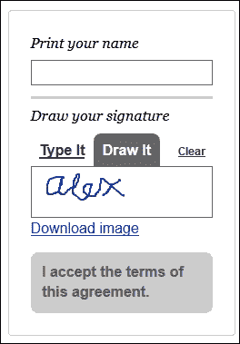

在此屏幕截图中，我已经添加了我的名字。尝试点击**绘制**然后画出你的名字 - 小心，需要手脚稳！接下来，点击链接。如果一切正常，我们将被提示打开或保存名为`signature.png`的文件。在适当的图形软件中打开它确认签名已正确保存。参考以下图像：


尽管这只是一个相对简单的演示，但它开启了一些真正的可能性。除了我们使用的签名插件之外，这个演示的关键在于两个方面：使用`<canvas>`元素来捕获绘制的签名，以及使用`.toDataURL()`方法将画布元素的内容转换为数据 URI，其中包含以 PNG 格式表示的图像（默认情况下）。

我们首先获取一个句柄，然后将图像绘制到一个 canvas 元素上。一旦下载事件处理程序被触发，它就会将图像转换为数据 URI 表示形式，然后将其呈现为我们可以保存以供以后使用的格式。

### 注意

如果您想了解更多关于`toDataURL()`方法的信息，那么 Mozilla 的开发者实验室有一篇很好的文章，可以在[`developer.mozilla.org/en-US/docs/Web/API/HTMLCanvasElement.toDataURL`](https://developer.mozilla.org/en-US/docs/Web/API/HTMLCanvasElement.toDataURL)找到。

让我们将这个技术应用到实践，并将其与本章开头涵盖的摄像头和图像操作技术相结合。这使我们可以变得非常疯狂；想要玩一些捕捉和更改网络摄像头图像的有趣内容吗？

# 捕获和操作网络摄像头图像

在本章的第二个也是最后一个演示中，我们将通过网络摄像头玩一些有趣的东西 - 我们可以从笔记本电脑或独立摄像头中获取和操作图像的方式之一。

这个演示的关键在于使用`getUserMedia`，它允许我们控制音频或视频源。这是一个相对年轻的 API，需要使用供应商前缀来确保完全支持。与其他 API 一样，它们的需求会随着时间的推移而消失，因此定期检查[`caniuse.com/#search=getusermedia`](http://caniuse.com/#search=getusermedia)是值得的，以查看是否已更新支持并删除了前缀的需求。

这个演示将汇集我们探讨过的一些概念，比如应用过滤器、将画布图像保存到文件以及控制网络摄像头。为了正确运行这个演示，我们将需要从 HTTP 协议地址而不是`file://.`运行它。为此，您将需要一些可用的网络空间，或者使用像 WAMP（适用于 PC - [`www.wampserver.com/en`](http://www.wampserver.com/en)）或 MAMP（适用于 Mac，现在也适用于 PC，来自[`www.mamp.info/en/`](http://www.mamp.info/en/)）。

好的，假设这一切都就绪，让我们开始吧：

1.  我们将从与本书附带的代码下载中提取`webcam demo`文件夹开始。它包含了为本演示所需的样式、标记和 jQuery 库的副本。

1.  一旦提取出来，将整个文件夹上传到您的网络空间。我将假设您正在使用 WAMPServer，所以这将是`/www`文件夹；如果您使用的是其他内容，请相应地进行更改。

1.  我们需要添加使此演示工作所需的 jQuery 魔法。在一个新文件中，继续添加以下代码；我们将逐节介绍它，从分配变量和过滤器数组开始：

    ```js
    $(document).ready(function() {
      var idx = 0;
      var filters = ['grayscale', 'sepia', 'blur', 'saturate', ''];

      var canvas = $("canvas")[0], context = canvas.getContext("2d"),
      video = $("video")[0], localStream, videoObj = { "video": true }, errBack = function(error) {
          console.log("Video capture error: ", error.code);
        };
    ```

1.  第一个函数处理通过过滤器的分页。我们循环遍历存储在过滤器数组中的过滤器名称。如果样式表中有相应的样式规则，则将以下内容应用于画布图像：

    ```js
      function changeFilter(e) {
        var el = e.target;
        el.className = '';
        var effect = filters[idx++ % filters.length];
        if (effect) {
          el.classList.add(effect);
        }
      }
    ```

1.  接下来，我们需要获取`getUserMedia`的实例，我们将用它来控制网络摄像头。由于这仍然是一个相对年轻的 API，我们必须使用供应商前缀：

    ```js
      navigator.getUserMedia = (navigator.getUserMedia || navigator.webkitGetUserMedia || navigator.mozGetUserMedia || navigator.msGetUserMedia);
    ```

1.  第一个事件处理程序中，`#startplay`按钮是最重要的。在这里，我们捕获网络摄像头源，然后将其分配给视频对象，并生成引用我们内容的 URL。一旦分配完成，我们开始播放视频，这样我们就可以在屏幕上查看内容：

    ```js
      $("#startplay").on("click", function(e) {
        if (navigator.getUserMedia) {
          navigator.getUserMedia(videoObj, function(stream) {
            video.src = window.URL.createObjectURL(stream);
            localStream = stream;
            video.play();
          }, errBack);
        }
      });
    ```

1.  然后，我们需要分配一些事件处理程序。按顺序，以下处理程序处理请求以拍摄图像快照，停止视频，更改过滤器，并下载快照图像的副本：

    ```js
      $("#snap").on("click", function() {
        context.drawImage(video, 0, 0, 320, 240);
      });

      $("#stopplay").on("click", function(e, stream) {
        localStream.stop();
      });

      $('#canvas').on('click', changeFilter);

      $("#download").on('click', function (e) {
        var dataURL = canvas.toDataURL('image/png');
        $("#download").prop("href", dataURL);
      });
    });
    ```

1.  将文件保存为`webcam.js`，并放在我们之前在此演示中上传的`webcam demo`文件夹的`js`子文件夹中。

1.  此时，我们可以尝试在浏览器中运行演示。如果一切正常，我们将首先收到一个请求，询问浏览器是否可以访问网络摄像头（出于安全原因），如下图所示：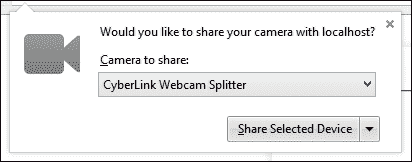

1.  然后是摄像头的初始化。它以一个占位符图像开始，如下图所示；几秒钟后，这将显示实时视频：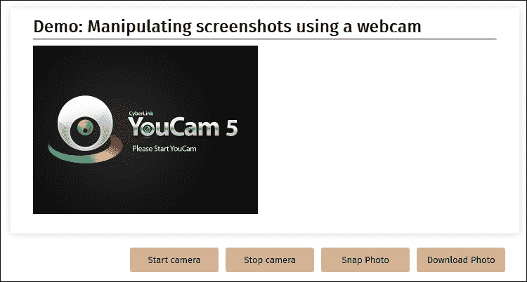

在这一点上，我们可以玩得很开心。尝试点击**拍照**以拍摄自己的照片快照；这将显示在实时视频的右侧。如果单击此图像，它将在样式表中设置的几个过滤器之间进行循环，并在`webcam.js`中引用：

```js
  var filters = ['grayscale', 'sepia', 'blur', 'saturate', ''];
```

等一下 - 有人注意到单击**下载照片**按钮后得到的图像有什么不同吗？你们中敏锐的人很快就会注意到，这是原始图像的副本，在应用过滤器之前。

原因是这些过滤器在 CSS 中设置 - 当在浏览器窗口中显示时，它们才会产生任何效果！为了解决这个问题，我们需要修改我们的下载事件处理程序。我们可以使用我们之前探索过的 CamanJS 库来应用一些基本的过滤器，例如库中提供的日出效果。

为此，请修改`#download`事件处理程序以显示以下代码：

```js
  $("#download").on('click', function (e) {
    e.preventDefault();
    Caman('#canvas', function(){
      this.sunrise();
      this.render(function() { this.save("webcam-photo.png"); });
    });
  });
```

现在尝试保存截图的副本。虽然它不会强制下载到您的桌面，但它仍然会在浏览器中显示一个图像，显示应用了日出滤镜的图像。

当使用`getUserMedia`时，我们只是触及了可能性的表面——在线学习更多是非常值得的。一个很好的起点是 Mozilla 开发者网络上的文章，可在[`developer.mozilla.org/en-US/docs/NavigatorUserMedia.getUserMedia`](https://developer.mozilla.org/en-US/docs/NavigatorUserMedia.getUserMedia)找到。注意——`getUserMedia`不支持 IE11 或更低版本，因此您需要使用像 Addy Osmani 的`getUserMedia.js`这样的 polyfill 库，可在[`github.com/addyosmani/getUserMedia.js`](https://github.com/addyosmani/getUserMedia.js)下载。

### 注意

顺便说一句，我曾考虑在这本书中加入使用 reveal.js 库来控制一个简单图像画廊的手势控制内容展示，就像在[`www.chromeexperiments.com/detail/gesture-based-revealjs/`](http://www.chromeexperiments.com/detail/gesture-based-revealjs/)中展示的那样。不幸的是，代码不够稳固，而且已经有一段时间没有更新了。我很想听听你的想法。这是展示一种流畅呈现内容的好方法，但需要更多的工作！

# 收尾工作

在我们总结这一章之前，值得暂停一下，考虑一下我们在本章中涵盖的一些技术带来的影响。

纯粹主义者可能会质疑使用 jQuery 应用过滤器的必要性，特别是如果我们所需要做的只是使用诸如`.addClass()`或者甚至`.toggleClass()`这样的方法来应用或移除特定的过滤器。另一方面，这本书当然是关于 jQuery 的，我们应该集中精力使用它，即使这意味着显示我们使用的一些过滤效果的明显延迟。

这个问题的简短答案取决于你——任何人都可以在某种程度上编写 jQuery 代码，但一般和优秀开发者的区别不仅仅在于编写代码。

真正的区别部分在于做出正确选择。jQuery 经常被视为简单的选择，特别是因为它提供了最广泛的支持范围。我们可以创建任何类型的过滤器来满足我们的需求，但这总是以处理能力为代价——我们无法摆脱操作画布元素需要大量资源的事实，因此完成速度很慢。如果使用高清图像（正如我们在*使用 CamanJS 应用过滤器*部分中注意到的那样）——事实上，速度会更慢，因为需要处理更多像素！

结论是，我们需要仔细考虑我们需要应用哪些过滤器，以及我们是否可以简单地使用 CSS3 过滤器来满足我们的需求。没错，这些可能无法解决我们所有的需求，但是支持正在变化。我们应该真正考虑在延迟不是问题的情况下使用 jQuery 过滤器，并且应用程序不会在移动平台上使用（由于处理每个像素所需的资源！）。

# 总结

操纵图像是 jQuery 中的一个悖论——我们可以使用 CSS3 滤镜轻松产生简洁的效果，但受到 CSS3 滤镜能够提供的限制；或者我们可以产生任何我们想要的滤镜，但以像素级别操作图像所需的处理资源为代价！在本章中，我们涵盖了大量信息，让我们花一点时间回顾我们学到的东西。

我们以添加 CSS3 滤镜开始，看到了将这些应用到图像上是多么容易。然后，我们转而研究了使用 CSS3 混合图像的不同技术，然后将注意力转向了检查 jQuery 图像插件。

我们花了一些时间探索一些应用滤镜的基本选项，然后创建了我们自己的基于 jQuery 的滤镜。然后我们转而研究如何通过动画过渡到使用滤镜，以帮助提供更流畅的过渡，最后看一下使用签名板和网络摄像头创建基本演示的方法，作为使用 jQuery 捕获图像的手段。

然后，我们总结了本章关于何时应该使用 CSS3 滤镜或 jQuery 的一些最终想法，强调任何人都可以编写代码，但好的开发人员知道在开发过程中何时使用正确的工具。

在下一章中，我们将扩展插件的使用，并探讨将插件开发技能提升到下一个水平。
