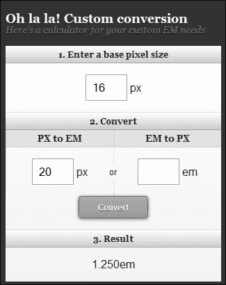
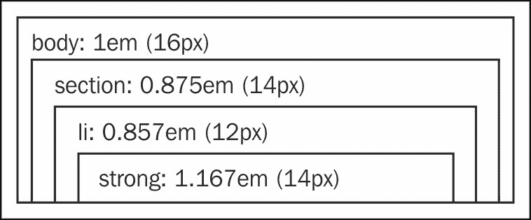
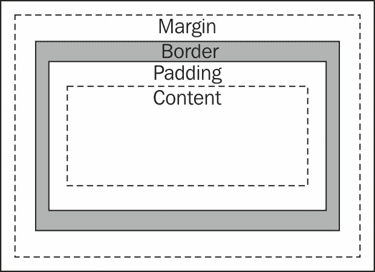
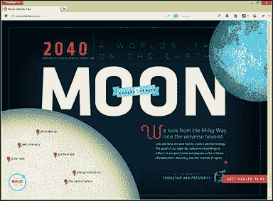
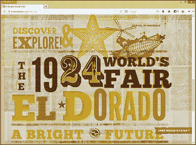

# 第四章 设计响应式文本

谈到响应式标题时，我们谈论的是灵活性。因此，在字体大小上使用固定的度量也应该是动态的。过去几年中它是如何实现的与现在的差别在于，早期我们只考虑了两种显示内容的方式：打印和屏幕。尽管时代变化，但对文本适应性的担忧仍然存在。

我们认为排版是我们设计的基础和我们 CSS 的支柱，因为我们网站的主要目标是通过回答用户的问题来向他们提供信息。避免创建十种不同的副标题样式是一个好的做法，为了做到这一点，我们必须根据我们网站的主题计划几个不同的标题。

在本章中，我们将学习：

+   理解并将文本转换为相对单位

+   盒子模型和段落间距

+   为漂亮的响应式标题自定义字体系列

+   自动管理字体大小

# 理解并将文本转换为相对单位

使用相对单位的主要优势之一是，当用户修改基本元素（来自浏览器）的字体大小时，所有字体大小都会按比例增加/减小，从而产生级联效应。

这些天，几乎每个浏览器都将基本元素`<html>`的默认设置设为 16 px。然而，如果用户想增大浏览器字体大小以便更容易阅读，这个值可以在用户端进行修改。

在谈论最常用的测量单位之前，我们想要强调两个单位，因为它们的流行度令人印象深刻，它们是：**vw**（视口宽度）和 **vh**（视口高度）。

这些视口单位在大多数常用的浏览器中仍然不太受欢迎，但我建议您随时关注[`www.w3.org/TR/css3-values/`](http://www.w3.org/TR/css3-values/)或[`caniuse.com/viewport-units`](http://caniuse.com/viewport-units)，因为这些单位使得根据浏览器大小调整字体大小的比例更加容易。

因此，最近最常用的相对单位在下一节中给出。

## 相对单位 – 百分比

百分比是相对于容器元素的，它更多用于创建结构，正如我们在第二章中所学到的 *设计响应式布局/网格*。然而，使用它设置我们的字体大小也没有问题。示例代码如下：

```js
body {
  font-size: 100%;  /* base 16px /*
}
p {
  font-size: 87.5%; /* 14px ÷ 16 */
}
```

一些开发人员更喜欢将正文的字体大小定义为固定的 62.5%（10 px）以便计算。在这种情况下，我们可以将子元素定义为 150% 代表 15 px，190% 代表 19 px，依此类推。虽然这种方法使得识别相应值更容易，但它可能只有在字体大小的第一级级联中有所帮助。

## 相对单位 – em

em 单位是相对于其父元素的计算字体大小。在下面的示例中，我们想要将子元素的字体大小转换为`20px`：

```js
body {
  font-size: 1em; /* base 16px /*
}
p {
  font-size: 1.25em; /* 20px ÷ 16 */
}
```

有一个非常好的网站帮助我们进行这个计算，[`pxtoem.com`](http://pxtoem.com)。让我们看看如何在以下截图中的组件上使用此工具；在左列中，我们定义基础字体，结果显示在中间的列中。此外，对于从 6px 到 24px 的不同尺寸，我们可以使用右列进行转换。



因此，请记住，在最终值前（当我们进行转换时）始终包含 px 值（正如我们在第二章中推荐的那样，*设计响应式布局/网格*）。我们强调这个提示，因为在处理字体大小时，有很多层叠样式。例如，考虑以下图：



## 相对单位 – rem

**rem** 来源于 CSS3，代表**根 em**，相对于根元素（或 HTML 元素）。换句话说，在`<html>`元素上重新定义字体大小，所有的 rem 单位都可能按比例缩放此基本元素，而不是其父元素。与 em 相比，这是唯一的区别。

让我们看看如何将前面图中的这些尺寸转换为 rem：

```js
body {
  font-size: 1em; /* base 16px /*
}
section,
section li strong {
  font-size: 14px; /*  fallback for IE8 or earlier  */
  font-size: 0.875rem; /* 14px ÷ 16 */
}
section li {
  font-size: 12px; /* fallback for IE8 or earlier  */
  font-size: 0.750rem; /* 12px ÷ 16 */
}
```

下面的做法可能节省大量时间，并有助于分析页面是否需要根据内容密度增加更多的空白空间。

尝试在所有主要结构开发之前编写文本排版的文档。我们通过生成包含所有主要 HTML 元素的模板文档，其中包含基于网站设计的正确样式表，来实现这一点。

# 使用 box-sizing 属性改进元素尺寸

所谓的**盒子模型**，如下面的屏幕截图所示，需要计算以找出包括边框和填充在内的元素的总宽度，现在已经过时了：



下面的示例显示了将有用区域分为两个带有每个容器边距百分比为 5％和 2px 边框的 div 的概念，这将使宽度计算更加困难：

```js
div.splitted {
  padding: 0 5%;
  border: 2px solid black;
  float: left;
  width: ?; /* real value= 50% - 10% - 4px */
}
```

在 CSS3 中，我们有`box-sizing`属性，其值为`border-box`，意味着此宽度值已经考虑了填充和边框尺寸。虽然在 Internet Explorer 浏览器的 8 版本及更高版本中运行良好，但该属性在 IE6 和 IE7 上并不完全有效。如果您需要为这些浏览器提供支持，有一个补丁可以完成这个补充任务，可以在[`github.com/Schepp/box-sizing-polyfill`](https://github.com/Schepp/box-sizing-polyfill)找到。

让我们看看它如何简化整个计算，以便在这个示例上工作：

```js
div.splitted {
  padding: 0 5%;
  width: 50%;
  border: 2px solid black;
  float: left;
}
```

我们可以看到在下面的代码中，我们可能在执行计算和分析屏幕上的干净或空白空间时更少遇到困难。此外，许多人将这种 `padding` 间距与 em 基于字体大小相关联，因为在某些情况下它可以避免比例计算。

```js
div.splitted {
  padding: 0 0.5em;
  width: 50%;
  border: 2px solid black;
  float: left;
  -webkit-box-sizing: border-box;
  -moz-box-sizing: border-box;
  box-sizing: border-box;
}
```

目前，一些浏览器需要上述前缀，但通过这种方式使用它们，我们已经覆盖了它们。此外，同样的填充可能也适用于垂直间距；例如，请考虑以下代码：

```js
div.splitted {
  padding-top: 1em;
}
```

# 为了创建美丽的响应式标题，定制字体系列

字体允许您为用户创建更吸引人的网站，并始终保持主题风格，而无需制作大量标题图像，每个标题都有一个。

### 提示

选择字体非常重要，因为它可能会影响用户对内容的吸收，或者可能无法展示我们工作的一页或两页以上。

`@font-face` 是一个 CSS 规则，允许设计师使用未安装在用户机器上的非标准网络字体，并帮助快速更改所有标题。`@font-face` 方法的重大好处是它不会用图像替换常规字体，并且还为响应式网页设计提供所需的灵活性。

### 提示

`@font-face` 只支持使用 EOT 字体的 IE8 或更早版本。此外，Safari iOS 4.1 及更低版本仅支持 SVG 字体。我们将在下一个主题中看到如何轻松提供此支持。

我们真的推荐访问[`www.google.com/fonts`](http://www.google.com/fonts)这个网站，以查看各种字体，尤其是字体的作者。请在使用之前阅读每种字体的许可证，确保可以商业使用。

属性 `@font-face` 的基本用法是定义这个规则样式，`font-family` 是以后调用字体的标签，`src` 是字体的位置，以及 `font-weight`（对于普通字体不需要，但对于其他一切，如粗体和细体，都是必需的）。例如，请考虑以下代码：

```js
@font-face {
  font-family: "Kite One";
  src: url(/fonts/KiteOne-Regular.ttf);
}
```

然后，只需像其他样式规则中的任何其他字体一样使用它：

```js
p {
  font-family: "Kite One", Helvetica, Arial, sans-serif;
}
```

然而，还有其他更好的方法。我们将清楚地看到如何使用 Font Squirrel、Fit Text、Slabtext、Lettering 和 Responsive Measure。

## 使用 Font Squirrel 工具生成

Font Squirrel 有一个很棒的工具，允许我们获取桌面字体文件并生成其网络对应物。此外，为我们特定字体生成正确代码和文件的服务是完全免费*。

*只有服务是免费的。请记住，每个字体系列都有自己的许可证。强烈建议用户在使用之前阅读字体许可证。

在网站 [`www.fontsquirrel.com/tools/webfont-generator`](http://www.fontsquirrel.com/tools/webfont-generator) 上，我们可以找到关于其主要特性的更多信息，这些特性包括：

+   Font Squirrel 不需要很多 CSS 技能

+   它提供了一个额外的区域来提高加载性能（**专家**模式）

+   生成的代码/文件支持使用旧浏览器的用户

+   资源工具包完全免费

### 操作方法

首先访问 Font Squirrel 网站，然后点击 **添加字体** 以选择您的个人字体或已经拥有正确许可的字体。然后，选择 **基本** 选项（暂时），并下载您的工具包。

在解压下载的文件后，我们应该在 CSS 文件的开头添加以下代码。以下代码将允许 CSS 文件访问字体文件，并根据情况提供正确的字体：

```js
@font-face{
  font-family: 'kite_oneregular';
  src: url('kiteone-regular-webfont.eot');
  src: url('kiteone-regular-webfont.eot?#iefix') format('embedded-opentype'),
  url('kiteone-regular-webfont.woff') format('woff'),
  url('kiteone-regular-webfont.ttf') format('truetype'),
  url('kiteone-regular-webfont.svg#kite_oneregular) format('svg');
  font-weight: normal;
  font-style: normal;
}
```

每当我们想要使用新字体时，只需像使用 `@font-face` 规则一样调用它，如下面的代码所示：

```js
p {
  font-family: 'kite_oneregular', Helvetica, Arial, sans-serif;
}
```

如果我们回到下载页面，Font Squirrel 还将允许您获取字体的子集，通过选择 **优化** 和 **导出** 模式显著减小文件大小。为了展示这种显著性，我们添加了相同的 Kite One 字体，并尝试了所有三种设置。总结结果，字体文件中的字形（字符）的哈希直接与字节大小相关，并且我们想要添加多少资源。

**基本** 设置保留字符不变。 **优化** 设置将字符减少到大约 256 个。在某些情况下，Kite One 字体的字符少于这个数字时，不会进行优化。

通过选择 **专家** 模式并仅包括 **基本拉丁** 设置，然后手动添加我们需要的字符，我们可以看到最大的节省。

让我们尝试一起按照 **专家** Font Squirrel 设置的步骤来做：

1.  点击 **添加字体**，选择要使用的字体文件。

1.  在 **渲染** 下，取消选中 **修正垂直度量**。

1.  在 **字体格式** 下，如下截图所示，选择 **SVG** ：

1.  在 **子集** 下，勾选 **自定义子集...**。

1.  在 **Unicode 表** 下，仅选择 **基本拉丁**。

    ### 提示

    这假设字体只使用英文字符；对于其他语言，请仅添加您需要的字符。

    在某些网站上，诸如 **’**、**‘**、**“** 和 **”** 等符号也很重要，因此将它们复制并粘贴到 **单个字符** 字段中，如下图所示：

    

1.  验证 **子集预览** 中生成的图像，如果需要可以进行调整。

1.  在确认您上传的字体符合网络嵌入的合法资格后，只需点击 **下载您的工具包**。

## FitText 插件

FitText 是一个使字体大小灵活的 jQuery 插件，它是一个越来越受欢迎的实用程序，使得灵活的显示类型更加易于使用。它通过缩放标题文本以填充父元素的宽度来工作。如果您想要快速演示此插件，以分析其灵活性有多惊人，您可以在插件网站 [`fittextjs.com/`](http://fittextjs.com/) 上查看其使用情况。

### 操作方法

在插件的 Github 网站[`github.com/davatron5000/FitText.js`](https://github.com/davatron5000/FitText.js)上下载此解决方案的文件后，让我们将以下代码插入到我们的 HTML 中：

```js
<h1 id="responsive_headline">My title using FitText</h1>
```

在 HTML 的底部（在`</body>`闭合标签之前），我们需要添加 jQuery 和 Fittext 库。然后，您必须执行应用于您的标题的插件：

```js
<script src="img/jquery-1.9.1.min.js"></script>
<script src="img/jquery.fittext.js"></script>
<script>
  $("#responsive_headline").fitText();
</script>
```

默认情况下，插件将设置字体大小为元素宽度的 1/10。有两种修改此标准字体大小控制的方法：配置压缩器和定义最小和最大尺寸。

通过使用压缩器，您将需要指定压缩值，例如，`1.2`可以更缓慢地调整文本大小，或者`0.8`可以更少地调整文本大小，如以下代码所示：

```js
<script>
$("#responsive_headline").fitText(1.2);
</script>
```

我们还可以通过定义最小和最大字体大小来修改此标准字体大小控制，以便在希望保留层次结构的情况下提供更多控制，如以下代码所示：

```js
<script>
$("#responsive_headline").fitText(1,{ minFontSize: '20px', maxFontSize: '40px' });
</script>
```

## SlabText 插件

SlabText 是一个插件，可以让您构建大、美丽且完全响应式的标题，从而使任何人都能够制作大、粗体且响应式的标题变得更容易。该脚本在调整每一行以填充可用的水平空间之前将标题拆分为行。每行设置的理想字符数通过将可用宽度除以像素字体大小来自动计算。

以下是其特点：

+   SlabText 插件完全响应式，并为具有完全响应式特性的手机而构建

+   **颜色控制** 选择部分的背景颜色、文本和文本阴影颜色

+   **额外选项** 设置一些填充，并确定文本阴影的长度和 **图像叠加** 通过 CSS3 背景剪辑上传图像并将其叠加到文本上

+   **字体控制** 选择您自己的字体，并对字体拥有最终控制权

+   **可克隆的** 根据需要克隆部分，并创建一大堆克隆

+   SlabText 插件允许您手动换行

+   它的压缩版本仅有 4 KB

+   它具有大量水平空间的标题，以在各种浏览器中更好地填充显示器

+   请务必在下载所有`@font-face`字体之后调用该脚本

因此，让我们从[`github.com/freqDec/slabText/`](https://github.com/freqDec/slabText/)下载此插件并进行实验。

### 如何操作

首先，我们需要为`header`标签添加一个 ID，以便在 JavaScript 中选择，然后在 HTML 代码的闭合`</body>`标签之前插入`<script>`标签。请考虑以下示例：

```js
<header>
  <h1 class="page-title">Linux commands: New users adds new users... fast & furious!</h1>
</header>
```

以下是提出解决方案的脚本：

```js
<script>
$(".page-title").slabText();
</script>
```

但是，与其保持自动化不如将行分解为不同的部分，修改用户感知和我们网站之间的通信：

```js
<header>
  <h1 id="specific-title"></h1>
</header>
```

脚本如下：

```js
<script src="img/jquery-1.9.1.min.js"></script>
<script src="img/jquery.slabtext.min.js"></script>
<script>
var stS = "<span class='slabtext'>",
    stE = "</span>",
    txt = [
      "Linux commands:",
      "Newusers",
      "adds new users...",
      "fast & furious!"];
$("#specific-title").html(stS + txt.join(stE + stS) + stE).slabText();
</script>
```

以下屏幕截图显示了两种状态，在运行强制手动换行代码之前（左侧）和之后（右侧）：


若要了解更多选项，请访问创建者的页面[`freqdec.github.io/slabText/`](http://freqdec.github.io/slabText/)。

## Lettering

Lettering 通过包装每个字符、单词或行，并添加一个类（创建一个可管理的代码）来提供完整的字母控制，以便快速访问 CSS 文件中的字符。它是一个基于 jQuery 的插件，可以更轻松地调整字符之间的间距，创建编辑设计等。

有两个相当令人印象深刻的网站，通过使用定制字母展示出良好的设计和大量的创意。请看以下示例，由[`lostworldsfairs.com/moon/`](http://lostworldsfairs.com/moon/)和[`lostworldsfairs.com/eldorado/`](http://lostworldsfairs.com/eldorado/)提供：



### 如何做

从[`github.com/davatron5000/Lettering.js`](https://github.com/davatron5000/Lettering.js)下载 zip 文件后，让我们通过插入以下简单的 HTML 代码来练习使用这个工具，该代码将在稍后使用的类中使用：

```js
<h1 class="fancy-title">Page Title</h1>
```

然后，请记住在`<head>`标签中包含 jQuery 库，如下代码所示：

```js
<script src="img/jquery-1.9.1.min.js"></script>
<script src="img/jquery.lettering.js"></script>
```

在 HTML 底部（在`</body>`关闭标签之前），我们需要调用此脚本以指定此插件将影响哪个类：

```js
<script>
  $(document).ready(function() {
    $(".fancy-title").lettering();
  });
</script>
```

之前的代码将产生以下输出。看一下这些 span 并想象一下你在没有这个插件的情况下是如何构建它的：

```js
<h1 class="fancy-title">
  <span class="char1">P</span>
  <span class="char2">a</span>
  <span class="char3">g</span>
  <span class="char4">e</span>
  <span class="char5"></span>
  <span class="char6">T</span>
  <span class="char7">i</span>
  <span class="char8">t</span>
  <span class="char9">l</span>
  <span class="char10">e</span>
</h1>
```

现在，结构已经准备好接收这样的样式：

```js
<style type="text/css">
  h1 { font-family: 'Impact'; font-size:50px;
    text-transform:uppercase; text-shadow: 1px 1px 2px #666; }
  .char1, .word1, .line1 { color: purple; }
  .char2, .word2, .line2 { color: orange; }
  .char3, .word3, .line3 { color: yellow; }
  .char4, .line4 { color: blue; }
  .char5 { color: green; }
  .char6 { color: indigo; }
  .char7 { color: violet; }
  .char8 { color: gold; }
  .char9 { color: cyan; }
  .char10 { color: lime; }
</style>
```

此外，如果标题每个词（而不是字符）都有不同的样式，此插件可以通过定义参数`"words"`来处理，如下代码所示：

```js
<script>
  $(document).ready(function() {
    $(".fancy-title").lettering("words");
  });
</script>
```

考虑使用`<br />`分割每行的不同样式的情况如下：

```js
<h1 class="fancy-title">Page Title <br /> with long text</h1>
```

对于前面的场景，在脚本中唯一的区别将是参数`"lines"`：

```js
<script>
  $(document).ready(function() {
    $(".fancy-title").lettering("lines");
  });
</script>
```

因此，现在我们认为您想知道为什么要付出如此大的努力来创建一个样式，来测量距离，以及知道为每个元素增加多少字体是必要的。我们强烈建议使用在线工具 Kern.js。

### Kern.js 工具

Kern.js 是一个在线工具，与 Lettering.js 完美匹配，因为它提供了一个很好的界面，可以通过点击和拖动来调整字母间距、行高和字母位置。当你完成这项任务后，只需复制生成的 CSS 并在我们的样式表中使用即可。

### 如何使用

进入该工具的网站[`www.kernjs.com/`](http://www.kernjs.com/)后，在页面底部有一个链接：**拖动到书签栏以安装**。将其拖到书签栏将使在我们的网站上激活 Kern.js 工具更加容易。

使用该功能的要求包括在网站的`<head>`标签中包含特定版本 1.7.2 的 jQuery 和 Kern.js 库。Kern.js 脚本可在[`github.com/bstro/kern.js`](https://github.com/bstro/kern.js)下载。

```js
<script src="img/jquery-1.7.2.min.js"></script>
<script src="img/kern.min.js"></script>
```

当通过书签栏中的**Kernjs.com**链接打开网站时，可能会显示五个选项在页面顶部：

+   字距调整（水平间距）

+   字体大小的增加或减少

+   调整行高（垂直间距）

+   完全的字母放置调整

+   调整角度旋转

以下截图显示了这些选项：


一旦完成调整，只需点击检查按钮，将此视觉更改转换为准备复制并在站点上执行的代码。

当存在多个自定义元素时要小心，因为此代码可能会覆盖前一个。然而，有一种简单的方法可以避免进一步的问题：为元素规范定义一个类。以下代码是这种情况的一个示例：

```js
<h1 class="fancy-title">Page Title</h1>
```

## 响应式测量

Responsive Measure 是一个简单的脚本，允许您传入一个选择器（最好是您的主要内容将放置的容器），该选择器生成生成理想测量所需的理想字体大小，以便您的文本。听起来像是魔法吗？我们将在以下部分中看到如何定制此解决方案及其用法。

### 如何做到这一点

从[`github.com/jbrewer/Responsive-Measure`](https://github.com/jbrewer/Responsive-Measure)下载此解决方案的文件后，让我们将此代码插入到 DOM 开头的`<head>`标记中：

```js
<script src="img/jquery-1.9.1.min.js"></script>
<script src="img/jquery.rm.js"></script>
```

在 HTML 底部（在`</body>`结束标记之前），我们需要调用 Responsive Measure 脚本以执行操作。但是，在执行脚本之前，我们将澄清以下两种控制文本大小的方式：

+   **idealLineLength**：其默认值为`66`，但我们可以定义我们自己的特定值来表示一行中可以容纳多少个字符和空格。此外，最小字体大小设置为`16px`，最大设置为`300px`。参数`sampleText`可以帮助计算具有平均字符宽度的字符数。

    ### 提示

    要记住，每行 45-75 个字符的范围通常被认为是舒适阅读的安全范围。

    这里是前面提到的代码：

    ```js
    <script>
    $('section').responsiveMeasure({
      idealLineLength: 45,
      minimumFontSize: 16,
      maximumFontSize: 300,
      sampleText: "n"
    });
    </script>
    ```

+   **minimumFontSize 和 maximumFontSize**：通过将最小值定义为 13 和最大值定义为 30，例如，来改进字体大小的处理。此外，默认值`idealLineLength`有时可能会对结果产生一些影响。如果发生这种情况，请定义您自己的值并进行修复，就像我们刚刚在前面的代码中看到的那样。

    所以，以下是代码：

    ```js
    <script>
    $('section').responsiveMeasure({
      minimumFontSize: 13,
      maximumFontSize: 30,
      sampleText: "n"
    });
    </script>
    ```

# 练习 4 – 自定义主页标题

让我们分三步完成这个练习。第二步和第三步只是第一步的补充：

1.  使用 Font Squirrel 生成器创建您的字体面套件。然后，将其实现在您网站的`<h1>`标记上。如果您不知道要使用哪种字体，我建议您从 GoogleFont 网站下载 Kite One 字体。

1.  使用 Lettering 插件可以更好地控制标题的每个字母、单词或行。之后，增加第一个字母的颜色，将`.char1`类的`color`属性从你的 CSS 文件中修改。

1.  点击书签栏上的链接使用 Kern.js 工具。之后，点击工具栏上的第二个按钮，并选择第一个字母以增加其字体大小。然后，点击最后一个按钮生成代码并将其包含在你的 CSS 文件中。

# 概要

在本章中，我们已经看到了文本的响应式字体大小。此外，我们已经学会了通过使用 Font Squirrel、FitText、SlabText、Lettering 和 Responsive Measure 等解决方案来定制字体族的不同方法。这些解决方案为我们构建响应式网站时所需的图像支持和独立性提供了支持。

在下一章中，我们将讨论图片和视频，并学习如何将它们转换为适应不同设备的响应式和自适应媒体。此外，我们将看到如何考虑不同的播放器技术和设备来有效地处理视频。
