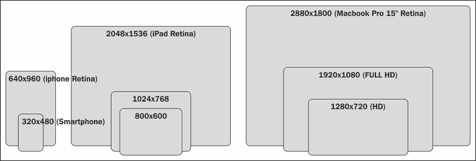
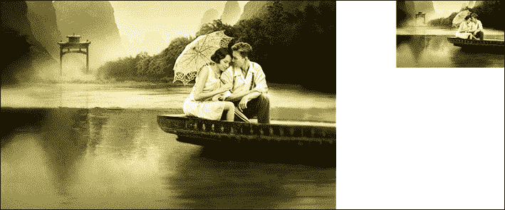
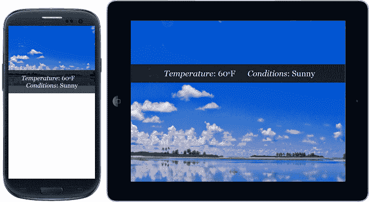
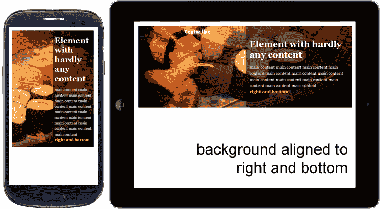
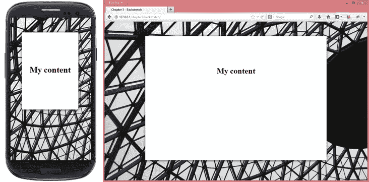

# 第五章准备图片和视频

最近，用于响应式站点的图像准备一直是最受讨论的问题之一，因为 W3C 尚未批准任何技术。与此同时，社区已经创造了一些各具优势的技术，试图解决这个问题。

我们将从基本图像调整开始本章。这个技术可以轻松地被集成到代码中，但移动用户正在等待更好的体验。

但是，在小型设备（如智能手机和平板电脑）上仅仅调整图像大小并不够有效，因为在这些设备上加载高质量的图像可能需要很长时间。稍后，我们将看到图像断点的重要性及其好处。

此外，我们将关注视频，因为它们在 HTML5 之前已经插入到我们的代码中，避免了从固定到响应式的站点转换上出现的问题。

此外，我们将讨论一些可用的 jQuery 插件以及如何使用它们，通过节省开发时间并改善界面。

在本章中，我们将学到：

+   只使用 CSS 的基本图像调整

+   为什么使用图像断点

+   图像标签的工作原理

+   控制图像艺术方向

+   使用 jQuery 插件和图像断点

+   使用 jQuery 插件创建响应式背景

+   处理高密度显示屏

+   使视频元素具有响应性

# 只使用 CSS 进行基本图像调整

以下代码可用于使图像在其父容器调整大小时具有缩放自由度。最大宽度设置为原始尺寸的 100%，其高度可以自动按照相同的图像比例进行调整：

```js
img {
  max-width: 100%;
  height: auto;
}
```

然而，要有效使用这一点，图像必须足够大，以便可以在最大可能的显示器上按比例缩放。然而，为桌面站点优化的图像对于移动互联网速度来说仍然相当沉重。

### 提示

如果你在 DOM 中使用`max-width`或`height`标记来调整 JPG 图像，那么你可能只会在 IE7 或更旧版本的浏览器上看到像素化的图像。然而，有一个简单的代码可以解决这个问题：

```js
img {
  -ms-interpolation-mode: bicubic;
}
```

这个特定的问题在 IE8 中被解决，在 IE9 中变得过时。

# 使用图像断点

适应性图片不仅仅是关于缩放图片的问题。它涉及到其他问题，以及在提供最佳用户体验时需要牢记的变量。诸如以下：

+   屏幕分辨率

+   带宽

+   浏览器窗口宽度

尝试确定发送到浏览器的最佳图像可能与每个变量都独立无关。这就是问题所在。例如，仅仅知道屏幕分辨率的值并不意味着用户有足够的带宽接收高清晰度图片。

因此，基于这些事实，我们将如何在我们的 Web 应用程序中制作一张图片，它需要在许多设备上显示良好的质量，而不会造成巨大的带宽浪费？



当我们处理位图图像（非矢量化图像，如 SVG）时，理想的解决方案似乎很简单：为每组分辨率提供不同大小的图片，其中每个图片都适用于某些类型的设备。

通常，我们考虑三种不同的屏幕尺寸来覆盖设备的多样性：

+   **480 px**：分辨率标准的智能手机（以移动为先）

+   **1024 px**：iPhone Retina（高像素密度智能手机），平板电脑和分辨率普通的桌面电脑

+   **1600 px**：iPad Retina（高像素密度平板电脑）和分辨率高的桌面电脑

已经有许多技术试图解决这个问题，并提供解决方案来帮助我们为每个场合提供正确的图片。它们都以略有不同的方式工作，根据您的需求，您将选择最符合您项目需求的选择。我们很快就会看到其中一些。

# 图片标签的工作原理

面对为用户提供正确图片的需求，W3C 正在努力研究它们。有一个此项倡议的非官方草案，其中包括了 `<picture>` 标签和不同的来源，以及它在其标准中，以便更容易地对图片进行适应。

### 注意

没有这个标准，浏览器开发人员无法准备好他们的浏览器以良好地渲染它。今天，前端社区正在尝试使用 CSS 和 JavaScript 来完成相同的任务。

这是 W3C 对 `<picture>` 标签的定义：

> "此规范为开发人员提供了声明图像的多个来源的方法，并且通过 CSS 媒体查询，它使开发人员能够控制何时向用户呈现这些图像。"

他们也考虑到了旧版浏览器，这些浏览器将显示一个简单的图片作为备用内容。以下是标签将被使用的示例：

```js
<picture width="500" height="500">
  <source media="(min-width:45em)" srcset="large1.jpg 1x, large2.jpg 2x">
  <source media="(min-width:18em)" srcset="medium1.jpg 1x, medium2.jpg 2x">
  <source srcset="small1.jpg 1x, small2.jpg 2x">
  
  <p>Accessible text for all image versions</p>
</picture>
```

我建议查看有关此规范的更新信息，请访问[`picture.responsiveimages.org/`](http://picture.responsiveimages.org/)。

# 对响应式图片的艺术指导的控制

这个话题最近已经讨论了很多。作者应该为不同尺寸的图片提供不同的来源，并根据他们的视觉判断，将主要元素聚焦在该特定断点的图片上。这就是艺术指导。

让我通过这个案例来澄清一下。当图片以较大的尺寸显示时，图片中显示的是船上的夫妇和背景中的河流是有意义的。背景有助于解释他们的位置，但总的来说，它没有提供任何相关信息。现在，看看当我们将图片缩小以适应较小的屏幕时会发生什么。这不是艺术指导。



将其缩小到那个尺寸，你几乎认不出这对夫妇。与其简单地调整图片大小，不如裁剪它以摆脱一些背景并集中在它上面更有意义。最终结果是一张在较小尺寸下效果更好的图片。让我们比较左边的图片（艺术方向）和右边的图片如下：


## 焦点 CSS 框架

焦点点改善了在缩小图像之前对图像最重要部分的聚焦。这样，它允许用户在智能手机上以较大尺寸看到图像的主要部分。所有这些都不需要使用 JavaScript 或 jQuery。

使用焦点，您可以定义一个代表您不想因较小分辨率而错过的部分的区域。被焦点覆盖的部分在缩放时保持可见，无论你将它们缩放到多远。

以下类名允许您裁剪和调整到图像的一个大致区域。请注意，类名中的 X 表示介于一和六之间的数字：

+   **左-X**/**右-X**：这些定义图像在水平方向上将关注多少个单位

+   **上-X**/**下-X**：这些定义图像在垂直方向上将关注多少个单位

+   **纵向**：默认情况下，该值设置为横向。但是如果一个图像的高度大于其宽度，则也添加 `portrait` 类

### 如何做

从[`github.com/adamdbradley/focal-point`](https://github.com/adamdbradley/focal-point)下载 CSS 文件后，让我们将此代码插入到我们 DOM 的 `<head>` 标签中：

```js
<link rel="stylesheet" href="/css/focal-point.min.css">
```

后来，我们可能会看到以下演示中的操作：


焦点的原则很简单：想象一个 12 x 12 单位的网格放在图片上：


现在，我们假设这个人的头是图片中最重要的部分，并且我们需要将其定义为焦点。即使这个人的脸在图片的右边，当缩小到较小分辨率时，它仍然会保持焦点。

要在技术上定义焦点，我们只需设置图像的两个类。这些类可以水平和垂直地定位焦点。它将从网格的中心开始，如下图所示：


以下是专注于人脸的代码：

```js
<div class="focal-point right-3 up-3">
  <div></div>
</div>
```

在这个例子中，焦点被定义为从中心向左三个网格单位，然后向上两个单位。`focal-point` 类与图像周围的 div 一样必不可少。

# <picture> 标签的替代解决方案

我们刚刚看到，W3C 正在努力制定标准，尽快标记图片，这将使您能够为您用于查看我们网站的设备提供更合适的视觉内容。

由于这种功能的迫切需要，社区创建了两个 JavaScript 插件，以实现大多数常用浏览器接受的预期结果。它们是 Foresight 和 Picturefill。

## Foresight - 根据屏幕大小选择正确的图像进行显示

Foresight 为网页提供了在请求从服务器请求图像之前，通知用户设备是否能够查看高分辨率图像（例如视网膜显示设备）的功能。

此外，Foresight 会判断用户设备当前的网络连接速度是否足够快，以处理高分辨率图像。根据设备显示和网络连接性，foresight.js 将为网页请求适当的图像。

通过自定义`img source`属性，使用诸如 URI 模板之类的方法，或者在 URI 中查找和替换值，可以形成为您图像的分辨率变体构建的请求，并具体使用新的 CSS `image-set()` 函数的混合实现。

基本格式是`image-set()`函数可能有一个或多个 image-set 变体，每个变体由逗号分隔。每个图像集变体最多可以有三个参数：

+   **URL**：这类似于`background-image:url()`。

+   **比例因子**：比例因子参数用作应用于识别图像密度的图像尺寸的乘法器。一些移动设备的像素比是 1.5 或 2。

+   **带宽**：这可以定义为低带宽或高带宽。

Foresight 还执行快速网络速度测试，以确保用户设备能够处理高分辨率图像，而不会让连接速度慢的用户等待很长时间下载图像。

### 如何做到

让我们访问网站[`github.com/adamdbradley/foresight.js`](https://github.com/adamdbradley/foresight.js)并下载文件。然后，我们将在 DOM 的`<head>`标签中插入以下代码：

```js
<script src="img/foresight.js "></script>
```

让我们看一个真实的例子，下面的代码中我们正在使用移动优先的概念：

```js
.fs-img {
  width:100%;
  font-family: 'image-set( url(-small|-small-2x) 2x high-bandwidth )';
  display:none;
}
```

然后，对于窗口，宽度至少为 600 px 和 800 px：

```js
@media (min-width:600px) {
  .fs-img {
    font-family: 'image-set( url(-small|-medium), url(-small|-medium-2x) 2x high-bandwidth )';
  }
}
@media (min-width:800px) {
  .fs-img {
    font-family: 'image-set( url(-small|-large), url(-small|-large-2x) 2x high-bandwidth )';
    max-width:100%;
  }
}
```

所以，我们用一些词来更好地解释它的工作原理。该代码将查找``标签的源代码中名称的片段，并将其替换为另一个名称。之后，站点将在其文件中搜索更改后的名称，验证所需的代码是否存在：

```js
.jpg">
```

### 提示

该引擎用于更改文件名的后缀，使其具有良好的可扩展性，这非常好，因为在创建新的响应式图像时可以避免对代码的大量干预。

如果我们比较这个例子中的图像，查看 KB 的差异，我们将得到 44 KB 的大图像，20 KB 的中图像和 12 KB 的小图像。对于单个图像来说，这不是一个巨大的差异。然而，将其应用到整个站点，可能会大大减少不必要图像的加载。


## Picturefill – 最接近 picture 标签的解决方案

Picturefill 是用于响应式图片的 JavaScript 插件，类似于未来的 `picture` 元素，但现在就可以使用。这个非常轻量级的解决方案使用 `span` 标签而不是 `picture` 或 `image`，以确保其自身的安全性。

Picturefill 本身支持 HD（Retina）图像替换。 Picturefill 还具有良好的性能优势，根据屏幕大小选择正确的图像，而无需下载其他图像。

要获取有关此插件的更多信息，请访问 [`github.com/scottjehl/picturefill`](https://github.com/scottjehl/picturefill)。

### 如何做

下载此解决方案的文件后，让我们将此代码插入到您 DOM 的 `<head>` 标签中：

```js
<script src="img/matchmedia.js"></script>
<script src="img/picturefill.js"></script>
```

这是在 HTML 中要使用的代码。请注意，它要求您指定每个图像及其变体的来源。请参阅以下示例：

```js
<span data-picture="" data-alt="Picture alternative text">
  <span data-src="img/small.jpg"></span>
  <span data-src="img/medium.jpg" data-media="(min-width: 400px)"></span>
  <span data-src="img/large.jpg" data-media="(min-width: 800px)"></span>
  <span data-src="img/extralarge.jpg" data-media="(min-width: 1000px)"></span>
  <!-- Fallback content for non-JS browsers -->
  <noscript>&lt;img src="img/small.jpg" alt="Picture alternative text"&gt;</noscript>
  
</span>
```

或许有些项目需要将其作为解决方案（在 HTML 代码中放置整个规范及其图像变体），但如果网站上有很多图像，可能会带来可扩展性问题和网站维护问题。

# 使用 jQuery 插件实现响应式背景图片

对于响应式站点来说，定位背景图并不总是一件容易的事情，因为其正确的显示取决于其内容的行为。

为了澄清，让我展示这个问题的一个示例：



问题在于，有时我们会固定内容以保持背景正确，但需要更改。有两个插件对定位此背景非常有帮助：Anystretch 和 Backstretch。

## Anystretch – 轻松拉伸背景

Anystretch 是一个 jQuery 插件，允许您向任何页面或块级元素添加动态调整大小的背景图像。最初，Anystretch 是从 Backstretch 派生出来的。

图像将拉伸以适应页面/元素，并随着窗口大小的更改而自动调整大小。有一些选项可以配置它，例如水平定位、垂直定位、速度、元素定位和数据名称。

此插件的另一个优点是，如果我们在加载 Anystretch 后要更改图像，我们只需要再次进行处理，提供新路径即可。

### 提示

是的，我们可以与 Breakpoints.js 插件一起使用，就像我们在第二章中所看到的*设计响应式布局/网格*，这样就可以更改图像路径并再次使用 Anystretch，如果需要的话。

### 如何做

从 [`github.com/danmillar/jquery-anystretch`](https://github.com/danmillar/jquery-anystretch) 下载文件后，让我们使用以下 HTML 代码来澄清其工作原理：

```js
<div class="div-home stretchMe" data-stretch="img/bg-home.jpg">
  <p>main content</p>
</div>
<div class="div-footer stretchMe" data-stretch="img/bg-footer.jpg">
  <p>footer content</p>
</div>
```

对于这个结构，有两个突出的词语：

+   `stretchMe`：这用于标识那些将由插件处理的元素

+   `data-stretch`：这将通知插件哪个图像可能成为背景

在 DOM 的底部（在 `</body>` 结束标记之前），我们需要包含 jQuery 代码和 Anystretch 脚本。然后，我们将对所有按照 `stretchMe` 类名设置的元素执行插件（只是一个建议的名称）。

```js
<script src="img/jquery-1.9.1.min.js"></script>
<script src="img/jquery.anystretch.min.js"></script>
<script>
$(".stretchMe").anystretch();
</script>
```

这是将插件应用于 div 元素的视觉结果：



到目前为止，这种方法不错，但是如果使用，将对所有响应式背景应用相同的行为。换句话说，如果我们想要更改特性，我们需要单独调用该函数。

### 提示

如果我们对同一个元素两次调用 `anystretch` 方法，它将替换现有图像并停止先前的处理。

如果我们查看上一个 HTML 代码，会发现一个名为 `div-home` 的类，它可以使用不同的选项执行，例如：

```js
<script>
$(".div-home").anystretch('',{speed:300, positionX:'right', positionY:'bottom'});
</script>
```

### 注意

`speed` 参数将配置在下载图像后淡入图像的时间。默认情况下，`positionX` 和 `positionY` 对齐在中心，但是插件允许我们更改它。

## Backstretch – 创建响应式背景幻灯片

Backstretch 是一个 jQuery 插件，允许用户向任何页面或元素添加动态调整大小的背景图像，它是 Anystretch 插件的基础。

但是，Backstretch 发展了，现在还提供动态调整幻灯片元素的背景图像大小。所有这些背景图像将拉伸以适应页面/元素，并且将随着窗口/元素大小的更改而自动调整大小。

另一个很好的改进是在页面加载后获取将要使用的图像，这样用户就不必等待太长时间才能完成图像的下载。

您可以在 [`github.com/srobbin/jquery-backstretch`](https://github.com/srobbin/jquery-backstretch) 找到要下载的文件。

### 如何操作

在 DOM 底部（在 `</body>` 结束标记之前），我们将包括 jQuery 和 Backstretch 库。然后，我们将执行插件，将 Backstrech 附加到元素的背景上：

```js
<script src="img/jquery-1.9.1.min.js"></script>
<script src="img/jquery.backstretch.min.js"></script>
<script>
$.backstretch("path/bgimage.jpg");
</script>
```

下面是视觉结果：



默认情况下，图像的对齐（垂直和水平）设置为中心，因为对于使用此解决方案的人来说更常见，但是如果需要，我们可以关闭它。另一个包括的选项是 `fade` 参数，用于配置图像淡入的时间。`parameter` 持续时间用于幻灯片，它与每个幻灯片显示之前的时间（以毫秒为单位）有关。

我们还可以将 Backstretch 附加到任何块级元素上。默认情况下，`<body>` 标记将接收此响应式背景。要做到这一点，更好的方法是通过使用以下代码定义一个类来接收此操作，而不是使用上一个代码：

```js
<script>
$(".div-home").backstretch("path/bgimage.jpg");
</script>
```

或者，要启动幻灯片放映，只需提供一个图像数组和幻灯片之间的时间量：

```js
<script>
  $(".div-home").backstretch([
    "path/bgimage1.jpg",
    "path/bgimage2.jpg",
    "path/bgimage3.jpg"    
  ], {duration: 5000});
</script>
```

此插件有很好的文档，并提供了用于更好处理的幻灯片 API。可以在 [`github.com/srobbin/jquery-backstretch#slideshow-api`](https://github.com/srobbin/jquery-backstretch#slideshow-api) 找到它。

# 处理高密度显示屏

屏幕密度指的是物理表面上的设备像素数量。通常以**每英寸像素** (**PPI**) 进行测量。苹果为其双倍密度显示器创造了市场术语**视网膜**。根据苹果官方网站的说法：

> “视网膜显示屏的像素密度非常高，以至于您的眼睛无法区分单个像素。”

换句话说，视网膜显示器的像素密度足够高，以至于人眼无法注意到像素化。但是，由于这些显示器正在广泛实施和使用，因此更加重要的是创建支持这些显示器的网站和应用程序。

在下图中，我们比较了视网膜和标准定义显示器之间的像素。在视网膜显示器中，与传统显示器相比，相同空间内的像素是双倍的：


### 注意

单词“double”并非所有支持高密度图像的设备所使用的确切值。目前，市场上还有其他屏幕密度，其密度值为 1.5 和 2.25。

## 如何做到

视网膜图像的通常值是普通图像值的两倍。因此，通过使用媒体查询，我们可以测试浏览器是否支持高密度图像。让我们在下面的示例中检查一下：

```js
/* normal sprite image has dimension of 100x100 pixels */
span.bigicon-success {
  background: url(sprite.png) no-repeat -50px 0;
}
@media only screen and (-webkit-min-device-pixel-ratio: 2), only screen and (min-device-pixel-ratio: 2) {
  span.bigicon-success {
    background-image: url(sprite@2x.png);
    /* retina sprite image has dimension of 200x200 pixels */
    background-size: 200px 200px;
  }
}
```

如果浏览器接受，我们会请求另一张图像来显示。然而，这种用法会产生两次图像请求：一次在检查之前，另一次在媒体查询内部。

现在，让我们看看如何使用 Foresight 只发出一次请求。

## 如何使用 Foresight 完成

该插件具有在向用户显示任何图像之前检测设备显示的屏幕密度的能力。

让我们在下面的示例中看看：

```js
.fs-img {
  font-family: 'image-set(url(-small | -small-2x) 2x high-bandwidth)';
}
```

在此示例中，浏览器会检查哪个图像元素具有类`fs-img`，并在显示任何图像之前（Foresight 的默认行为）检查它是否支持视网膜图像；此外，它还可以检查用户是否处于高带宽状态。

请注意，在请求`castle-small.jpg`文件之前，例如，它会查找后缀`-small`并将其替换为`-small-2x`，然后请求文件`castle-small-2x.jpg`。

有一个在线工具可以帮助计算图像在视网膜上查看时应该具有的大小。可在 [`teehanlax.com.s3.amazonaws.com/files/teehanlax_density_converter.html`](http://teehanlax.com.s3.amazonaws.com/files/teehanlax_density_converter.html) 获取。 

# 制作响应式视频元素

在我们的网站开发中使用 HTML5 之前，视频的使用受限于设备对 Adobe Flash Player 的接受。然而，由于 HTML5 中 `<video>` 的大力发展，以及苹果公司在其设备上拒绝 Adobe Flash Player 的立场，这种义务不再存在。

目前，这个元素 `<video>` 在现有设备和现代浏览器（IE9 及以上版本）中得到了很好的接受，使得其在响应式网站上的处理尤其是灵活性更加容易。仅为澄清，以下是 `video` 标签在 DOM 中通常的样子：

```js
<video id="highlight-video" poster="snapshot.jpg" controls>
  <source src="img/video.m4v" type="video/mp4" /> <!-- for Safari -->
  <source src="img/video.ogg" type="video/ogg" /> <!-- for Firefox -->
</video>
```

使视频流畅的 CSS 代码非常简单：

```js
video, iframe {
   max-width: 100%;
   height: auto;
}
```

然而，老旧浏览器和新浏览器之间存在操作差异，并且为了增加内容的可访问性。通常更倾向于使用更安全的方法。这条路就是继续使用嵌入式视频或 `<iframe>` 标签。我们很快就会看到如何使这些视频更具响应性和灵活性。

现在，让我们专注于当前的技术。好消息是，视频提供商如 YouTube 或 Vimeo 已经支持 `<video>` 标签，但这仍然不是默认行为。这个在不同设备上使用的代码可能会成为一个问题，因为我们需要根据每种情况来适应代码。

解决适应性问题的方法是他们创建了 FitVids 插件。

## FitVids – 响应式视频的快速解决方案

FitVids 是一个轻量级的 jQuery 插件，通过创建一个包装器来自动调整我们响应式网页设计中视频宽度的工作，以保持其比例，否则被嵌入的视频的比例将会是这样：


目前支持的播放器有 YouTube、Vimeo、Blip.tv、Viddler 和 Kickstarter。但如果需要使用我们自己的播放器，有一个选项可以指定自定义播放器。

### 如何做

在 DOM 底部（在 `</body>` 结束标签之前），我们需要包含 jQuery 代码和 FitVids 脚本。然后，我们只需要将其执行附加到元素的类或 ID 上，如下所示：

```js
<script src="img/jquery-1.9.1.min.js"></script>
<script src="img/jquery.fitvids.js"></script>
<script>
$(function () {
  $(".video-wrapper").fitVids();
});
</script>
```

之后，让我们使用这段 HTML 代码只是作为示例来看看它是如何工作的：

```js
<div class="video-wrapper ">
  <iframe width="560" height="315" frameborder="0" allowfullscreen src="img/UM0Cl3wWys0"></iframe>
</div>
```

以下截图显示了使用 FitVids 的 YouTube、Vimeo 和 Viddler 视频的示例：


# 练习 – 为特色主页图片创建不同的图像版本

正如我们刚刚看到的，为每个设备加载正确的图像对于我们的响应式网站非常重要。因此，让我们在以下断点中的设计中实践这项技术，展示不同的图像：

+   最大宽度 = 480

+   最大宽度 = 1024

+   最小宽度 = 1025

以下屏幕截图显示了网站以及我正在引用的照片，就像我们在第二章中看到的那样，*设计响应式布局/网格*。对于这个练习，我指的是盒子内突出显示的图像：


对于这项活动，我建议使用 Foresight 插件，因为它可以更好地可视化图像源和断点。

### 提示

不要忘记检查您正在使用的特定设备是否支持显示高密度图像。

# 总结

在本章中，我们学习了将固定图像转换为灵活图像的简单方法，但仅仅理解这一点并不足以使它们适应不同的设备。此外，我们还学习了通过使用 Foresight 和 Picturefill 插件向用户提供正确图像的其他方法。当使用 FocalPoint 框架调整图像大小时，我们还控制了艺术方向，将焦点放在图片中的主要元素上。此外，我们还学会了使用 FitVids 插件使视频尺寸变得流动起来而不感到紧张。

在下一章中，我们将了解哪些幻灯片插件适用于响应式网站，学习如何构建它们，更改一些选项和效果，并给用户留下良好的印象。此外，我们还将了解在移动网站上通常使用和实现的手势。
